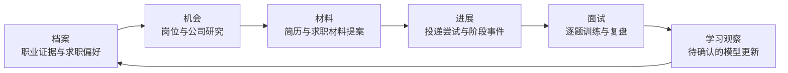
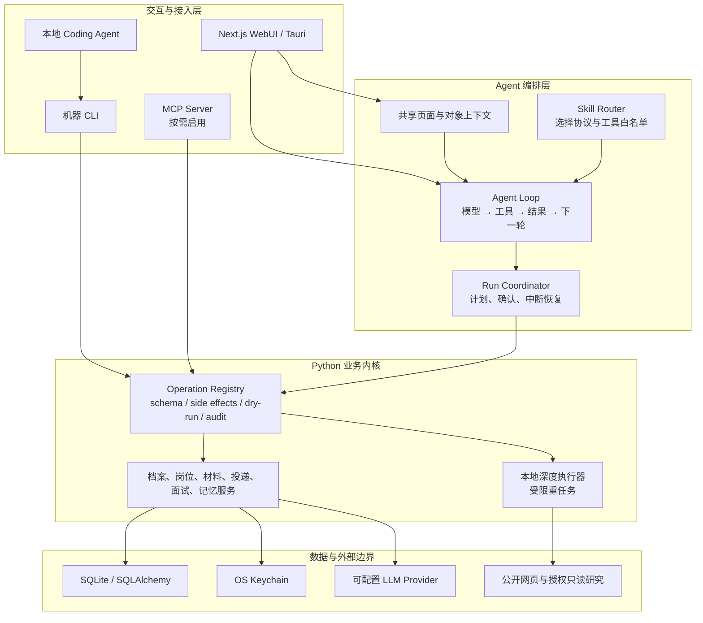

<p align="center">
  
</p>

<h1 align="center">OfferU</h1>

<p align="center">
  <strong>本地优先、证据驱动的 AI 求职工作台</strong><br />
  把职业事实、岗位研究、材料定制、投递进展与面试训练连接成可确认、可追溯的闭环。
</p>

<p align="center">
  
  
  
  
  
</p>

<p align="center">
  <a href="./README_EN.md">English</a> ·
  <a href="#快速开始">快速开始</a> ·
  <a href="#5-分钟演示路径">演示路径</a> ·
  <a href="#agent-如何工作">Agent 实现</a> ·
  <a href="#skillmcpcli-分别解决什么问题">Skill / MCP / CLI</a>
</p>

> [!IMPORTANT]
> OfferU 当前是本地单人版 POC，不是 SaaS，也不自动代替用户投递。项目优先证明“AI 能否在事实、权限和确认边界内推进求职任务”，而不是追求无人值守自动化。

## 一分钟了解

多数求职工具只解决一个局部问题：维护表格、改一版简历、生成几道面试题。真正费时间的是信息在这些环节之间反复丢失：

- 个人经历散落在旧简历、聊天和项目文档中，事实难以复用；
- 每换一个岗位，都要重新理解 JD、选择经历、改写材料；
- 邮件只能证明“收到了一条消息”，不能直接证明投递状态已经变化；
- 模拟面试常给出通用建议，却不了解候选人的真实经历与目标岗位；
- Agent 可以调用很多工具，但缺少统一权限、确认、审计和失败语义。

OfferU 把这些问题压成一条求职闭环：

```text
已确认职业事实
      ↓
岗位与公司证据
      ↓
可审核的材料提案
      ↓
投递尝试与阶段事件
      ↓
面试训练与学习观察
      ↓
用户确认后更新职业模型
```

项目的核心不是“自动生成更多内容”，而是让同一份事实和证据跨阶段复用，并让每个有副作用的动作都可以被用户检查。

## 5 分钟演示路径

仓库暂未提供公开在线 Demo。OfferU 会处理简历、邮箱和面试转写等个人数据，因此当前优先提供本地演示。

建议按下面的顺序展示，而不是逐页介绍功能：

1. **建立档案**：在“档案”中录入一条可追溯的教育、项目或工作事实。
2. **选择岗位**：打开一个真实 JD，查看岗位详情和已有研究证据。
3. **生成提案**：让 OfferU 基于已确认事实准备岗位化简历差异，而不是直接覆盖原简历。
4. **确认执行**：展示写操作的 dry-run、用户确认和审计结果。
5. **切换入口**：用 CLI 发现并读取同一 Operation Registry，证明 Web Agent 与 CLI 没有复制业务逻辑。
6. **面试训练**：基于同一岗位与档案逐题练习，分别查看内容评价和表达行为反馈。

用于现场证明控制契约的命令：

```powershell
cd backend

# 查看 CLI 契约、当前操作数量和安全约束
python -m app.cli manifest --pretty

# 发现所有原子操作
python -m app.cli ops --pretty

# 查看单个操作的参数、权限、副作用和输出结构
python -m app.cli schema prepare_resume_optimization --pretty

# 安全读取
python -m app.cli run list_jobs --arg page_size=5 --pretty

# 只预演副作用，不写数据库、不调用 LLM、不访问外部系统
python -m app.cli run prepare_resume_optimization --arg job_id=1 --dry-run --pretty
```

## 产品边界

OfferU 明确不做以下事情：

- 不把 Agent 推断、面试评价或简历建议直接升级为职业事实；
- 不根据表情、姿态或声音推断人格、诚信、情绪或录用概率；
- 不在用户不知情时发送邮件、发布内容或提交站外申请；
- 不让本地 Coding Agent 直接写业务数据库或绕过确认门；
- 不把 Skill、CLI、MCP 或 WebUI 建成四套彼此漂移的业务系统；
- 不为了未来 SaaS 需求提前引入租户、组织、登录和计费模型。

## 业务架构

OfferU 按求职流程组织能力，而不是按 AI 功能堆页面。



| 阶段 | 输入 | 处理 | 可见结果 |
|---|---|---|---|
| 档案 | 用户原话、已有简历、登记工作源 | 提取、去重、来源校验、确认 | 可复用的职业证据 |
| 机会 | JD、公司公开信息、授权研究摘录 | 来源分级、匹配、风险与缺口分析 | 公司档案与岗位档案 |
| 材料 | 职业证据、岗位证据、参考简历 | 召回、事实门、差异生成 | 可接受或拒绝的材料提案 |
| 进展 | 投递动作、邮件与日程信号 | 关联候选、人工确认、追加事件 | 当前阶段与下一动作 |
| 面试 | 岗位、简历、题目、回答 | 内容评价、独立表达行为统计 | 可引用证据的复盘报告 |

## 系统架构

第一阶段只有 Python/FastAPI 承载业务逻辑。Tauri/Rust 只负责桌面壳、进程生命周期和操作系统桥接。



### 为什么要有 Operation Registry

业务能力只定义一次，再由不同入口做薄适配：

```text
UI / Agent / CLI / MCP
          ↓
  execute_operation(...)
          ↓
参数校验 → 副作用识别 → dry-run → 用户确认 → 执行 → 审计
```

每个 Operation 声明稳定名称、输入参数、领域分组、副作用、权限、示例、版本和统一输出信封。当前真实数量以 `python -m app.cli manifest --pretty` 返回的 `operation_count` 为准，避免 README 中的数字随代码演进而失真。

## Agent 如何工作

OfferU 主 Agent 不是一个“套了 System Prompt 的聊天框”，而是一条受业务约束的执行循环：

1. **读取上下文**：获取当前页面、选中对象、已确认职业事实和对话历史。
2. **选择 Skill**：显式选择或路由到一个业务协议；每个协议限制可用工具集合。
3. **规划动作**：模型根据目标输出回答或结构化工具调用。
4. **执行只读工具**：读取档案、岗位、研究、材料和投递状态，把结果返回模型。
5. **拦截副作用**：写入、LLM 调用和外部访问先形成待确认动作或 dry-run 结果。
6. **恢复运行**：用户确认后，Run Coordinator 只执行被确认的动作；中断状态与检查点可用于恢复和防止重复写入。
7. **沉淀观察**：本轮行为可以形成学习观察，但必须经过记忆收件箱和事实门才能改变职业模型。

最小化伪代码：

```python
while turns < max_turns:
    output = model(messages, allowed_tools)

    if output.final_answer:
        return output.final_answer

    for call in output.tool_calls:
        if call.has_side_effects and not call.confirmed:
            return create_confirmation_proposal(call)

        result = execute_operation(call.name, call.args)
        messages.append(result)
```

项目没有使用“大而全”的通用 Agent 框架重写所有业务。原因不是框架无价值，而是 OfferU 最难的部分在于职业事实、投递状态、敏感数据授权和用户确认边界；这些规则必须留在确定性的 Python 业务层。Agent 框架适合管理 loop、handoff、HITL 和持久化，但不能代替领域模型。

关键实现：

- [`backend/app/services/harness_agent.py`](./backend/app/services/harness_agent.py)：主 Agent 回合、Skill 路由、工具规划与确认提案；
- [`backend/app/services/agent_skill_registry.py`](./backend/app/services/agent_skill_registry.py)：当前 Skill 协议、状态和工具白名单；
- [`backend/app/services/agent_run_coordinator.py`](./backend/app/services/agent_run_coordinator.py)：确认后执行与中断恢复；
- [`backend/app/ops.py`](./backend/app/ops.py)：统一 Operation Registry、dry-run 与审计入口；
- [`backend/app/services/coding_agent_runtime.py`](./backend/app/services/coding_agent_runtime.py)：本地 Coding Agent capability probe 与受限执行。

## Skill、MCP、CLI 分别解决什么问题

三者不是同一层，也不是互相替代关系。

| 能力 | 回答的问题 | OfferU 中的作用 | 不负责什么 |
|---|---|---|---|
| **Skill** | “这类任务应该怎么做？” | 封装领域步骤、注意事项、工具白名单和输入输出约束 | 不天然提供数据库连接、权限与可靠执行 |
| **MCP** | “不同 Agent Host 如何标准化发现和调用外部能力？” | 让外部客户端通过协议发现并调用 OfferU 工具或资源 | 不定义求职 SOP，也不替代业务授权 |
| **CLI** | “本机进程如何被人或 Agent 稳定调用？” | 提供 JSON stdout、稳定退出码、schema 发现、文件参数和 dry-run | 不负责模型推理与任务规划 |
| **Operation Registry** | “产品允许做什么，风险和结果契约是什么？” | 作为所有入口共享的业务能力事实源 | 不决定用户此刻想完成什么 |

### 为什么不让用户直接运行一个 Skill

Skill 可以告诉 Agent“先读岗位，再对照档案，最后生成可审核提案”，但它本身不能证明：

- 读取的是哪一份正式档案；
- 当前调用者是否有权访问敏感数据；
- 写操作是否经过 dry-run 与确认；
- 执行失败后是否可以重试、恢复和审计；
- WebUI、CLI 与外部 Agent 是否得到一致结果。

因此 OfferU 的组合是：

```text
Skill 决定流程
  + Operation Registry 约束业务动作
  + CLI / MCP 提供不同调用通道
  + 主 Agent 管理上下文、规划与确认
```

本地 Coding Agent 默认优先使用 CLI，是因为本机子进程调用需要稳定 JSON、退出码、文件输入和明确的 dry-run；当能力需要被多个兼容客户端远程发现、维护长连接或跨语言复用时，MCP 更合适。

参考：

- [MCP 官方架构说明](https://modelcontextprotocol.io/docs/learn/architecture)
- [Agent Skills 开放规范](https://agentskills.io/specification)
- [OfferU Agent-Native CLI Contract](./docs/AGENT_NATIVE_CLI_CONTRACT.md)
- [ADR 0029：统一 Operation Registry](./docs/adr/0029-one-operation-registry-for-gui-cli-tui-and-slash-skills.md)

## 当前实现状态

| 能力 | 状态 | 说明 |
|---|---|---|
| Python/FastAPI 单业务后端 | 已实现 | 桌面端只启动 Python 业务运行时 |
| Operation Registry 与机器 CLI | 已实现 | 支持发现、schema、JSON 输出、dry-run 和审计 |
| 主 Agent Skill 路由与工具白名单 | 已实现 | 当前 Registry 为代码内定义，正在向可版本化 Skill 包收敛 |
| 持久 Run、确认与恢复 | 已实现 | 副作用动作由用户确认后执行 |
| MCP Streamable HTTP | 可选 | 默认关闭；通用 `run_operation` 已接入 Registry，旧专用工具仍在迁移 |
| 本地深度执行器 | 部分实现 | 只承担岗位研究、批量评估和工作源摘要等可审计重任务 |
| 公司/岗位研究与证据化简历 | 部分闭环 | 公开研究、提案、事实门和采纳路径已存在，仍在补齐体验与基准 |
| 邮箱到投递进展 | 部分闭环 | 外部消息先成为候选进展，不能静默推进正式状态 |
| AI 面试 | 部分闭环 | 逐题内容评价与本地表达行为反馈分开；不输出人格或录用概率 |
| 公开在线 Demo | 未提供 | 当前通过本地 POC 和去标识化场景演示 |
| 自动站外投递 | 非目标 | 只准备材料和登记动作，不替用户提交 |

产品边界与 accepted decisions 见 [`CONTEXT.md`](./CONTEXT.md) 和 [`docs/adr/`](./docs/adr/)。

## 如何验证 SOP 是否真的提升效率

OfferU 当前不宣称“效率提升 X%”。如果没有对照实验，这个数字无法区分 SOP、工具熟练度、模型变化和任务难度。

计划采用配对交叉实验：

1. 准备难度相近、参与者未做过的岗位任务对；
2. 固定模型、参数、数据快照、Skill 版本和 Operation 版本；
3. 随机分配 `无 SOP → 有 SOP` 与 `有 SOP → 无 SOP` 的执行顺序，抵消学习效应；
4. 通过 Operation Audit Log 自动采集过程数据，不依赖参与者回忆；
5. 除平均值外，保留失败样本、方差和置信区间。

主要指标：

- **任务成功率**：结果是否通过事实、来源和安全不变量；
- **Time to Valid Result**：从开始到第一份可接受结果的时间；
- **人工干预次数**：补参数、纠错和重新解释的次数；
- **返工率**：因事实错误、权限越界或格式失败而重做的比例；
- **执行成本**：模型 token、外部调用与人工审核时间。

只有在固定基准上同时改善成功率和有效结果时间，才能把提升归因给 SOP；“我第二次做得更快”不能作为证据。

## 快速开始

### 环境要求

- Python 3.12
- Node.js 18+
- 一个可用的 LLM API Key，或本地 Ollama
- Docker Desktop（可选）

### 本地 Web 开发

```powershell
git clone https://github.com/Paker-kk/OfferU.git
cd OfferU

# 后端
python -m venv backend/.venv312
backend/.venv312/Scripts/Activate.ps1
pip install -r backend/requirements.txt
Copy-Item .env.example backend/.env
python backend/run_server.py

# 另开一个终端启动前端
cd frontend
npm install
npm run dev
```

打开：

- WebUI：<http://localhost:3300>
- API 文档：<http://localhost:8000/docs>

> Windows 前端开发端口固定为 `3300`。如需修改，必须同步
> `frontend/package.json`、`frontend/src-tauri/tauri.conf.json`
> 与 `frontend/src-tauri/src/lib.rs`。

### Docker

```powershell
git clone https://github.com/Paker-kk/OfferU.git
cd OfferU
Copy-Item .env.example .env
docker compose up -d
```

Docker 默认地址：

- WebUI：<http://localhost:3011>
- API 文档：<http://localhost:9000/docs>

### 可选 MCP 接入

MCP 默认关闭。只在可信本机环境需要外部 Agent 发现工具时，在 `backend/.env` 中设置：

```dotenv
OFFERU_ENABLE_MCP=true
```

端点：`http://127.0.0.1:8000/mcp`

生产或局域网部署前必须补齐认证、调用方隔离和网络边界，不能直接暴露开发端点。

## 数据与安全

- 本地单人版以 SQLite 为主数据存储；Docker 开发模式可使用 PostgreSQL。
- API Key 与 OAuth/IMAP 凭据不应提交到 Git；敏感凭据优先进入操作系统钥匙串。
- 简历、邮件片段和面试转写发往云端模型前，需要按供应商和数据类别授权。
- 邮件与短信只是外部进展信号；用户确认前不能改变正式投递阶段。
- 原始摄像头画面不上传、不落盘；只保留明确授权的派生表达行为事件。
- AI 生成内容必须经过事实门和用户审核，最终投递内容由使用者负责。

## 项目结构

```text
OfferU/
├── backend/
│   ├── app/
│   │   ├── ops.py                         # Operation Registry
│   │   ├── cli.py                         # 机器 CLI
│   │   ├── mcp_server.py                  # 可选 MCP 适配器
│   │   ├── routes/                        # FastAPI transport
│   │   └── services/
│   │       ├── harness_agent.py           # 主 Agent loop
│   │       ├── agent_skill_registry.py    # Skill 路由与白名单
│   │       ├── agent_run_coordinator.py   # 确认与恢复
│   │       └── coding_agent_runtime.py    # 本地深度执行器适配
│   └── tests/                              # 领域与控制契约测试
├── frontend/
│   ├── src/app/                            # Next.js 页面
│   ├── src/components/workbench/           # 任务工作台与共享右栏
│   └── src-tauri/                          # Tauri 桌面壳
├── docs/
│   ├── adr/                                # 已接受架构决策
│   └── AGENT_NATIVE_CLI_CONTRACT.md
├── CONTEXT.md                              # 领域语言与产品边界
└── docker-compose.yml
```

## Roadmap

当前优先级不是继续增加页面，而是完成可独立验收的纵向闭环：

1. 统一安全、来源、确认、审计和数据授权底座；
2. 完成邮箱信号 → 候选进展 → 用户确认 → 投递时间线；
3. 完成岗位研究 → 证据化简历提案 → 用户采纳；
4. 完成轮次式面试 → 内容评价 / 表达反馈 → 学习观察；
5. 建立去标识化 Demo 数据、90 秒演示视频与 SOP 对照基准。

详细路线见 [`docs/IMPLEMENTATION_ROADMAP_2026-07-17.md`](./docs/IMPLEMENTATION_ROADMAP_2026-07-17.md)。

## License

[MIT](./LICENSE)

## 联系方式

- GitHub：[Paker-kk/OfferU](https://github.com/Paker-kk/OfferU)
- 灵感来源：[santifer/career-ops](https://github.com/santifer/career-ops)

