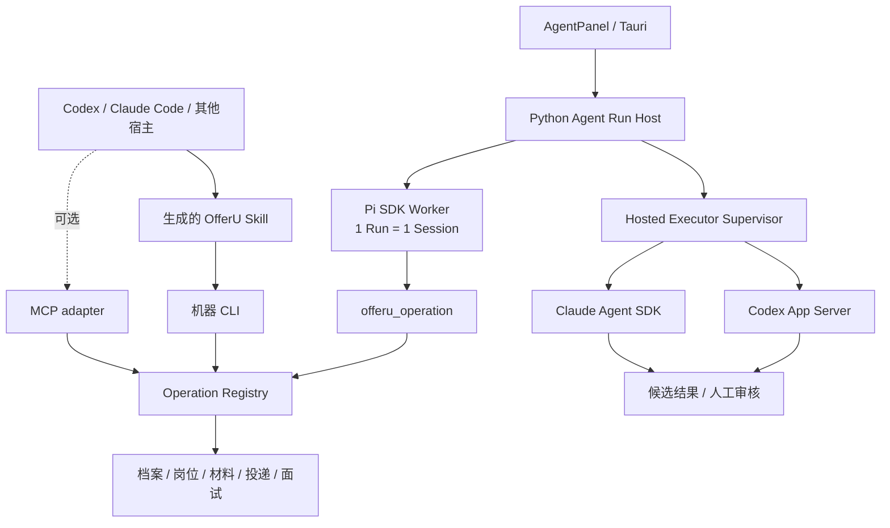

<p align="center">
  
</p>

<h1 align="center">OfferU</h1>

<p align="center">
  <strong>本地优先、证据驱动的 AI 求职工作台</strong><br />
  用同一份职业事实连接岗位研究、材料提案、投递进展、面试训练与可审计 Agent。
</p>

<p align="center">
  <a href="https://github.com/avabbbb/OfferU/stargazers"></a>
  <a href="https://github.com/avabbbb/OfferU/forks"></a>
  <a href="https://github.com/avabbbb/OfferU/issues"></a>
  <a href="https://github.com/avabbbb/OfferU/releases"></a>
  
</p>

<p align="center">
  
  
  
  
  
</p>

<p align="center">
  <a href="./README_EN.md">English</a> ·
  <a href="#当前版本">当前版本</a> ·
  <a href="#agent-系统">Agent 系统</a> ·
  <a href="#快速开始">快速开始</a> ·
  <a href="#roadmap">Roadmap</a>
</p>

> [!IMPORTANT]
> OfferU 目前是本地单人版 POC，不是 SaaS，也不会自动提交申请、发送邮件或联系第三方。AI 产出先是提案或候选信号，只有通过证据门和使用者确认后才能改变正式求职事实。

<table>
  <tr>
    <td width="50%"></td>
    <td width="50%"></td>
  </tr>
  <tr>
    <td align="center"><strong>任务内 Agent Run、事件与确认</strong></td>
    <td align="center"><strong>候选结论、来源和未知项审核</strong></td>
  </tr>
</table>

## 一分钟认识 OfferU

求职不是一次生成，而是一条持续变化的证据链：

```text
已确认职业事实
      ↓
岗位与公司证据
      ↓
可审核的材料提案
      ↓
投递尝试与阶段事件
      ↓
面试训练与学习观察
      ↓
使用者确认后更新职业模型
```

OfferU 让同一份事实跨阶段复用，并把数据授权、LLM 调用、写入和外部动作放进明确的确认与审计契约。它不是通用 Agent 的数据库外壳，也不是只生成一份简历后就结束的工具。

## 当前版本

事实基线：**2026-07-30**。

| 能力 | 当前状态 | 边界 |
|---|---|---|
| 今日工作台、机会、材料、进展、面试 | 可用 / 持续收敛 | 按求职阶段组织，而不是平铺技术模块 |
| 岗位采集、筛选与研究 | 可用 / 部分闭环 | 公开来源与使用者授权来源分开；研究先进入候选审核 |
| 职业档案与长期学习 | 可用 / 部分闭环 | AI 推断和学习观察不能直接成为职业事实 |
| 简历、求职信与 PDF | 可用 / 部分闭环 | PDF/DOCX 可解析为带页码与质量诊断的候选项；确认后才创建简历段落，不自动覆盖或投递 |
| 投递表、邮件与日程信号 | 可用 / 部分闭环 | 外部消息先成为候选进展，确认后才改变正式阶段 |
| 面试题库、模拟与表达反馈 | 可用 / 部分闭环 | 内容评分与可观察表达行为分开，不推断人格或录用概率 |
| 内置主 Agent | Pi SDK 主路径已接通 | AgentPanel → Python Run Host → 受限 Pi Session → Operation Registry |
| 外部 Coding Agent | 原生托管与证据 handback 已实现 | Codex / Claude 是可替换重任务执行器，不是第二业务后端 |
| Tauri 前端 | 已迁移到 Vite 静态 SPA | 开发端口固定 3300；发布时直接加载内嵌 `dist`，不再启动 Next.js |

真实 Operation、Skill 和确认边界请从机器 CLI 动态发现，不依赖 README 中会漂移的固定数量：

```powershell
Set-Location backend
python -m app.cli doctor --pretty
python -m app.cli manifest --pretty
```

## Agent 系统

是的，OfferU 的内置 Agent Core 已经以 **Pi SDK 为运行时底座**。Pi 负责 AgentSession、模型适配、上下文压缩、类型化工具、Session 和流式生命周期；Python 仍是唯一业务后端，负责 Skill、Operation、权限、确认、审计、幂等和职业事实门。



两条路线共享控制面，但保留各自原生运行时：

| 路线 | 用途 | 已完成 | 主要缺口 |
|---|---|---|---|
| 内置 Pi 主 Agent | 产品内对话、Skill 选择和 Operation loop | 任务绑定 Run、受限 Session、流式事件、SSE 续接、proposal/confirm、取消与恢复 | 剩余 Operation 严格 Schema、Session 丢失决策、更多故障演练 |
| 外部 Coding Agent | 借助 Codex、Claude 等宿主操作 OfferU 或执行重研究 | Skill + CLI/MCP、多宿主投影、原生 Codex/Claude adapter、任务 session、统一事件、证据审核 | 通用文件产物 handback、多版本和可用上游现场验收 |

关键安全边界：

- Pi 内置 Bash、文件读写和通用 coding tools 在 OfferU Run 中关闭，只暴露 `offeru_operation`。
- Codex 与 Claude 的公开研究任务不获得数据库、任意 shell 或 OfferU 业务写权限。
- GUI、内置 Agent、CLI、MCP 和外部宿主都经过同一个 Operation Registry。
- 副作用先持久化 proposal，再由独立确认执行一次；失败必须可见，禁止静默降级。

完整设计见 [Agent System](./docs/architecture/agent-system.md)，CareerOps 差异见 [CareerOps alignment](./docs/architecture/career-ops-alignment.md)，现场阻塞见 [Runtime acceptance](./docs/architecture/runtime-acceptance-2026-07-30.md)。

## 快速开始

### 环境要求

- Python 3.12
- Node.js 22.19+
- npm
- 一个可用的 LLM API Key，或本地 Ollama
- Tesseract `chi_sim` + `eng`（可选；只在识别纯扫描 PDF 时需要，Docker 后端已内置）
- Docker Desktop（可选）

### 本地开发

```powershell
git clone https://github.com/avabbbb/OfferU.git
Set-Location OfferU

# Pi SDK 与 Claude hosted worker
npm --prefix agent-runtime ci --ignore-scripts

# Python 业务后端
python -m venv backend/.venv312
backend/.venv312/Scripts/Activate.ps1
python -m pip install -r backend/requirements.txt
Copy-Item .env.example backend/.env
python backend/run_server.py

# 另开终端：Vite 前端
npm --prefix frontend ci
npm --prefix frontend run dev
```

打开：

- WebUI：<http://localhost:3300>
- API 文档：<http://localhost:8000/docs>

Windows 前端开发端口固定为 `3300`。如需修改，必须同步 `frontend/package.json` 和 `frontend/src-tauri/tauri.conf.json` 的 `devUrl`；`frontendDist` 必须继续指向 `../dist`。详见 [ADR 0047](./docs/adr/0047-use-vite-static-spa-for-tauri-frontend.md)。

文本型 PDF 和 DOCX 无需 OCR。纯扫描 PDF 需要安装 [Tesseract](https://tesseract-ocr.github.io/tessdoc/Installation.html) 以及 `chi_sim`、`eng` 训练数据；可用 `tesseract --list-langs` 检查。解析响应和导入审核界面会显示 OCR 配置、逐页解析方式、质量和低质量页，不会把识别失败伪装成成功。

### Docker 开发栈

```powershell
Copy-Item .env.example .env
docker compose up -d
```

| 服务 | 地址 |
|---|---|
| WebUI | <http://localhost:3011> |
| Backend API | <http://localhost:9000> |
| API Docs | <http://localhost:9000/docs> |

Docker Compose 当前用于 PostgreSQL、FastAPI 和 Vite WebUI 联调；Pi/Claude 本地 Worker 与 Tauri 打包请使用上面的本地开发路径。

### 外部 Agent 控制 OfferU

从 `backend/` 运行：

```powershell
python -m app.cli manifest --pretty
python -m app.cli ops --pretty
python -m app.cli schema prepare_resume_optimization --pretty
python -m app.cli run list_jobs --arg page_size=5 --pretty

# 副作用命令只创建 proposal
python -m app.cli run start_job_research --arg job_id=1 --pretty
# 只有明确确认后才执行
python -m app.cli confirm <run_id> --action <action_id> --pretty
```

外部宿主使用 `.agents`、`.claude`、`.codex` 或 `.copilot` 中由 Skill Registry 生成的 OfferU 入口。不要直接调用内部 HTTP、写数据库或把多个业务步骤藏进 shell。

`inspect_resume_document` 为外部宿主和内置 Pi 提供同一条 PDF/DOCX 解析能力。它是需要独立确认的敏感本地读取 Operation，限制 10MB，只返回原文与诊断，不直接写入档案；文件路径和简历正文会从 Operation 审计记录中脱敏。

MCP 默认关闭。只在可信本机环境确有需要时，在 `backend/.env` 设置 `OFFERU_ENABLE_MCP=true`；端点为 `http://127.0.0.1:8000/mcp`。

## 数据、安全与计数

- 本地单人版以 SQLite 为主数据存储；Docker 联调可使用 PostgreSQL。
- API Key 与 OAuth / IMAP 凭据不得提交到 Git，敏感凭据优先进入操作系统钥匙串。
- 简历、邮件片段和面试转写发往云端模型前，需要按供应商和数据类别授权。
- 简历导入先生成候选项；只有使用者勾选后才写入 Resume sections，不能自动成为职业档案事实。
- 原始摄像头画面不上传、不落盘；只保存明确授权的派生表达事件。
- README 顶部的 stars、forks、issues 和 release downloads 来自 GitHub / Shields 动态公开数据。
- `README views` 是徽章请求次数，不是 GitHub 官方独立访客数，也不能当作真实用户数。
- OfferU 默认不上传使用遥测。未来远程匿名遥测必须有独立 ADR、显式 opt-in 和字段白名单。

## 项目结构

```text
OfferU/
├── agent-runtime/              # Pi SDK Worker + Claude hosted worker
├── backend/
│   ├── app/ops.py              # 唯一 Operation Registry
│   ├── app/cli.py              # 机器 CLI
│   ├── app/mcp_server.py       # 可选 MCP 薄适配器
│   └── app/services/           # Agent Host、Guardian、领域服务
├── frontend/
│   ├── src/vite/               # SPA 路由与页面级懒加载
│   ├── src/app/                # 复用的 React 业务页面
│   └── src-tauri/              # Tauri 桌面壳
├── docs/
│   ├── architecture/           # 当前架构与日期化验收
│   ├── adr/                    # 已确认架构决策
│   └── README.md               # 文档事实优先级
├── asset/screenshots/          # README 页面截图
├── CONTEXT.md                  # 领域语言与产品边界
└── docker-compose.yml
```

依赖目录、虚拟环境、构建产物和本地调研草稿不属于仓库结构；不要把它们作为架构事实源。

## Roadmap

1. 将剩余 Operation 参数收敛为严格 JSON Schema。
2. 完成托管执行器的通用文件产物 handback 与人工审核。
3. 在可用上游上完成 Codex / Claude 多版本、取消、恢复和故障现场验收。
4. 完成岗位研究 → 简历提案 → 使用者采纳，以及邮件信号 → 候选进展 → 使用者确认两个闭环。
5. 建立桌面 Release、版本说明和隐私安全的本地运行指标。

文档入口见 [docs/README.md](./docs/README.md)。当前领域边界以 [CONTEXT.md](./CONTEXT.md) 和 [accepted ADRs](./docs/adr/) 为准。

## 参考与许可

- [CareerOps](https://github.com/santifer/career-ops)：外部 Coding Agent / CLI-first 交互参考
- [Pi SDK](https://pi.dev/docs/latest/sdk)：内置 Agent runtime 脚手架
- [Codex App Server](https://developers.openai.com/codex/app-server/)：Codex 原生托管协议
- [Claude Agent SDK](https://platform.claude.com/docs/en/agent-sdk/overview)：Claude 原生托管 SDK
- [Tauri frontend configuration](https://v2.tauri.app/start/frontend/) 与 [Vite](https://vite.dev/guide/)
- [Model Context Protocol](https://modelcontextprotocol.io/docs/learn/architecture)
- [Agent Skills specification](https://agentskills.io/specification)

OfferU 使用 [MIT License](./LICENSE)。欢迎通过 [GitHub Issues](https://github.com/avabbbb/OfferU/issues) 提交可复现问题和边界明确的改进建议。
