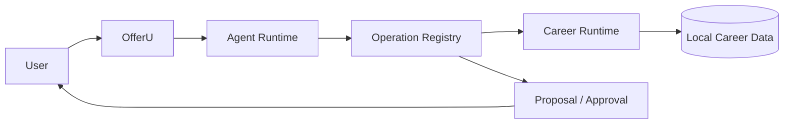

<p align="center">
  
</p>

<h1 align="center">OfferU</h1>

<p align="center">
  <strong>Your local-first AI Career OS.</strong><br/>
  Understand every job. Tailor every application. Learn from every interview.
</p>

<p align="center">
  <strong>English</strong> ·
  <a href="./README_ZH.md">简体中文</a> ·
  <a href="./QUICKSTART.md">Quickstart</a> ·
  <a href="./INTERNAL_BETA.md">Demo</a> ·
  <a href="./ARCHITECTURE.md">Architecture</a> ·
  <a href="./docs/README.md">Docs</a>
</p>

<p align="center">
  <em>Local-first · Evidence-driven · Human-controlled</em>
</p>

<p align="center">
  
</p>

<p align="center">
  <em>Internal Beta — source available, signed installer not yet released. See <a href="./STATUS.md">Status</a>.</em>
</p>

<table>
  <tr>
    <td width="50%"></td>
    <td width="50%"></td>
  </tr>
  <tr>
    <td align="center"><strong>Today: jobs, evidence and next actions</strong></td>
    <td align="center"><strong>Job detail: research, gaps, preparation</strong></td>
  </tr>
  <tr>
    <td width="50%"></td>
    <td width="50%"></td>
  </tr>
  <tr>
    <td align="center"><strong>Pipeline: stages, timeline, next action</strong></td>
    <td align="center"><strong>Resume: tailoring with evidence check</strong></td>
  </tr>
</table>

---

## Why OfferU?

Most job-search tools solve one step.

Your resume lives in one place. Job research lives in another. Application tracking becomes a spreadsheet.
Interview practice starts from zero every single time.

OfferU treats the whole search as one evolving system instead of four disconnected chores:

```text
Career Profile
      ↓
   Save Job
      ↓
Role Intelligence
      ↓
Evidence Gap
      ↓
Tailored Resume
      ↓
Application Pipeline
      ↓
Targeted Interview
      ↓
Debrief & Learning
      ↺
```

Instead of opening a fresh AI chat for every job, OfferU keeps one persistent, evidence-backed career
context and carries what it learns across the entire search.

### Persistent career context

OfferU maintains structured career evidence — experience, achievements, skills, preferences, goals and
reviewed learning observations.

AI suggestions never silently become career facts. New information enters a reviewable candidate flow
before it can update your long-term profile.

### Role Intelligence

OfferU does not only summarize a job description. It compares the target role against a cohort of
similar jobs, separates what is common from what is distinctive, and maps those signals against your
own evidence.

```text
What does this role emphasize?
           ×
What can I actually prove?
           ↓
What should I prepare next?
```

### Evidence-grounded resume tailoring

Every target job can have its own tailored resume without overwriting the source resume.

The Resume Workspace supports structured manual editing, live A4 / Letter preview, job-specific resume
versions, AI proposals with before / after diffs, accept / reject review, stale-proposal protection and
PDF export.

AI-generated claims are checked against career evidence before they become trusted application content.

### Application pipeline

Today, Pipeline, Job Detail and Timeline all read from the same underlying career state. Application
progress is modeled as **events** rather than independent UI state, so OfferU can project one truth
across the product instead of asking you to maintain several trackers.

### Targeted interview practice

Interview preparation is grounded in the intersection of role delta, career evidence gap and previous
interview learning:

```text
Role Delta
×
Career Evidence Gap
×
Previous Interview Learning
```

OfferU generates targeted focus areas, runs turn-based practice, challenges vague answers, produces
transcript-backed debriefs and turns useful observations into reviewable learning candidates.

### A controlled agent, not a black box

OfferU lets an AI agent reason and use tools, but the model never owns business truth.

```text
Agent Runtime
    ↓
Operation Registry
    ↓
Proposal / Approval
    ↓
Career Runtime
```

The agent reasons. The Operation Registry controls capabilities and side effects. The Career Runtime
owns persisted truth. You remain the approval authority for sensitive changes and irreversible actions.

---

## Product surfaces

| Surface      | Purpose                                                                                            |
| ------------ | -------------------------------------------------------------------------------------------------- |
| **Today**    | What changed, what OfferU finished, what needs your attention, and what matters next              |
| **Pipeline** | Every opportunity, application stage, timeline and next action                                     |
| **Job**      | Research, Role Intelligence, evidence gaps, resume, application packet and interview preparation    |
| **Profile**  | Long-term career evidence, goals, preferences and reviewed learning                                |

Memory is a mechanism for evolving Profile — not a separate product silo.
The Agent is a system-wide capability — not another disconnected chat window.

---

## AI setup

The product direction is **Connect → Auto → Ready**.

> **Beginner: connect an agent. Advanced: configure the stack.**

Normal users should not have to understand runtimes, protocol versions, model IDs or custom endpoints.
OfferU detects a local agent you already have, checks it, and consumes its own model and account:

```text
        OfferU

   AI Connection
        ↓
    Auto Detect
        ↓
┌───────┼───────┐
Codex  Claude  OpenCode
        ↓
   OfferU Skill
        ↓
   OfferU Bridge
        ↓
 Operation Registry
        ↓
   Career Runtime
```

If you already use **Codex** with your ChatGPT account, **Claude Code** with your Claude account, or
**OpenCode**, OfferU does not need an API key from you at all — the agent brings its own model and
authentication.

API configuration is the fallback for users with no local agent, self-hosting users, and advanced users
who deliberately want to configure the stack. It lives behind Advanced, where you get two protocols
rather than dozens of vendor presets:

- OpenAI-compatible endpoint
- Anthropic-compatible endpoint

Runtime diagnostics, experimental providers and provider health are advanced / developer surfaces.

---

## Architecture

OfferU is split into three authorities on purpose:



- **Reasoning authority** — replaceable agent runtimes plan, reason and choose capabilities.
- **Execution authority** — the Operation Registry validates schema, permissions, side effects, dry runs,
  proposals and audit.
- **Truth authority** — the Python Career Runtime owns Profile, Jobs, Applications, Resumes, Interviews,
  Memory and other persisted career state.

This is why the underlying agent harness can evolve without moving career truth into a model or an
external runtime. Every surface — GUI, CLI, TUI, skills and agent integrations — goes through the same
Operation Registry; none of them writes business state on its own.

See [ARCHITECTURE.md](./ARCHITECTURE.md) for the full boundaries and [CONTEXT.md](./CONTEXT.md) for
domain language and invariants.

---

## Current technology

```text
React / TypeScript   → product UI
Python / FastAPI     → career domain runtime, Operation Registry,
                       automation, persistence
Tauri / Rust         → desktop shell, process lifecycle, OS integration
Agent runtimes       → replaceable reasoning engines
SQLite               → local career data
```

OfferU intentionally does not duplicate business logic across UI, CLI, plugins and agent integrations.

---

## Safety principles

- AI output is not automatically career truth.
- Important mutations are reviewable and auditable.
- External irreversible actions require explicit user control.
- Browser automation may assist with forms but must not silently submit applications.
- Career evidence preserves provenance; behaviour signals and model inferences enter a review inbox first.
- Provider failures must be visible rather than silently returning fake success.
- API keys live in the OS keyring (Windows Credential Manager / macOS Keychain / Linux Secret Service);
  the config file keeps only a `credential_ref`. If the keyring is unavailable, saving fails loudly
  instead of falling back to plaintext.
- Credentials should stay out of model context, logs and version control.

See [SECURITY.md](./SECURITY.md) for the current security status.

---

## Getting started

OfferU is not yet published as a signed consumer installer. For source development and internal testing:

- [DEVELOPMENT.md](./DEVELOPMENT.md) — environment and dev setup
- [QUICKSTART.md](./QUICKSTART.md) — fastest local path
- [INTERNAL_BETA.md](./INTERNAL_BETA.md) — internal beta walkthrough and golden path

The intended public user path is:

```text
Download
→ Install
→ Launch
→ Connect your AI agent
→ Build Profile
→ Save a Job
→ Let OfferU prepare the rest
```

> If you find an `OfferU.exe` in the repository root, it is a legacy `0.1.0` binary, not the current
> release candidate. Do not run it. The web entrypoint is always `http://127.0.0.1:7410`;
> `8080` is only an optional local llama.cpp model endpoint.

---

## Release status

OfferU uses evidence-backed release gates rather than treating a successful build as production readiness.
Current status, validation evidence, known issues and quality scores live in:

- [STATUS.md](./STATUS.md)
- [RELEASE_CHECKLIST.md](./RELEASE_CHECKLIST.md)
- [QUALITY_SCORE.md](./QUALITY_SCORE.md)
- [KNOWN_ISSUES.md](./KNOWN_ISSUES.md)

Suggested developer checks:

```powershell
Set-Location backend
.\.venv312\Scripts\python.exe -m pytest tests -q

Set-Location ..\frontend
npm run typecheck
npm run build
```

These commands only validate their own scope; they do not mean "ready for beta" or "ready to release".

---

## Roadmap

Current priorities are productization, not more top-level features:

1. **Zero-friction AI setup** — connect once, detect capabilities, default to Auto.
2. **Live Role Intelligence** — validate at least one real external research path end to end.
3. **Public desktop release** — signed installer, clean-machine setup, migration, backup, restore, upgrade.
4. **Privacy & security hardening** — finish the remaining security and privacy gates.
5. **Real-user feedback** — use it in actual job searches and fix the highest-impact issues.

---

## Contributing

OfferU is moving quickly toward a public local-first release. Before contributing, read:

- [CONTEXT.md](./CONTEXT.md) — domain language and invariants
- [ARCHITECTURE.md](./ARCHITECTURE.md) — system boundaries
- [docs/adr/README.md](./docs/adr/README.md) — accepted architecture decisions
- [DEVELOPMENT.md](./DEVELOPMENT.md) — development setup

Please do not bypass the Operation Registry for business mutations, and do not introduce a second source
of career truth.

---

## License

[MIT](./LICENSE)
