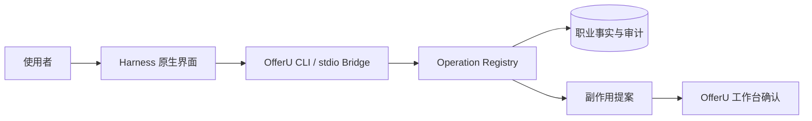

<p align="center">
  
</p>

<h1 align="center">OfferU</h1>

<p align="center">
  <strong>本地优先、证据驱动的 AI 求职操作台</strong><br />
  让你选择的 Coding Agent 负责思考和规划，让 OfferU 负责事实、权限、确认与审计。
</p>

<p align="center">
  <a href="./README_EN.md">English</a> ·
  <a href="./QUICKSTART.md">Quickstart</a> ·
  <a href="#cli-first-控制面">CLI-first</a> ·
  <a href="#架构方向">架构</a> ·
  <a href="./docs/README.md">设计文档</a>
</p>

> [!IMPORTANT]
> OfferU 目前是本地单人 Internal Beta 候选版本，核心 Replay/Fixture 路径、Windows 本地 bundle/lifecycle 和一组重复 E2E 已有当前证据；Public Release readiness 仍未通过，因为 signed installer、previous-release upgrade、clean-machine 独立验收、完整 security/privacy、长时 reliability 和 live Role Intelligence claim 仍未完成。当前不是公开发布版。它不是自动投递机器人，不会自动提交申请、发送邮件或联系第三方。Agent 的推断、材料和进展更新必须先成为候选或提案，再由使用者审核。

<table>
  <tr>
    <td width="50%"></td>
    <td width="50%"></td>
  </tr>
  <tr>
    <td align="center"><strong>Run、事件、权限与确认</strong></td>
    <td align="center"><strong>来源、未知项与候选结论审核</strong></td>
  </tr>
</table>

## OfferU 是什么

OfferU 把求职过程收敛成四个用户入口：

1. **Today**：当前行动、待确认信号、自动任务和下一步。
2. **Pipeline**：所有目标岗位、投递阶段、事件时间线和下一动作。
3. **Opportunity / Job**：岗位研究、证据缺口、材料候选和面试训练。
4. **Profile**：长期职业事实、证据、偏好、目标和待审核学习候选。

Memory 是 Profile 的演进机制；Agent 是全局能力；Role Intelligence、Resume、Application Packet 和 Interview 都属于 Job 上下文。

岗位材料从 Job Detail 进入 Resume Workspace：左侧编辑结构化内容，中间实时预览 A4/Letter，右侧审核 AI Proposal、样式和版本。原简历始终保留，岗位版本通过 `source_resume_id` / `target_job_id` 关联，Application Packet 引用当前 `ResumeVersion`。

SQLite 与领域服务保存正式事实；React/Tauri 工作台负责呈现和人类控制；所有自动化业务操作统一经过 Python Operation Registry。模型回答本身不是事实，也不是执行成功的证明。

## 架构方向

OfferU 正在从内置主 Agent 迁移为“操作台 + 外部 Harness 主脑”：



- **唯一主控 Loop 在外部 Harness**：规划、对话和工具循环由 Codex 等外部 Harness 宿主持有。
- **OfferU 是确定性控制面**：提供任务上下文、原子 Operation、权限、提案、确认、工件和审计。
- **CLI-first，不采用 MCP 业务接口**：目标 Bridge 是私有 stdio JSONL 协议；Harness 通过薄插件或 adapter 接入。
- **DeepSeek Harness 与 Codex 优先**：Codex 采用官方 App Server 边界。Claude Code、OpenCode 和 Pi 通过同一一致性契约后再标记支持。
- **确认权不交给模型**：Harness 原生审批只管理其文件或 shell 工具；OfferU 的业务副作用只能在工作台批准一次。

上面是已接受的架构边界。当前 Main Agent UI 通过 provider-neutral `AgentRuntimeProvider` 消费 Pi/Replay 等适配器；C1 全局控制面审计已证明正式业务 mutation 没有已知的 Route 级 Registry 旁路。旧 Pi Worker、CLI `confirm` 和实验性 MCP 仍属于迁移期/兼容表面，不能作为新的业务集成契约。Codex App Server 的结构适配与 fixture/replay 路径已有验证，但本机真实 Codex 仍受认证阻塞；真实 `job-search` Capability Plugin 已有 Manifest、Skill、CLI 和契约测试，live Role Intelligence 采集仍需单独验证。具体差距见[迁移路线](./docs/implementation/migration-roadmap.md)。

上游现状以官方资料为准：

- [Codex App Server](https://developers.openai.com/codex/app-server) 提供官方 stdio JSONL 深度集成边界；实验能力必须版本门控。

## 当前获取方式（仅源码开发）

Public 用户的最终路径只能是 Download → Verify publisher/checksum → Install → Launch → Onboarding。当前只有未签名的本地 Windows bundle evidence，尚无通过 Release Gate 的公开 installer；以下命令只用于源码开发，完整说明见 [DEVELOPMENT.md](./DEVELOPMENT.md)，不要把它当作普通用户安装流程。

注意：如果仓库根目录有 `OfferU.exe`，当前发现它是历史 `0.1.0` 二进制，不是当前 `0.4.0` Release Candidate；不要双击该文件。当前网页开发入口固定为 `http://127.0.0.1:7410`，`8080` 不是 OfferU 网页服务。

### 环境

当前主要开发环境是 Windows：

- Git
- Python 3.12
- Node.js 22.19 或更高版本，以及 npm
- Rust/Tauri toolchain（只在运行桌面壳时需要）

```powershell
git clone https://github.com/avabbbb/OfferU.git
Set-Location OfferU

py -3.12 -m venv backend\.venv312
backend\.venv312\Scripts\python.exe -m pip install --upgrade pip
backend\.venv312\Scripts\python.exe -m pip install -r backend\requirements.txt

npm --prefix agent-runtime ci
npm --prefix frontend ci

if (-not (Test-Path backend\.env)) {
  Copy-Item .env.example backend\.env
}
```

`backend/.env` 是本地配置，不应提交。当前设置页的模型连接还可能写入被忽略的本地 `backend/config.json`；不要把“未提交”误认为“已由系统钥匙串加密”，试用时优先使用可撤销的测试凭据。模型功能在 provider 未配置时应明确失败；不要把 API Key、简历正文或邮箱内容粘贴到公开 Agent 会话。

### 浏览器开发版

终端 A：

```powershell
backend\.venv312\Scripts\python.exe backend\run_server.py
```

终端 B：

```powershell
npm --prefix frontend run dev
```

打开 [http://127.0.0.1:7410](http://127.0.0.1:7410)。后端固定使用 `127.0.0.1:8765`。`8080` 不是 OfferU 网页地址，只是可选本地 llama.cpp Provider 接口；不要在浏览器中打开它。

若出现 `Failed to fetch` 或 CORS 错误，先检查 Windows 用户环境变量 `CORS_ORIGINS`。系统环境变量优先于 `backend/.env`，其中必须包含 `http://localhost:7410` 与 `http://127.0.0.1:7410`。

### 桌面开发版

安装 Rust/Tauri toolchain 后：

```powershell
npm --prefix frontend run tauri -- dev
```

桌面开发壳会启动自己的前端和后端；不要同时保留上一节的两个进程。

## CLI-first 控制面

当前代码的只读能力发现入口位于 `backend`：

```powershell
Set-Location backend

.\.venv312\Scripts\python.exe -m app.cli doctor --pretty
.\.venv312\Scripts\python.exe -m app.cli manifest --pretty
.\.venv312\Scripts\python.exe -m app.cli ops --pretty
.\.venv312\Scripts\python.exe -m app.cli schema list_jobs --pretty
.\.venv312\Scripts\python.exe -m app.cli run agent_playbook --arg detail=full --pretty
```

外部 Agent 必须先读取实时 manifest 与 schema，不能把某个版本的参数写死。当前 CLI 的 mutation/`confirm` 是迁移前表面：不要让模型自动调用确认，也不要据此实现新集成。目标 Harness 协议见 [Agent Bridge](./docs/architecture/agent-bridge-protocol.md)。

## 安全边界

- 仅支持本地单人版；不引入账号、多租户、计费或 SaaS 预埋。
- GUI、CLI、TUI、Skill 和 Harness 共用一个 Operation Registry。
- 职业事实必须有来源；行为信号和模型推断先进入候选/记忆收件箱。
- Mutation 先持久化提案，再由 OfferU 工作台独立批准；断连、过期或权限不明时失败关闭。
- Harness 文件工具仅可作用于当前 Run 工件区；工件经审核后才能进入正式业务状态。
- 浏览器扩展可以采集岗位和安全填表，但不得点击最终提交。
- 目标安全边界要求凭据不进入模型上下文、日志、SQLite 或版本库；在钥匙串存储和对应 Eval 完成前，不把当前实现描述为已加固。

发现安全问题时，请使用 GitHub 的私密安全报告渠道，不要在公开 Issue 中粘贴凭据或个人资料。

## Eval 与项目状态

OfferU 的发布结论由版本化任务、轨迹证据和真实 outcome 决定，不能由截图、构建成功或模型自评代替。

- 上一检查点：**Resume Workspace Beta Ready（Internal Beta / Replay / Fixture only）**
- 当前状态：**Public Release NOT READY**；完整 Gate 与证据分级见 [STATUS.md](./STATUS.md) 和 [RELEASE_CHECKLIST.md](./RELEASE_CHECKLIST.md)
- 核心套件：[offeru-core-v1](./docs/evals/offeru-core-v1.md)
- Eval 规则：[docs/evals/README.md](./docs/evals/README.md)

开发者建议检查命令：

```powershell
Set-Location backend
.\.venv312\Scripts\python.exe -m pytest tests -q

Set-Location ..\frontend
npm run typecheck
npm run build
```

这些命令只验证各自范围，不单独代表可内测或可发布。

## 文档

- [Public Quickstart（当前未发布）](./QUICKSTART.md)
- [源码开发说明](./DEVELOPMENT.md)
- [Internal Beta 验收与 Golden Path](./INTERNAL_BETA.md)
- [Public Release Goal](./GOAL.md)
- [Public Release Checklist](./RELEASE_CHECKLIST.md)
- [Quality Score](./QUALITY_SCORE.md)
- [当前验证状态](./STATUS.md)
- [已知限制](./KNOWN_ISSUES.md)
- [架构边界](./ARCHITECTURE.md)
- [文档导航与 10 份活跃设计](./docs/README.md)
- [领域词汇与不变量](./CONTEXT.md)
- [ADR 决策账本](./docs/adr/README.md)
- [外部 Harness 主控总览](./docs/architecture/agent-system.md)
- [Harness接入策略](./docs/architecture/harness-integrations.md)
- [纵向迁移路线](./docs/implementation/migration-roadmap.md)

仓库不再保存日期化的旧计划、审计和失效报告；Git 历史就是归档。新的长期决策进入 ADR 账本，现行细节直接更新对应主题文档。

## License

[MIT](./LICENSE)
