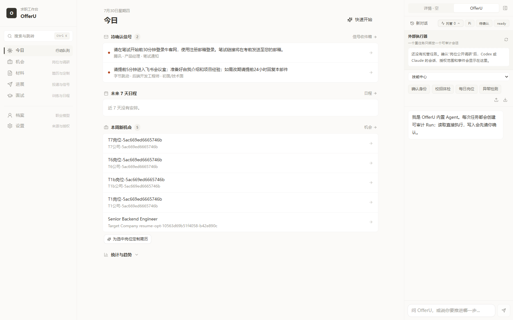
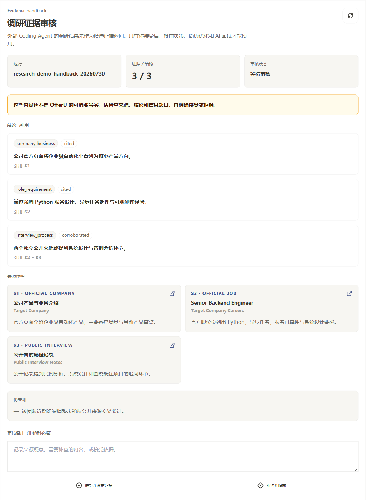

<p align="center">
  
</p>

<h1 align="center">OfferU</h1>

<p align="center">
  <strong>本地优先、证据驱动、Eval-first 的 AI 求职工作台</strong><br />
  用同一份职业事实连接岗位判断、研究、材料提案、投递进展、面试训练与可审计 Agent。
</p>

<p align="center">
  <a href="https://github.com/avabbbb/OfferU/stargazers"></a>
  <a href="https://github.com/avabbbb/OfferU/issues"></a>
  
  
  
</p>

<p align="center">
  <a href="./README_EN.md">English</a> ·
  <a href="#当前状态">当前状态</a> ·
  <a href="#普通用户核心闭环">核心闭环</a> ·
  <a href="#快速开始">快速开始</a> ·
  <a href="#eval-first-开发">Eval</a> ·
  <a href="./docs/evals/deepseek-deep-test-prompt.md">DeepSeek 深测</a>
</p>

> [!IMPORTANT]
> OfferU 目前是本地单人内部 Alpha，不是 SaaS。系统不会自动提交申请、发送邮件或联系第三方；Agent 产出先是候选或提案，只有经过事实门和使用者确认后才能改变正式求职状态。

<table>
  <tr>
    <td width="50%"></td>
    <td width="50%"></td>
  </tr>
  <tr>
    <td align="center"><strong>任务内 Agent Run、事件与确认</strong></td>
    <td align="center"><strong>候选结论、来源与未知项审核</strong></td>
  </tr>
</table>

## 从这里开始

| 你的目标 | 建议入口 |
|---|---|
| 先理解 OfferU 为谁解决什么问题 | [普通用户核心闭环](#普通用户核心闭环) 与 [`CONTEXT.md`](./CONTEXT.md) |
| 在本机启动产品 | [快速开始](#快速开始) |
| 了解 Agent、Registry 与安全边界 | [`Agent System`](./docs/architecture/agent-system.md) |
| 参与开发或判断架构决策 | [`docs/README.md`](./docs/README.md) 与最新 accepted ADR |
| 把完整测试任务交给 DeepSeek | [`DeepSeek 深度测试提示词`](./docs/evals/deepseek-deep-test-prompt.md) |

## 当前状态

> [!NOTE]
> `internal alpha` 只描述开发阶段，不代表核心能力已经通过正式验收。OfferU 目前仍没有一份符合 [`offeru-core-v1`](./docs/evals/offeru-core-v1.md) 的有效 baseline。

| 证据账本 | 当前结论 |
|---|---|
| 当前有效 baseline | 尚无；没有报告可以作为当前版本的正式通过证据 |
| 本轮验证状态 | 仅重构文档，未运行测试、构建或外部 Agent，因此没有新增产品通过结论 |
| 下一次证明方式 | 由使用者在准备好后，手动把[完整深测提示词](./docs/evals/deepseek-deep-test-prompt.md)交给新的 DeepSeek 会话；项目不会自动启动外部 Agent |

因此，本 README 只陈述证据等级，不用“功能已实现”推导“用户可用”，也不把截图、旧报告或单次测试当作发布证明。

状态含义：`PROVEN` = 有当前有效 Eval 证据；`PARTIAL` = 有实现或局部证据，但尚未满足完整验收规则；`UNPROVEN` = 尚未真实执行到可判定程度；`BLOCKED` = 环境或依赖阻止验证。

| 评估对象 | 当前证据状态 | 要达到 PROVEN 还缺什么 |
|---|---|---|
| Operation / Skill 控制面 | `PARTIAL` | 对 live manifest 的 schema、dry-run、proposal/confirm 和入口一致性做机器验收 |
| 内置主 Agent | `PARTIAL` | 三次独立验证上下文、路由、工具参数、失败状态和最终 outcome |
| 前端工程入口 | `UNPROVEN` | 候选语法修复后重新取得 typecheck=0、build=0 的新证据 |
| 普通用户求职闭环 | `UNPROVEN` | 在隔离数据上完成岗位 → 决策 → 材料 → 投递进展的真实用户旅程 |
| 安全与人工控制 | `PARTIAL` | 证明无 Registry 绕过、无静默成功、无提示注入越权和无凭据泄漏 |
| DeepSeek/研究/邮件等真实集成 | `UNPROVEN` | 使用当次真实 provider、授权数据和可追溯 trace 完成对应集成任务 |
| 内测/发布就绪度 | `UNPROVEN` | 所有 `required` 任务实际通过，且被声称可用的集成均有真实证据 |

历史内测评估已经移入 [`docs/evals/reports`](./docs/evals/reports/README.md) 并标记为 pre-eval；其中问题是首轮复现候选，不代表当前版本仍有或已经修复。

## 普通用户核心闭环

OfferU 要让用户不必理解 Agent、Operation 或工作流术语，也能完成这条路径：

```text
选中当前岗位
  → 问“这个岗位值得投吗？”
  → 系统自动使用已确认职业档案和当前 JD
  → 给出带证据、未知项和风险的投前判断
  → 用户确认投 / 有条件投 / 不投
  → 只基于已验证事实生成定制材料提案
  → 用户审核后受控填表，绝不自动提交
  → 跟踪一次申请尝试及阶段事件
  → 邮件信号先成为候选进展，确认后更新状态
```

这条链路是产品的 Golden Path，也是 `offeru-core-v1` 的核心。后续优先级由它的真实失败决定，而不是继续堆功能页。

## 为什么是“证据驱动”

- 职业经历、能力和偏好只有在来源可追溯并经用户确认后才是正式事实。
- 岗位研究逐条保留来源、时间和未知项；外部文本默认不可信。
- 简历、求职信、决策和进展先是可审核 candidate/proposal。
- 面试反馈和 Agent 推断是学习观察，不能直接改写职业事实。
- LLM、写入和外部动作经过统一 Registry、授权、确认和审计边界。

## Agent 系统

```text
React/Vite/Tauri UI ──> Python Agent Run Host ──> Pi SDK Worker
        │                         │                       │
        │                         └──── scoped tools ─────┘
        │                                      │
External IDE/CLI Agent ──> Skill + Machine CLI │
                                               ↓
                                      Operation Registry
                                               ↓
                          schema → auth → proposal → confirm
                                               ↓
                                    Python/SQLite facts
```

- **Python 是唯一业务后端**：档案、岗位、材料、申请、面试和审计事实都归 Python/SQL 管理。
- **Pi SDK 是内置 Agent runtime**：负责会话 loop、模型协议、工具调用和流式事件，不持有业务写权限。
- **外部 Coding Agent 是可替换宿主**：先读取实时 contract，再通过机器 CLI/MCP 调用原子 Operation。
- **托管重任务是受限执行会话**：provider adapter 只返回 candidate 和证据，不能直接成为职业事实。
- **DeepSeek Eval Agent 是测试执行者**：它可运行仓库测试并写报告；当 DeepSeek 也是被测 provider 时，不能担任唯一 grader。

完整边界见 [`Agent System`](./docs/architecture/agent-system.md)。

## 快速开始

### 环境要求

- Windows（当前主要开发环境）
- Python 3.12
- Node.js 与 npm
- Rust/Tauri toolchain（只在运行桌面壳时需要）

### 1. 后端

在仓库根目录运行：

```powershell
python -m venv backend/.venv312
backend\.venv312\Scripts\python.exe -m pip install -r backend\requirements.txt
Copy-Item .env.example backend\.env
backend\.venv312\Scripts\python.exe backend\run_server.py
```

按需在 `backend/.env` 或设置页配置 provider；不要提交 API Key。

### 2. 前端

新终端中运行：

```powershell
npm --prefix frontend ci
npm --prefix frontend run dev
```

打开 `http://localhost:7410`。开发端口固定为 `7410`：若修改，必须同步 `frontend/package.json` 的 `dev/start` 与 `frontend/src-tauri/tauri.conf.json` 的 `devUrl`；`frontendDist` 必须继续指向 `../dist`。

### 3. 读取实时 Agent contract

```powershell
Set-Location backend
.\.venv312\Scripts\python.exe -m app.cli doctor --pretty
.\.venv312\Scripts\python.exe -m app.cli manifest --pretty
.\.venv312\Scripts\python.exe -m app.cli ops --pretty
.\.venv312\Scripts\python.exe -m app.cli schema <operation_name> --pretty
```

不要依赖 README 中会漂移的 Operation 数量、Skill 数量、provider 或模型名。

## Eval-first 开发

任何“可用”“Agent 完整”“适合内测”的结论都必须经过：

```text
真实用户任务 → fixtures → 1/3 次 trials → trajectory + outcome graders
              → Eval 报告 → 人工复核 → 下一工程决策
```

入口：

- [`Eval 方法与验收规则`](./docs/evals/README.md)
- [`OfferU Core v1：24 个任务`](./docs/evals/offeru-core-v1.md)
- [`可直接粘贴给 DeepSeek 的完整深测提示词`](./docs/evals/deepseek-deep-test-prompt.md)
- [`DeepSeek IDE/CLI 实测手册`](./docs/evals/deepseek-runbook.md)
- [`机器可读报告 Schema`](./docs/evals/report-schema.json)
- [`报告目录`](./docs/evals/reports/README.md)

测试由使用者显式启动，不由 OfferU 或 Codex 自动调用 DeepSeek。报告返回后，决策顺序固定为：报告完整性 → 关键安全与控制失败 → 静默失败/错误状态 → 阻断 Golden Path 的必测任务 → 已获授权的真实集成 → 主观质量优化。

## 文档与仓库结构

```text
OFFERU/
├─ backend/                  FastAPI、领域服务、Registry、Agent Run Host
├─ frontend/                 React + Vite + Tauri
├─ agent-runtime/            Pi SDK worker/runtime bridge
├─ docs/
│  ├─ README.md              文档事实入口
│  ├─ architecture/          当前架构合同
│  ├─ adr/                   保留历史的架构决策
│  ├─ evals/                 prompt、suite、runbook、schema、reports
│  ├─ agents/                Issue/triage/domain 协作规则
│  ├─ design/                机器可读设计资产
│  └─ archive/               过时计划、审计与研究稿
├─ CONTEXT.md                领域语言与产品边界
└─ AGENTS.md                 Agent 开发约束
```

从 [`docs/README.md`](./docs/README.md) 进入完整文档；归档内容不证明当前能力。

## Eval 驱动 Roadmap

1. 继续完善文档、fixtures 与隔离条件；由使用者决定何时手动启动新一轮 DeepSeek 深测。
2. 主 Agent 先验证报告 schema、脱敏和证据，再复核真实 trace/outcome。
3. 让本地 Golden Path 在三个独立 trials 中稳定通过。
4. 按“关键安全与控制 → 静默失败 → 核心旅程”一次只修一个纵向切片，并固化为 regression task。
5. 最后分别验证研究、材料、邮件等真实集成，再讨论新增能力和 UI 优化。

## License

[MIT](./LICENSE)
