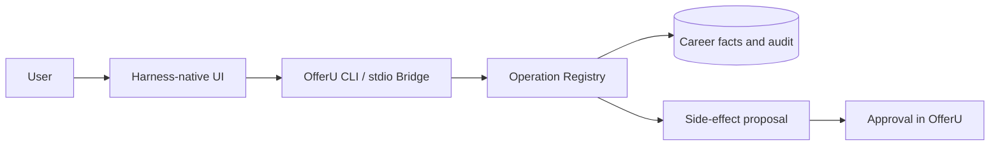

<p align="center">
  
</p>

<h1 align="center">OfferU</h1>

<p align="center">
  <strong>A local-first, evidence-driven AI career operations console</strong><br />
  Your chosen coding agent thinks and plans; OfferU owns facts, permissions, approvals, and audit.
</p>

<p align="center">
  <a href="./README.md">中文</a> ·
  <a href="#quick-start">Quick start</a> ·
  <a href="#cli-first-control-surface">CLI-first</a> ·
  <a href="#architecture-direction">Architecture</a> ·
  <a href="./docs/README.md">Design docs</a>
</p>

> [!IMPORTANT]
> OfferU is a local, single-user internal alpha with no valid formal Eval baseline yet. It is not an autonomous application bot: it does not submit applications, send email, or contact third parties automatically. Agent inferences, materials, and progress updates must first become reviewable candidates or proposals.

<table>
  <tr>
    <td width="50%"></td>
    <td width="50%"></td>
  </tr>
  <tr>
    <td align="center"><strong>Runs, events, grants, and approvals</strong></td>
    <td align="center"><strong>Sources, unknowns, and candidate findings</strong></td>
  </tr>
</table>

## What OfferU is

OfferU organizes the job search into five connected stages:

1. **Today**: next actions, signals awaiting review, and active Agent Runs.
2. **Opportunities**: job capture, JD review, company research, and pre-application decisions.
3. **Materials**: confirmed career facts, a base resume, and job-specific proposals.
4. **Progress**: individual application attempts, stage events, email signals, and follow-ups.
5. **Interviews**: question preparation, turn-based practice, and explainable learning observations.

SQLite and domain services own formal facts. The React/Tauri workbench presents them and gives the human control. Every automated business action goes through the Python Operation Registry. A model response is neither a career fact nor proof that an action succeeded.

## Architecture direction

OfferU is migrating from an embedded main agent to a “console + external harness brain” architecture:



- **The external harness owns the only main loop.** DeepSeek Harness, Codex, and other hosts own reasoning, conversation, planning, and their tool loop.
- **OfferU is the deterministic control plane.** It provides scoped context, atomic Operations, grants, proposals, approvals, artifacts, and audit.
- **CLI-first; no MCP business interface.** The target Bridge is a private stdio JSONL protocol, wrapped by a thin harness plugin or adapter.
- **DeepSeek Harness and Codex come first.** DSH Web is the first interaction surface; Codex uses the official App Server boundary. Claude Code, OpenCode, and Pi become supported only after passing the same conformance contract.
- **The model never owns business approval.** Harness-native approval governs its file or shell tools only. An OfferU side effect can be approved once, independently, in the OfferU workbench.

This is the accepted **target architecture**, not a completion claim. The repository still contains the Pi worker, the legacy CLI `confirm` surface, an experimental MCP module, and other migration-era entry points; none is a surface for new integrations. The DSH plugin, Codex adapter, and new Bridge have not yet passed an end-to-end vertical-slice acceptance. See the [migration roadmap](./docs/implementation/migration-roadmap.md).

For current upstream boundaries, use the official sources:

- [DeepSeek Harness](https://github.com/deepseek-ai/deepseek-harness) is still a Developer Preview, so the adapter must pin and probe compatible capabilities.
- [Codex App Server](https://developers.openai.com/codex/app-server) is the official stdio JSONL integration boundary; experimental capabilities must be version-gated.

## Quick start

### Requirements

The primary development environment is Windows:

- Git
- Python 3.12
- Node.js 22.19 or later, plus npm
- Rust/Tauri toolchain, only for the desktop shell

```powershell
git clone https://github.com/avabbbb/OfferU.git
Set-Location OfferU

py -3.12 -m venv backend\.venv312
backend\.venv312\Scripts\python.exe -m pip install --upgrade pip
backend\.venv312\Scripts\python.exe -m pip install -r backend\requirements.txt

npm --prefix agent-runtime ci
npm --prefix frontend ci

if (-not (Test-Path backend\.env)) {
  Copy-Item .env.example backend\.env
}
```

`backend/.env` is local configuration and must not be committed. Model connections from the current Settings UI may still be written to the ignored local `backend/config.json`; “not committed” does not mean “encrypted in the OS keychain,” so prefer revocable test credentials. Model-dependent features should fail explicitly when no provider is configured. Never paste API keys, resume contents, or email into a public agent session.

### Browser development mode

Terminal A:

```powershell
backend\.venv312\Scripts\python.exe backend\run_server.py
```

Terminal B:

```powershell
npm --prefix frontend run dev
```

Open [http://localhost:7410](http://localhost:7410). The backend uses `127.0.0.1:8765`.

If the browser reports `Failed to fetch` or a CORS error, inspect the Windows user environment variable `CORS_ORIGINS` first. System environment variables override `backend/.env`; the value must include `http://localhost:7410` and `http://127.0.0.1:7410`.

### Desktop development mode

After installing the Rust/Tauri toolchain:

```powershell
npm --prefix frontend run tauri -- dev
```

The desktop development shell starts its own frontend and backend. Stop the two browser-mode processes first to avoid port conflicts.

## CLI-first control surface

The current read-only discovery surface lives under `backend`:

```powershell
Set-Location backend

.\.venv312\Scripts\python.exe -m app.cli doctor --pretty
.\.venv312\Scripts\python.exe -m app.cli manifest --pretty
.\.venv312\Scripts\python.exe -m app.cli ops --pretty
.\.venv312\Scripts\python.exe -m app.cli schema list_jobs --pretty
.\.venv312\Scripts\python.exe -m app.cli run agent_playbook --arg detail=full --pretty
```

An external agent must discover the live manifest and schemas instead of hard-coding one release's arguments. The current mutation/`confirm` CLI is a pre-migration surface: do not let a model automate confirmation or use it as the basis for a new integration. See the target [Agent Bridge protocol](./docs/architecture/agent-bridge-protocol.md).

## Safety boundaries

- Local single-user only; no accounts, tenancy, billing, or speculative SaaS layer.
- GUI, CLI, TUI, Skills, and harness adapters share one Operation Registry.
- Career facts require sources; behavioral signals and model inferences enter review queues first.
- A mutation persists a proposal, then needs independent approval in OfferU. Disconnects, expiry, or ambiguous authority fail closed.
- Harness file tools are confined to the current Run artifact directory. Artifacts remain candidates until reviewed.
- The browser extension may capture jobs and fill safe fields, but it must never click final submit.
- The target boundary keeps credentials out of model context, logs, SQLite, and version control. Do not describe the current build as hardened until keychain storage and its Evals pass.

Use GitHub's private security reporting channel for vulnerabilities. Do not paste credentials or personal records into a public Issue.

## Evals and project status

Release claims require versioned tasks, trajectory evidence, and real outcomes. Screenshots, a successful build, or model self-assessment are not enough.

- Current status: **internal alpha**
- Current baseline: **not established**
- Core suite: [offeru-core-v1](./docs/evals/offeru-core-v1.md)
- Eval rules: [docs/evals/README.md](./docs/evals/README.md)

Suggested developer checks:

```powershell
Set-Location backend
.\.venv312\Scripts\python.exe -m pytest tests -q

Set-Location ..\frontend
npm run typecheck
npm run build
```

Each command validates only its own layer; none is a standalone beta or release verdict.

## Documentation

- [Documentation map and ten active designs](./docs/README.md)
- [Domain language and invariants](./CONTEXT.md)
- [Consolidated ADR ledger](./docs/adr/README.md)
- [External-harness agent architecture](./docs/architecture/agent-system.md)
- [DSH, Codex, and other harness integrations](./docs/architecture/harness-integrations.md)
- [Vertical migration roadmap](./docs/implementation/migration-roadmap.md)

The repository no longer keeps dated obsolete plans, audits, or invalid reports. Git history is the archive. Durable decisions go into the ADR ledger; current detail is edited in the relevant topic document.

## License

[MIT](./LICENSE)
