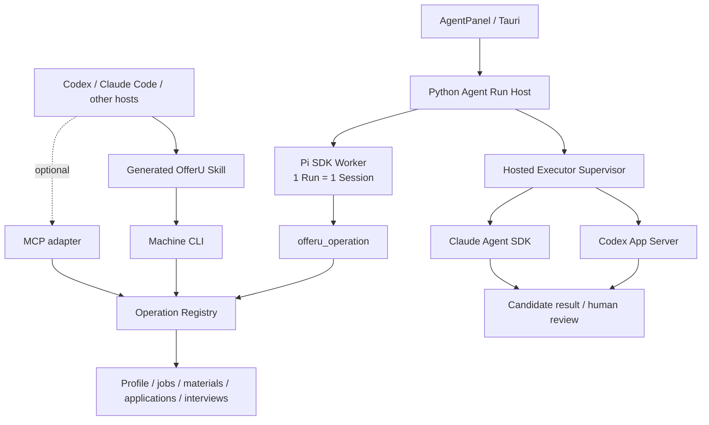

<p align="center">
  
</p>

<h1 align="center">OfferU</h1>

<p align="center">
  <strong>A local-first, evidence-driven AI job-search workbench</strong><br />
  One set of career facts connecting job research, material proposals, application progress, interview practice, and auditable Agents.
</p>

<p align="center">
  <a href="https://github.com/avabbbb/OfferU/stargazers"></a>
  <a href="https://github.com/avabbbb/OfferU/forks"></a>
  <a href="https://github.com/avabbbb/OfferU/issues"></a>
  <a href="https://github.com/avabbbb/OfferU/releases"></a>
  
</p>

<p align="center">
  
  
  
  
  
</p>

<p align="center">
  <a href="./README.md">中文</a> ·
  <a href="#current-release">Current release</a> ·
  <a href="#agent-system">Agent system</a> ·
  <a href="#quick-start">Quick start</a> ·
  <a href="#roadmap">Roadmap</a>
</p>

> [!IMPORTANT]
> OfferU is currently a local, single-user POC—not a SaaS product. It never submits applications, sends email, or contacts third parties automatically. AI output begins as a proposal or candidate signal and may change formal job-search facts only after evidence gates and user confirmation.

<table>
  <tr>
    <td width="50%"></td>
    <td width="50%"></td>
  </tr>
  <tr>
    <td align="center"><strong>Task-bound Agent Runs, events, and confirmation</strong></td>
    <td align="center"><strong>Candidate claims, sources, and gap review</strong></td>
  </tr>
</table>

## OfferU in one minute

A job search is an evolving evidence chain, not a one-shot generation task:

```text
Confirmed career facts
        ↓
Job and company evidence
        ↓
Reviewable material proposals
        ↓
Application attempts and stage events
        ↓
Interview practice and learning observations
        ↓
User-confirmed career-model updates
```

OfferU reuses the same facts across stages while placing data access, model calls, writes, and external actions behind explicit confirmation and audit contracts. It is neither a generic Agent wrapped around a database nor a tool that ends after generating one résumé.

## Current release

Evidence baseline: **2026-07-30**.

| Capability | Current state | Boundary |
|---|---|---|
| Today, opportunities, materials, progress, interviews | Usable / converging | Organized around job-search stages, not technical modules |
| Job collection, triage, and research | Usable / partial loop | Public and user-authorized sources remain separate; research is reviewed as a candidate |
| Career profile and long-term learning | Usable / partial loop | Inference and learning observations cannot become career facts directly |
| Résumés, cover letters, and PDF | Usable / partial loop | PDF/DOCX files become page-linked candidates with quality diagnostics; only confirmed items create résumé sections |
| Application table, email, and calendar signals | Usable / partial loop | External messages become candidate progress until the user confirms a stage change |
| Interview library, simulation, and delivery feedback | Usable / partial loop | Content scoring remains separate from observable delivery; no personality or hiring inference |
| Built-in main Agent | Pi SDK main path connected | AgentPanel → Python Run Host → restricted Pi Session → Operation Registry |
| External coding agents | Native hosting and evidence handback implemented | Codex / Claude are replaceable heavy-task executors, not a second business backend |
| Tauri frontend | Migrated to a Vite static SPA | Fixed dev port 3300; releases embed `dist` and do not start Next.js |

Discover live Operations, Skills, and confirmation boundaries from the machine CLI instead of relying on numbers that will drift:

```powershell
Set-Location backend
python -m app.cli doctor --pretty
python -m app.cli manifest --pretty
```

## Agent system

Yes: **Pi SDK is the runtime foundation of OfferU's built-in Agent Core**. Pi owns AgentSession, provider adaptation, context compaction, typed tools, Sessions, and lifecycle streaming. Python remains the only business backend and owns Skills, Operations, permissions, confirmation, audit, idempotency, and career-fact gates.



The two paths share a control plane while retaining their native runtimes:

| Path | Purpose | Implemented | Main gaps |
|---|---|---|---|
| Built-in Pi main Agent | In-product conversation, Skill selection, and Operation loop | Task-bound Runs, restricted Sessions, streaming events, SSE reconnect, proposal/confirm, cancel, and resume | Strict schemas for remaining Operations, lost-Session decisions, more failure drills |
| External coding agents | Let Codex, Claude, and other hosts control OfferU or run deep research | Skill + CLI/MCP, multi-host projection, native Codex/Claude adapters, task sessions, normalized events, evidence review | General file-artifact handback, multi-version and healthy-upstream live acceptance |

Key safety boundaries:

- Pi's built-in shell, file-write, and generic coding tools are disabled in OfferU Runs; only `offeru_operation` is exposed.
- Public-research tasks hosted by Codex or Claude receive no database, arbitrary shell, or OfferU business-write authority.
- GUI, the built-in Agent, CLI, MCP, and external hosts all pass through one Operation Registry.
- Side effects persist a proposal before a separate confirmation executes it once; failures stay visible and never degrade silently.

See [Agent System](./docs/architecture/agent-system.md), [CareerOps alignment](./docs/architecture/career-ops-alignment.md), and the [runtime acceptance snapshot](./docs/architecture/runtime-acceptance-2026-07-30.md).

## Quick start

### Requirements

- Python 3.12
- Node.js 22.19+
- npm
- A usable LLM API key or local Ollama
- Tesseract `chi_sim` + `eng` (optional; needed only for image-only scanned PDFs and included in the backend Docker image)
- Docker Desktop (optional)

### Local development

```powershell
git clone https://github.com/avabbbb/OfferU.git
Set-Location OfferU

# Pi SDK and Claude hosted worker
npm --prefix agent-runtime ci --ignore-scripts

# Python business backend
python -m venv backend/.venv312
backend/.venv312/Scripts/Activate.ps1
python -m pip install -r backend/requirements.txt
Copy-Item .env.example backend/.env
python backend/run_server.py

# In another terminal: Vite frontend
npm --prefix frontend ci
npm --prefix frontend run dev
```

Open:

- WebUI: <http://localhost:3300>
- API docs: <http://localhost:8000/docs>

The Windows frontend development port is fixed at `3300`. A port change must update both `frontend/package.json` and `frontend/src-tauri/tauri.conf.json`; `frontendDist` must continue to point at `../dist`. See [ADR 0047](./docs/adr/0047-use-vite-static-spa-for-tauri-frontend.md).

Text-layer PDFs and DOCX files do not need OCR. Image-only PDFs require [Tesseract](https://tesseract-ocr.github.io/tessdoc/Installation.html) with the `chi_sim` and `eng` trained data; use `tesseract --list-langs` to inspect the installation. Parse responses and the import review UI expose OCR configuration, per-page methods, quality, and low-quality pages instead of reporting false success.

### Docker development stack

```powershell
Copy-Item .env.example .env
docker compose up -d
```

| Service | Address |
|---|---|
| WebUI | <http://localhost:3011> |
| Backend API | <http://localhost:9000> |
| API docs | <http://localhost:9000/docs> |

Docker Compose currently covers PostgreSQL, FastAPI, and the Vite WebUI. Use the local development path above for Pi/Claude local workers and Tauri packaging.

### Control OfferU from an external Agent

Run from `backend/`:

```powershell
python -m app.cli manifest --pretty
python -m app.cli ops --pretty
python -m app.cli schema prepare_resume_optimization --pretty
python -m app.cli run list_jobs --arg page_size=5 --pretty

# A side-effect command only creates a proposal
python -m app.cli run start_job_research --arg job_id=1 --pretty
# Execute only after explicit confirmation
python -m app.cli confirm <run_id> --action <action_id> --pretty
```

External hosts use the generated OfferU entry under `.agents`, `.claude`, `.codex`, or `.copilot`. Do not call internal HTTP directly, write the database, or hide multi-step business behavior in shell scripts.

`inspect_resume_document` gives external hosts and the embedded Pi Agent the same PDF/DOCX parser. It is a confirmation-required sensitive local-read Operation, accepts files up to 10 MB, returns text and diagnostics without writing profile facts, and redacts both the local path and résumé text from Operation audit records.

MCP is disabled by default. In a trusted local environment only, set `OFFERU_ENABLE_MCP=true` in `backend/.env`; the endpoint is `http://127.0.0.1:8000/mcp`.

## Data, safety, and metrics

- The local single-user edition uses SQLite; Docker integration can use PostgreSQL.
- API keys and OAuth / IMAP credentials must never enter Git and should use the OS keychain.
- Résumés, email excerpts, and interview transcripts require provider- and data-category consent before cloud model access.
- Résumé imports first produce candidates; only user-selected items become Resume sections and they do not automatically become career-profile facts.
- Raw camera video is neither uploaded nor persisted; only explicitly authorized derived delivery events are retained.
- Stars, forks, issues, and release downloads at the top come from dynamic GitHub / Shields data.
- `README views` counts badge requests, not GitHub-verified unique visitors or users.
- OfferU uploads no usage telemetry by default. Any future anonymous remote telemetry requires a separate ADR, explicit opt-in, and a field allowlist.

## Repository map

```text
OfferU/
├── agent-runtime/              # Pi SDK Worker + Claude hosted worker
├── backend/
│   ├── app/ops.py              # sole Operation Registry
│   ├── app/cli.py              # machine CLI
│   ├── app/mcp_server.py       # optional thin MCP adapter
│   └── app/services/           # Agent Hosts, Guardian, domain services
├── frontend/
│   ├── src/vite/               # SPA routes and page-level lazy loading
│   ├── src/app/                # reused React feature pages
│   └── src-tauri/              # Tauri desktop shell
├── docs/
│   ├── architecture/           # current architecture and dated acceptance
│   ├── adr/                    # accepted architecture decisions
│   └── README.md               # documentation source-of-truth order
├── asset/screenshots/          # README screenshots
├── CONTEXT.md                  # domain language and product boundary
└── docker-compose.yml
```

Dependency directories, virtual environments, build output, and local research drafts are not repository architecture and must not be treated as sources of truth.

## Roadmap

1. Give every remaining Operation a strict JSON Schema input contract.
2. Add general file-artifact handback and human review for hosted executors.
3. Complete multi-version Codex / Claude cancel, resume, and failure acceptance against healthy upstreams.
4. Close job research → résumé proposal → user adoption, and email signal → candidate progress → user confirmation.
5. Establish desktop Releases, release notes, and privacy-safe local runtime metrics.

Start with [docs/README.md](./docs/README.md). [CONTEXT.md](./CONTEXT.md) and the latest [accepted ADRs](./docs/adr/) govern current boundaries.

## References and license

- [CareerOps](https://github.com/santifer/career-ops): external coding-agent / CLI-first interaction reference
- [Pi SDK](https://pi.dev/docs/latest/sdk): built-in Agent runtime scaffolding
- [Codex App Server](https://developers.openai.com/codex/app-server/): native Codex hosting protocol
- [Claude Agent SDK](https://platform.claude.com/docs/en/agent-sdk/overview): native Claude hosting SDK
- [Tauri frontend configuration](https://v2.tauri.app/start/frontend/) and [Vite](https://vite.dev/guide/)
- [Model Context Protocol](https://modelcontextprotocol.io/docs/learn/architecture)
- [Agent Skills specification](https://agentskills.io/specification)

OfferU is licensed under the [MIT License](./LICENSE). Reproducible bug reports and tightly scoped proposals are welcome in [GitHub Issues](https://github.com/avabbbb/OfferU/issues).
