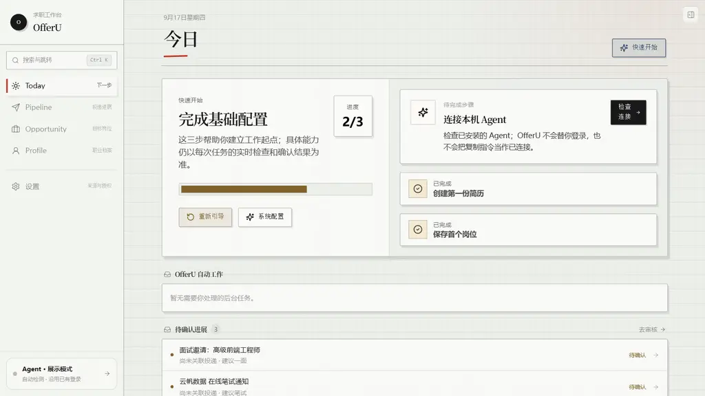
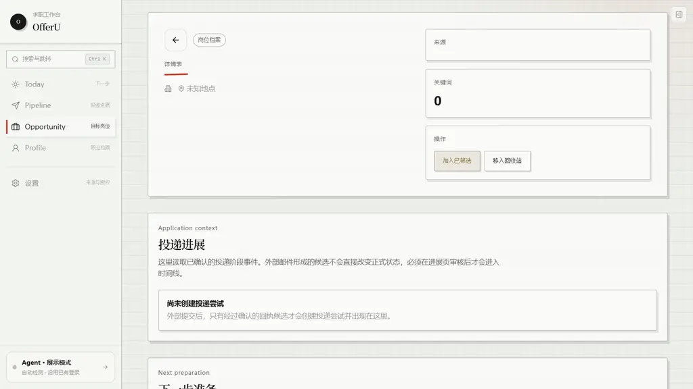
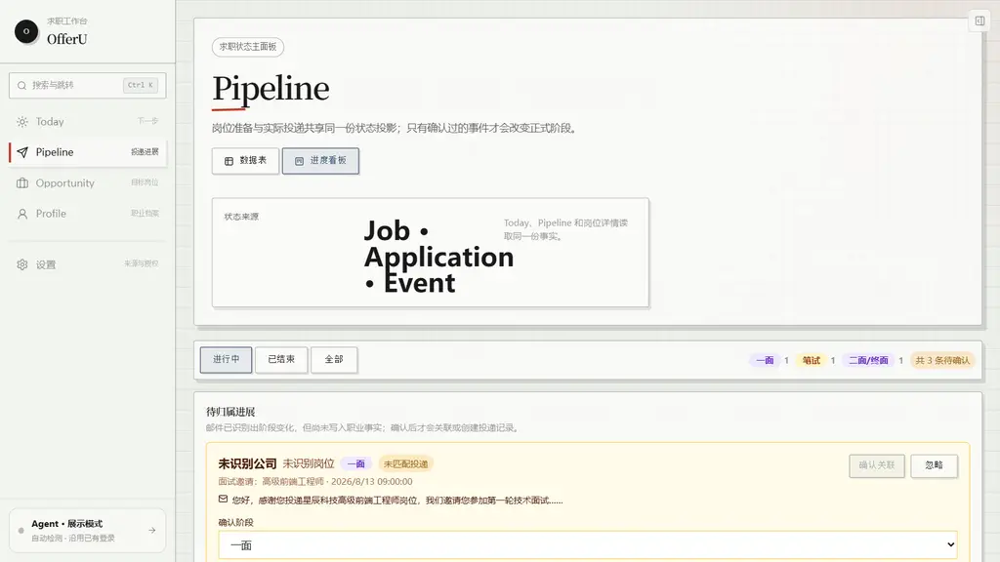
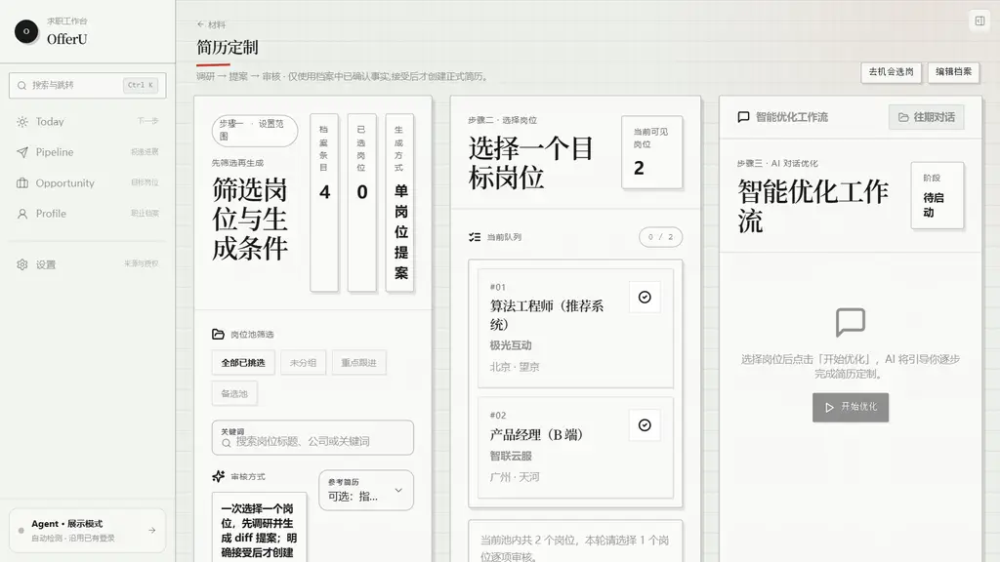
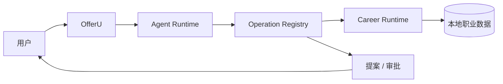

<p align="center">
  
</p>

<h1 align="center">OfferU</h1>

<p align="center">
  <strong>一个会持续理解你、自动维护求职流程的本地 AI Career OS</strong><br/>
  保存一个目标岗位，OfferU 围绕你的真实经历完成岗位研究、针对性材料准备、投递管理和面试训练。
</p>

<p align="center">
  <a href="./README.md">English</a> ·
  <strong>简体中文</strong> ·
  <a href="./QUICKSTART.md">快速开始</a> ·
  <a href="./INTERNAL_BETA.md">内测验收</a> ·
  <a href="./ARCHITECTURE.md">架构</a> ·
  <a href="./docs/README.md">文档</a>
</p>

<p align="center">
  <em>本地优先 · 证据驱动 · 人类可控</em>
</p>

<p align="center">
  
</p>

<p align="center">
  <em>Internal Beta —— 源码可用，签名安装包尚未发布。详见 <a href="./STATUS.md">Status</a>。</em>
</p>

<table>
  <tr>
    <td width="50%"></td>
    <td width="50%"></td>
  </tr>
  <tr>
    <td align="center"><strong>工作台：岗位、证据与下一步</strong></td>
    <td align="center"><strong>岗位详情：研究、缺口与准备</strong></td>
  </tr>
  <tr>
    <td width="50%"></td>
    <td width="50%"></td>
  </tr>
  <tr>
    <td align="center"><strong>Pipeline：阶段、时间线与下一动作</strong></td>
    <td align="center"><strong>简历：基于证据的定制</strong></td>
  </tr>
</table>

---

## 为什么是 OfferU

多数求职工具只解决其中一步：简历在一个地方，岗位研究在另一个地方，投递记录变成一张 Excel，
面试准备每次都从零开始。

OfferU 把整段求职当成一套持续演进的系统，而不是四件互不相关的杂事：

```text
职业档案
   ↓
保存岗位
   ↓
岗位理解（Role Intelligence）
   ↓
证据缺口
   ↓
定制简历
   ↓
投递 Pipeline
   ↓
针对性面试
   ↓
复盘与学习
   ↺
```

你不需要为每一个岗位都新开一个 AI 对话。OfferU 保留一份持续积累、有证据支撑的职业上下文，
并把它学到的东西带到后续每一次申请里。

### 持续积累的职业上下文

OfferU 维护结构化的职业证据：经历、成果、技能、偏好、目标和已审核的学习观察。

AI 的建议不会悄悄变成职业事实。新信息必须先进入可审核的候选流，才能更新你的长期档案。

### 岗位理解（Role Intelligence）

OfferU 不只是总结 JD。它把目标岗位和一批相似岗位做对比，区分"这个岗位普遍要求什么"和
"这个岗位特别看重什么"，再把这些信号映射回你自己的证据。

```text
这个岗位看重什么？
      ×
我实际上能证明什么？
      ↓
我下一步该准备什么？
```

### 有证据支撑的简历定制

每个目标岗位都可以有自己的定制简历，且不会覆盖原始简历。

Resume Workspace 支持结构化手工编辑、A4 / Letter 实时预览、按岗位分版本、带前后对比的
AI 提案、接受/拒绝审核、过期提案保护和 PDF 导出。

AI 生成的说法在成为可信的申请材料之前，会先和职业证据做核对。

### 投递 Pipeline

Today、Pipeline、Job Detail 和 Timeline 读的是同一份底层职业状态。投递进展被建模成**事件**
而不是各自独立的 UI 状态，所以 OfferU 能在整个产品里投射同一个事实，不需要你同时维护好几张表。

### 针对性面试训练

面试准备建立在"岗位差异 × 证据缺口 × 历史面试学习"的交集上：

```text
岗位差异
×
职业证据缺口
×
既往面试学习
```

OfferU 会生成针对性的面试重点，进行多轮对话训练，追问含糊的回答，产出基于转写的复盘，
并把有价值的观察变成可审核的学习候选。

### 受控的 Agent，不是黑盒

OfferU 允许 AI Agent 推理和使用工具，但模型不掌握业务事实。

```text
Agent Runtime
    ↓
Operation Registry
    ↓
提案 / 审批
    ↓
Career Runtime
```

Agent 负责推理；Operation Registry 负责控制能力与副作用；Career Runtime 负责持有持久化事实。
敏感变更和不可逆动作的最终批准权始终在你手里。

---

## 产品入口

| 入口          | 作用                                                     |
| ------------- | -------------------------------------------------------- |
| **Today**     | 发生了什么变化、OfferU 完成了什么、需要你关注什么、下一步做什么 |
| **Pipeline**  | 所有机会、投递阶段、时间线和下一动作                     |
| **Job**       | 岗位研究、岗位理解、证据缺口、简历、申请材料和面试准备   |
| **Profile**   | 长期职业证据、目标、偏好和已审核的学习内容               |

Memory 是 Profile 的演进机制，不是独立的产品孤岛。
Agent 是全局能力，不是又一个割裂的聊天窗口。

---

## AI 连接

产品方向是 **连接 → 自动 → 就绪**。

> **小白：连接一个 Agent。进阶：配置技术栈。**

普通用户不需要理解 Runtime、协议版本、模型 ID 或自定义端点。OfferU 会检测你本机已有的 Agent、
完成检查，然后直接使用它自己的模型和账号：

```text
        OfferU

   AI 连接层
      ↓
    自动检测
      ↓
┌─────┼─────┐
Codex  Claude  OpenCode
      ↓
  OfferU Skill
      ↓
  OfferU Bridge
      ↓
 Operation Registry
      ↓
   Career Runtime
```

如果你已经在用登录了 ChatGPT 账号的 **Codex**、登录了 Claude 账号的 **Claude Code**，或者
**OpenCode**，OfferU 根本不需要你填 API Key —— Agent 自带模型和认证。

API 配置属于"没有本地 Agent / 自托管 / 高级用户"的兜底路径，收在高级设置里，并且只提供两种
协议而不是几十个厂商预设：

- OpenAI 兼容端点
- Anthropic 兼容端点

Runtime 诊断、实验性 Provider 和 Provider Health 都属于高级/开发者界面。

---

## 架构

OfferU 刻意把系统拆成三个权威：



- **推理权威** —— 可替换的 Agent Runtime 负责规划、推理和选择能力。
- **执行权威** —— Operation Registry 负责校验 schema、权限、副作用、dry run、提案和审计。
- **事实权威** —— Python Career Runtime 持有 Profile、Jobs、Applications、Resumes、Interviews、
  Memory 等持久化职业状态。

这也是为什么底层 Agent Harness 可以持续演进，而职业事实始终不会被搬进模型或外部 Runtime。
GUI、CLI、TUI、Skill 和 Agent 集成共用同一个 Operation Registry，没有任何一个入口能自己写业务状态。

完整边界见 [ARCHITECTURE.md](./ARCHITECTURE.md)，领域词汇与不变量见 [CONTEXT.md](./CONTEXT.md)。

---

## 当前技术栈

```text
React / TypeScript   → 产品界面
Python / FastAPI     → 职业领域运行时、Operation Registry、
                       自动化与持久化
Tauri / Rust         → 桌面外壳、进程生命周期、系统集成
Agent Runtime        → 可替换的推理引擎
SQLite               → 本地职业数据
```

OfferU 刻意不在 UI、CLI、插件和 Agent 集成之间复制业务逻辑。

---

## 安全原则

- AI 输出不会自动成为职业事实。
- 重要变更可审核、可追溯。
- 对外部的不可逆动作必须显式由你控制。
- 浏览器自动化可以辅助填表，但绝不能静默提交申请。
- 职业证据保留来源；行为信号与模型推断先进入审核收件箱。
- Provider 失败必须可见，不允许用"假成功"掩盖。
- API Key 只存系统钥匙串（Windows 凭据管理器 / macOS 钥匙串 / Linux Secret Service），
  配置文件只保留 `credential_ref`；钥匙串不可用时保存直接失败，不回退为明文。
- 凭据不进入模型上下文、日志和版本库。

当前安全状态见 [SECURITY.md](./SECURITY.md)。

---

## 开始使用

OfferU 还没有对外发布签名安装包。源码开发与内测请看：

- [DEVELOPMENT.md](./DEVELOPMENT.md) —— 环境与开发启动
- [QUICKSTART.md](./QUICKSTART.md) —— 最快的本地路径
- [INTERNAL_BETA.md](./INTERNAL_BETA.md) —— 内测验收与 Golden Path

面向普通用户的最终路径是：

```text
下载
→ 安装
→ 启动
→ 连接你的 AI Agent
→ 建立职业档案
→ 保存一个岗位
→ 剩下的交给 OfferU 准备
```

> 如果仓库根目录存在 `OfferU.exe`，那是历史 `0.1.0` 二进制，不是当前 Release Candidate，不要运行。
> 网页入口始终是 `http://127.0.0.1:7410`；`8080` 只是可选的本地 llama.cpp 模型端点。

---

## 发布状态

OfferU 用证据驱动的发布 Gate 判断能否发布，构建成功不等于可以发布。当前状态、验证证据、
已知问题和质量评分见：

- [STATUS.md](./STATUS.md)
- [RELEASE_CHECKLIST.md](./RELEASE_CHECKLIST.md)
- [QUALITY_SCORE.md](./QUALITY_SCORE.md)
- [KNOWN_ISSUES.md](./KNOWN_ISSUES.md)

开发者建议检查命令：

```powershell
Set-Location backend
.\.venv312\Scripts\python.exe -m pytest tests -q

Set-Location ..\frontend
npm run typecheck
npm run build
```

这些命令只验证各自范围，不代表"可内测"或"可发布"。

---

## 路线图

当前优先级是产品化，而不是继续堆顶层功能：

1. **零摩擦 AI 接入** —— 连接一次，自动检测能力，默认 Auto。
2. **真实可用的 Role Intelligence** —— 至少打通一条真实的外部研究链路。
3. **公开桌面版发布** —— 签名安装包、clean-machine 安装、迁移、备份、恢复与升级验证。
4. **隐私与安全加固** —— 完成剩余的安全与隐私 Gate。
5. **真实用户反馈** —— 在真实求职流程中使用，修掉影响最大的问题。

---

## 参与贡献

OfferU 正在快速走向公开的本地优先版本。贡献前请先读：

- [CONTEXT.md](./CONTEXT.md) —— 领域词汇与不变量
- [ARCHITECTURE.md](./ARCHITECTURE.md) —— 系统边界
- [docs/adr/README.md](./docs/adr/README.md) —— 已接受的架构决策
- [DEVELOPMENT.md](./DEVELOPMENT.md) —— 开发设置

请不要绕过 Operation Registry 直接做业务变更，也不要引入第二个职业事实来源。

---

## License

[MIT](./LICENSE)
