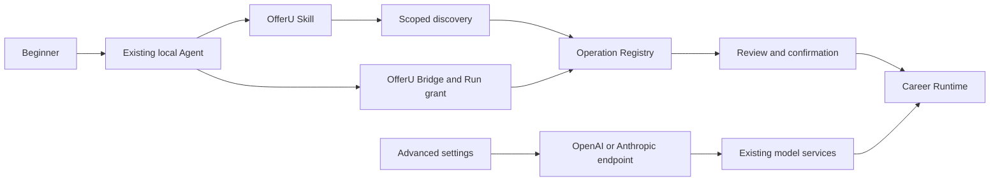

# OfferU product and architecture simplification

Date: 2026-09-14. Status: S1-S4 source implementation and offline regression complete; Codex Agent connection acceptance passed on 2026-09-16.

## Authorized direction

Keep existing career capabilities and the Operation Registry. Make the beginner path an existing local Agent plus the OfferU Skill. Prefer Codex, then Claude Code and OpenCode. Other adapters and the embedded workbench remain available through advanced controls. Beginners do not configure a model endpoint. Advanced users configure OpenAI-compatible or Anthropic-compatible endpoints without a vendor/model preset catalogue.

The user explicitly requested Luna for implementation after analysis. Execute one vertical slice at a time. The primary agent reviews each result and owns the quantitative audit and final acceptance. The original request included tests and isolated managed Chromium headless E2E. The latest AGENTS instructions supplied on continuation explicitly prohibit executing tests/builds: subsequent slices write tests and list commands, but do not run them. Earlier validation evidence is historical, not acceptance of later edits.

## Verified baseline

- `backend/app/cli.py:_commands`: 8 CLI verbs, unchanged by this work.
- Static AST inventory of `backend/app/ops.py`: 257 Operation declarations, 88 read-only and 169 with side effects, across 18 groups. Confirm against the runtime registry when measuring schema size.
- 28 operations import their implementation from `legacy_operations`. This is provenance, not proof that they are unused. Some current application-table, calendar and resume-template UI routes depend on them.
- CLI manifest defaults to every complete Operation schema. `--summary` and `--group` already exist but generated Skill instructions lead with the unbounded manifest.
- The Bridge's actual read grant contains 14 operations. A declaration for one mutation exists, but read-only checks prevent its invocation. Do not enlarge this grant during a discovery cleanup.
- Both Settings and Onboarding contain independent `FALLBACK_PROVIDER_PRESETS`, including model IDs and Base URLs. `llm_presets.py` and `agents/llm.py` also duplicate provider defaults.
- Onboarding has four steps and a full API form in step 1. The reusable `AgentConnectionPanel` already exists in Settings and the global shell.
- Connection checks distinguish installation, native authentication and live inference. Codex has a no-model `account/read` probe. Other adapters must not be labelled ready merely because their executable exists.
- `_view` can overwrite a persisted blocked status with older conformance success. Fix this precedence before simplifying the status text.
- Config models contain `api_format`, but the runtime explicitly rejects formats other than OpenAI. An Anthropic dropdown alone would be false support.
- `routes/config.py:_normalize_llm_state` reconstructs each `LlmApiConfig` from only older fields, discarding `api_format`, `models`, JSON capability and headers. S2 must preserve these fields through normalization and masked edits.
- `credential_store.py` already uses the OS keyring for account secrets. LLM config persistence still writes raw keys through `save_llm_config_file`; scraper cookies have a separate config read path.
- `JOB_SAVED` dispatches Role Intelligence through `auto`; a local Agent handshake alone does not prove public-web research or every background model feature is available.
- Existing uncommitted changes in `backend/scripts/live_eval`, `backend/tests/evals`, `deliverables` and `docs/evals` belong to the user and must be preserved.

## Architecture to preserve

Discovery filters are not authorization. Registry confirmation, Bridge grants, data permissions, audit and career-fact review remain authoritative. No second Agent loop, registry, generic shell tool or automatic provider failover is introduced.

## Sequential Luna implementation slices

### S1: Beginner connection and truthful status

Allowed files: `frontend/src/components/onboarding/OnboardingWizard.tsx`, `frontend/src/components/workbench/AgentConnectionPanel.tsx`, `frontend/src/app/settings/page.tsx`, `frontend/src/lib/api.ts`, `backend/app/services/agent_connection.py`, `backend/tests/test_agent_connection.py`.

The primary agent additionally assigns `frontend/src/components/onboarding/OnboardingChecklist.tsx` and `frontend/src/lib/useOnboarding.ts` to S1: Today still requires a vendor API key after the wizard, so its checklist must use the same connection state and guide the user to save a job rather than requiring scraper credentials.

Reuse the existing connection panel in onboarding; remove its duplicated API form/catalogue and unnecessary API-save requirement, retaining all Profile/import and job-start behavior. Move Settings model endpoints and technical details behind an initially closed advanced disclosure; preserve their edit/save behavior until S2. Remove Settings' fallback catalogue and consume the backend response with a visible failure state. Put beginner/recommended metadata on the backend connection view; render only the three beginner choices initially. Keep additional installed adapters and capability diagnostics discoverable under advanced. Give missing Agents official guidance and re-detection. A copied prompt is not a verified integration. Never promote persisted blocked/auth failure/unavailable state to ready from older conformance evidence.

Acceptance: connection tests, frontend typecheck, empty/no-Agent/auth-blocked/stale status and advanced expansion browser scenarios. No automatic login or writes to native Agent credential directories.

### S2: Two endpoint protocols through one catalogue

Allowed files: `backend/app/llm_presets.py`, `backend/app/agents/llm.py`, `backend/app/llm_config_store.py`, `backend/app/routes/config.py`, `backend/requirements.txt`, directly related LLM/config tests, `frontend/src/app/settings/page.tsx`.

Expose exactly two endpoint protocol templates from the backend; allow a custom service name, URL and model ID, without vendor or model lists. Persist `api_format` on edits and round trips. Implement Anthropic text, streaming and connection testing with the official Python SDK; do not build a proxy protocol translator or a new reasoning loop. Validate failure, malformed/empty response, timeout and unavailable credentials. Preserve existing explicitly configured model IDs and endpoints. Existing custom OpenAI-compatible connections remain usable. Preserve the current HTTP/proxy boundary.

Acceptance: existing BYOK tests plus actual protocol-shaped mock transports for both formats, streaming cleanup and failed connection tests; frontend advanced form typecheck.

Preserve explicit existing connections. The old per-vendor environment lookup may retain a small backend-only URL map until that input is retired, but it must use one authority and must not reintroduce selectable vendor/model presets. No model ID is automatically replaced by a new default. Remove unused duplicate tier/default maps after checking callers. `api_format` is a validated `openai | anthropic` protocol choice independent of the custom `provider_id` slug.

### S3: Credentials at the OS boundary

Allowed files: `backend/app/services/credential_store.py`, `backend/app/llm_config_store.py`, `backend/app/routes/config.py`, `backend/app/agents/llm.py`, `backend/app/services/runtime_credentials.py`, directly related secret/config tests, relevant security documentation.

Reuse the keyring service. Persist references and nonsensitive connection metadata, resolve secrets only at their runtime use, and mask all outward projections. Config writes must fail visibly if secure storage is unavailable. Handle existing secrets only on an explicitly requested config save using store-before-replace semantics; preserve the original file if storage fails. Do not rewrite native Agent authentication/proxy settings or silently migrate actual user secrets during validation. Test with an isolated fake keyring and canaries, never the user's vault. Audit sensitive default headers and scraper-cookie paths as well as API keys.

Acceptance: no canary in config, response, diagnostics or exported data; restart resolution; preservation on vault/write failure; masked-value edit preservation.

### S4: Progressive capability discovery

Allowed files: `backend/app/cli.py`, `backend/app/services/agent_skill_projections.py`, generated OfferU Skill projections owned by that generator, directly related CLI/Skill tests; a small dedicated discovery module only if the existing CLI cannot express the policy simply.

Default manifest returns capability groups and compact Skill metadata, not all schemas. `ops` without a selector returns a small discovery Skill surface. `--skill` and existing `--group` return compact operation summaries; `schema` fetches one full schema. Add an explicit `--all` developer escape hatch for complete audit inventory. Unknown group/Skill must return an error rather than silently expand or appear valid. Keep all 257 registered operations and UI routes. Skills must discover live scope and must not ask the model to approve its own proposal. Existing confirmation enforcement remains unchanged.

Acceptance: exact counts and serialized bytes before/after; selector contracts; generated projection consistency; all current workflow Operations remain registered; Bridge grants remain unchanged.

### S5: Product documentation and acceptance

Allowed files: `README.md` (English primary), `README_ZH.md` (Chinese), `QUICKSTART.md`, this report, a dedicated operation inventory report, and directly related acceptance scripts under `backend/scripts/e2e`. `README_EN.md` was removed once `README.md` became the English primary entrypoint.

Make English the product-first root README and provide current Chinese documentation. Keep an accurate old-English link if referenced elsewhere. State actual release readiness and distinguish setup verification, live model execution and research capability. Do not claim a signed release or complete automation from a connection check. Provide an inventory of every Operation with primary classification, owner, known static caller evidence, effects, default visibility and keep/isolate rationale. Static string references are evidence, not runtime call frequency or permission proof.

Run targeted backend tests, frontend typecheck/build, architecture audit and isolated headless browser acceptance. Tests, logs, caches, profiles, databases and screenshots use `H:\tmp\offeru`; webpage/API are exactly `127.0.0.1:7410` / `127.0.0.1:8766`. Check service ownership/readiness before navigation. Use synthetic career data and report any live-provider limitation honestly. Do not edit release verdicts to pass missing external gates.

## External implementation evidence

Official sources checked on 2026-09-14:

- [Codex Skills](https://learn.chatgpt.com/docs/build-skills): native skill loading and progressive instructions.
- [Claude Code Skills](https://code.claude.com/docs/en/skills): a Skill body loads when used; personal/project scope is explicit.
- [OpenCode Skills](https://opencode.ai/docs/skills/): native Skill discovery, supporting the same thin-integration direction.
- [Anthropic Python SDK](https://platform.claude.com/docs/en/cli-sdks-libraries/sdks/python): asynchronous messages and stream helpers; use the SDK rather than translating protocols manually.
- [CC Switch](https://github.com/farion1231/cc-switch): configuration-management reference; OfferU does not need its vendor catalogue or global provider switching.
- [WorkBuddy](https://www.workbuddy.cn/docs/workbuddy/Overview): product reference only, not evidence that its integration contract can replace OfferU's current adapters.

## Completion evidence

Incomplete. Never equate an installed CLI, a local handshake, a copied Skill instruction, and a completed career task.

### Continuation audit: 2026-09-15

The workspace advanced externally through commits `c753c46`, `38e2474`, and `bf85034`. Do not duplicate or revert their onboarding, Settings, or vault work. README English/Chinese changes and evaluation files are also existing work to preserve.

Luna reports S1 complete: backend-driven beginner/recommended metadata, removed onboarding API form and duplicate fallback catalogues, collapsed advanced controls, truthful connection-state priority, and a connection-based Today checklist. Its historical validation reports 16 backend tests plus 5 subtests passed and frontend typecheck passed. No browser acceptance has been performed. Review found a missing dependency on the checklist's error/stale/offline flags; a follow-up repair is assigned. S2 is assigned to the same Luna worker; the parent retains analysis/review ownership.

S3 must now harden the existing `llm_secret_vault.py`, not introduce another vault. Static review identifies these unresolved risks (no real config or vault was exercised):

- `_dehydrate_config_item` treats an empty key with an existing reference as deletion. `read_key` returns an empty string on any read failure. A reference-only or temporarily unreadable configuration must not become a credential deletion merely because another setting is saved; explicit clear and failed resolution need distinct semantics.
- Vault writes/deletions occur before atomic config replacement. Reusing a live reference or deleting it before `os.replace` succeeds can change the effective credentials despite a failed save. Tests must cover both vault failure and file-replacement failure with a fake vault.
- `_load_config` currently migrates plaintext at module import and catches all failures before falling back to settings. This conflicts with the planned explicit-save migration boundary and can hide valid connection metadata on failure. Preserve user data; never exercise this path against the real workspace during development.
- Backend-wide write/read/delete probing uses one fixed reference. It does not prove that each configured credential can be read, and concurrent checks can collide. Read failures need accurate, sanitized per-connection feedback rather than only a healthy generic probe.
- `keyring` selection alone does not establish OS-native secure storage. The library supports alternate backends, including plaintext implementations; select or validate the permitted platform backend before claiming an OS-vault guarantee. See [keyring documentation](https://keyring.readthedocs.io/en/stable/).
- API-key extraction does not yet cover sensitive `default_headers`, cookies, or all export/redaction paths. These remain audit items, not completed security guarantees.
- `discover_local_engines` in `llm_config_store.py` writes the entire loaded config through `save_llm_config_file` without dehydration. Secret extraction should be enforced at the common persistence boundary, not left to each route/import/discovery caller. Do not naively add a second dehydration pass while empty-key/reference semantics still mean deletion.

The data-safety archive builder copies the database, uploads, and managed artifacts, not `config.json` or `.env`. This limits one direct export path but is not proof that database audit rows or uploaded user files contain no secrets.

The S2 normalization fix must retain `credential_ref` along with protocol and model metadata. S3 follows sequentially after S2 review, with explicit file ownership and fake-vault tests. No real credential migration, deletion, or native Agent authentication changes are authorized as development verification.

S2's first draft did not pass review: runtime protocol validation still rejected Anthropic, editing a custom connection discarded protocol/credential metadata, and the OpenAI probe accepted arbitrary HTTP 200 JSON. The new test also imported the config route before isolating its import-time side effects. All are returned to Luna for correction; the draft is not evidence of usable Anthropic support.

The current beginner path deliberately copies a Skill-reading instruction into the user's existing Agent. The connection response checks that the repository Skill file exists but does not install it into native global directories or prove the Agent read it. The UI's context-sync acknowledgment is not a Skill-installation acknowledgment. Automatic Skill installation plus end-to-end Agent readback remains an unmet original completion criterion unless the user accepts the explicitly lighter entry path; a clarification was sent without blocking already authorized implementation.

### Acceptance ledger

| Measure / gate | Baseline | Current evidence | Status |
| --- | --- | --- | --- |
| CLI verbs | 8 | CLI unchanged | Preserved |
| Registered Operations | 257 | Registry source unchanged by S1/S2 | Runtime recount pending |
| Default full operation schemas | 257 | 0 schemas; 35 compact Skill cards | Source complete; runtime measurement pending |
| Legacy implementation Operations | 28 | No removal; current callers preserved | Isolation policy pending S4 |
| Frontend fallback provider catalogues | 2 | Onboarding removed; Settings uses backend response | Source reviewed |
| User-visible endpoint templates | 11 backend vendor presets | 2 backend protocol templates | S2 under review |
| Duplicate runtime URL/tier catalogues | Runtime maps duplicate preset module | Runtime now delegates to preset module | Source reviewed; backend legacy table retained |
| Beginner API-key prerequisite | Wizard plus Today checklist | Local-Agent connection path | Source reviewed; no browser evidence |
| Skill installed / Agent readback | Not established | Copy instruction only | Not established |
| Credential preservation on vault/disk failure | Not established | Atomic save and fake-vault regression tests written | Source complete; tests not run |
| Backend tests / frontend typecheck | Historical S1 result | No post-S1 execution under latest instructions | Not verified |
| Browser E2E / live job automation | Not executed | No user-data writes or browser sessions | Not verified |

### Source completion update: 2026-09-15

The user authorized the primary agent to finish after Luna execution repeatedly stalled. The source now implements the agreed progressive-disclosure and credential boundaries without removing product capabilities:

- CLI remains 8 verbs and the registry remains 257 Operations by source inventory. Default `manifest` returns **0 Operation schemas** and **35 compact Skill cards**; `manifest --skill` returns only that Skill's compact Operation summaries, `schema` returns one full schema, and `manifest --all` preserves the complete audit escape hatch.
- All five checked-in Agent projections, including `.claude/agents/offeru-operator.md`, are generated from the same Skill Registry. Startup no longer requests the giant `agent_playbook`, and external Agents are instructed to leave proposals for review inside OfferU rather than confirming their own work.
- The 28 legacy implementations remain registered and reachable by their current product routes, but none enter the default manifest. Bridge grants are untouched.
- Shared config persistence dehydrates API keys, custom connection headers, and BOSS/智联 cookies before atomic replacement. Disk stores only owned references or explicit `env:VAR` references. Replacement refs are unique; failed writes delete only refs created by that attempt; successful rotation deletes only prior OfferU refs present in the replaced config.
- Vault reads restore secrets only in process memory. Missing configured refs produce a sanitized `vault_status` error. The health probe uses a unique owned ref, and plaintext/null/third-party keyring backends are rejected in favor of the platform-native Windows, macOS, or Linux backends.
- Tests were added for selector conflicts and unknown selectors, compact manifests, generated projection drift, vault failure rollback, reference-only preservation, header/cookie dehydration, runtime cookie hydration, ref rotation, read-error visibility, and native-backend validation. They were deliberately not executed.

| Measure | Before | Source after | Runtime proof |
| --- | ---: | ---: | --- |
| Top-level CLI verbs | 8 | 8 | Recount not run |
| Registered Operations | 257 | 257, registry declarations unchanged | Recount not run |
| Operation schemas in default Agent startup manifest | 257 | 0 | Serializer measurement not run |
| Compact Skill cards in default manifest | 0 | 35 by current registry source | Recount not run |
| Legacy implementations | 28 | 28, excluded from default startup | Route regression not run |
| Bridge read grants | 14 | 14, bridge code unchanged | Conformance not run |
| User-visible endpoint templates | 11 vendor presets | 2 protocols | Browser evidence not run |
| Raw LLM keys in config persistence | Allowed | Rejected/dehydrated | Fake-vault tests written, not run |
| Raw custom headers in config persistence | Allowed | Rejected/dehydrated | Fake-vault tests written, not run |
| Raw scraper cookies in config persistence | Allowed | Rejected/dehydrated | Fake-vault tests written, not run |

The remaining original gap is not hidden: onboarding provides the existing-Agent plus OfferU Skill path, but no runtime evidence proves automatic native Skill installation/update or that Codex, Claude Code, or OpenCode actually read the Skill. Managed-Chromium onboarding and failure-path E2E, live Agent conformance, architecture audit, backend tests, frontend typecheck/build, and product-regression workflows remain acceptance work for the user-requested validation phase.

S2 source changes now cover both SDK execution paths, shared HTTP settings, text-response checks, streaming cleanup, the two-template editor, metadata-preserving edits, and reference-only/keyless configuration retention. The old pruning call was a concrete data-loss bug: a configured credential reference was discarded because no plaintext key was present. Explicit empty connection lists also no longer regenerate legacy connections. Transport and normalization regression tests have been written, including early stream closure, but have not been executed under the latest instructions. S3a is assigned to Luna for immutable credential references and the common atomic-save boundary.

The existing README already describes the two-protocol direction and OS keyring storage. Do not use that prose as proof that the implementation or secure-backend checks pass. Preserve the user's README edits and report any mismatch explicitly.

### S3 implementation constraints

Use immutable, uniquely generated references for replacement credentials. Reuse an existing reference only when its stored value is unchanged; never overwrite or delete an existing user reference before config replacement succeeds. A missing runtime key with a retained reference means unresolved/unchanged, not an explicit delete. Cleanup may remove only references created by the current failed save. Keeping an unreferenced old credential is preferable to destructive implicit cleanup; no global vault sweep is part of this task.

Enforce dehydration once in the shared `save_llm_config_file` boundary, using a copy of the input and recording the newly created references for failure cleanup. Remove duplicate caller-side dehydration. Config load must remain read-only; migration happens on an explicit save. Preserve referenced connection metadata when the vault is locked and expose sanitized read errors in `vault_status`.

Store connection headers and additional parameters together with the connection credential so arbitrary authentication header names cannot leak into config. A top-level reference map may cover existing legacy API-key fields and scraper-cookie fields; it is storage metadata, not a new credential service. Native Agent authentication remains outside this boundary. Verify the selected keyring is an allowed OS backend, and use a unique owned reference for an explicit write/read probe.

The full baseline inventory and exact schema/token measurements are in [Operation inventory](2026-09-14-operation-inventory.md). All 28 legacy implementations have current route references. `routes/agent.py` still contains a giant inline tool prompt, but `main.py` mounts `main_agent.router`, not that old chat router; retain it as an explicitly isolated historical surface during this round. MCP is optional and disabled by default; its full catalog is a developer surface, not the beginner Skill contract.

The fixed 7410/8766 services were already running before this task (PIDs 11880 and 6128 at inspection). They are not owned by the agent and must not be stopped or used for synthetic business writes. Browser setup acceptance should route API requests to an in-process isolated ASGI app or explicit response fixtures; state exactly which evidence uses each. Reuse the live frontend only after readiness verification. This keeps the required origins and preserves the real workspace.

## Agent connection acceptance update: 2026-09-16

The user explicitly moved this work from source completion into runtime acceptance and authorized the tests that earlier instructions had deferred. The older no-test statements above remain historical context and are superseded by the evidence in this section.

### Implemented connection lifecycle

- `AgentIntegrationManager` now owns provider-neutral inspect, install, update, repair and probe behavior. Codex, OpenCode and Claude Code path/invocation differences stay in adapters.
- Beginner UI actions execute `connect_agent_integration` through the Operation Registry. Normal setup no longer asks the user to copy a Skill or terminal command. The panel presents Agent detected, Skill installed/current, safe readback, and current-context sync as separate steps.
- Installed Skill state uses exact generated content, version and SHA-256. Unknown files require an explicit repair action; symlink destinations are rejected. Update writes a real file atomically rather than relying on a symlink.
- Codex verification asks app-server `skills/list` with a forced refresh in an isolated H-drive workspace. Only a returned, enabled `offeru` entry at the expected global path advances to `DISCOVERED`.
- The Codex turn receives the discovered Skill as a structured `skill` input. Its temporary thread disables inherited plugins/apps, omits the general Skill catalogue and disables inherited MCP servers without changing the user's config. The probe remains read-only with `approvalPolicy=never`.
- The nonce is provider-bound, valid for at most five minutes and deleted on first successful read. `VERIFIED` additionally requires an exact nonce in the final response and an app-server dynamic-tool event proving execution of `get_agent_connection_nonce` through the Operation Registry. The probe does not depend on shell access.
- OpenCode discovery runs `opencode debug skill --pure` in an isolated H-drive workspace and compares the returned global Skill location. It may reach `DISCOVERED`, but not `VERIFIED`, because a live nonce readback adapter is not yet implemented.
- Claude Code supports automatic file install/update/repair. It remains `INSTALLED`, not `VERIFIED`; no deterministic local discovery/readback API has been wired.

### Runtime measurements

Measured from the current imported runtime rather than source estimates:

| Measure | Current |
| --- | ---: |
| Top-level CLI verbs | 8 |
| Registered Operations | 259 |
| Default manifest Operation schemas | 0 |
| Default compact Skill cards | 36 |
| Default manifest serialized bytes | 14,596 |
| Full manifest Operation schemas | 259 |
| Full manifest serialized bytes | 359,412 |
| Bridge grants | 14 |
| Operations implemented by `legacy_operations` | 28 |

The two added Operations are the user-triggered integration lifecycle and the read-only one-time nonce. The added non-featured Skill card is `connection_probe`; these are acceptance infrastructure, not a renewed expansion of the business capability surface.

### Real local-Agent evidence

| Journey | Evidence | Result |
| --- | --- | --- |
| Codex detection | `codex-cli 0.154.0`, contract-compatible executable found | PASS |
| Codex fresh Skill install | Real file installed under `C:\Users\ava\.codex\skills\offeru\SKILL.md`; expected hash matched | PASS |
| Codex Skill update | Installed marker changed to an older version, state became `OUTDATED`, product update restored the exact current hash | PASS |
| Codex discovery | Fresh isolated app-server `skills/list` returned the global OfferU Skill | PASS (`DISCOVERED`) |
| Codex nonce readback | A fresh isolated app-server session selected the OfferU Skill, called the dynamic `get_agent_connection_nonce` tool through the Operation Registry and returned the exact one-time nonce | PASS (`VERIFIED`) |
| Codex 5/5 fresh-connect | Five consecutive fresh sessions passed in 18.5 s, 16.2 s, 11.5 s, 12.3 s and 19.5 s | PASS (5/5) |
| Codex read-only product task | An isolated synthetic Today context was read only through `get_current_view`; the final answer exactly returned the stored next action and fixture provenance | PASS |
| Codex mutation boundary | Codex called `set_current_view`; the Registry persisted a Proposal, state remained unchanged, Workbench pending-proposal API exposed it, human confirmation executed it once and replay produced zero tool calls | PASS |
| OpenCode install | Real file installed under `C:\Users\ava\.config\opencode\skills\offeru\SKILL.md` | PASS |
| OpenCode discovery | `opencode debug skill --pure` from an isolated non-repository workspace returned the expected global path/content | PASS (`DISCOVERED`) |
| Claude Code install | Real file installed under `C:\Users\ava\.claude\skills\offeru\SKILL.md` | PASS |
| Claude Code discovery/readback | No deterministic adapter implemented | NOT VERIFIED |

The initial Codex diagnostics proved Skill discovery but exposed repeated `responseStreamDisconnected` retries. Direct OpenAI endpoints timed out on this workstation while the existing Windows proxy at `127.0.0.1:7890` responded immediately. The adapter now inherits the OS proxy only when the launching process has not explicitly set `HTTP_PROXY` or `HTTPS_PROXY`; explicit process proxy configuration still wins. No Codex credential, native login, proxy setting or user configuration file was rewritten. With that transport boundary restored, the deterministic nonce probe passed and then repeated 5/5.

### Verification executed

- Full backend after the final Codex transport and dynamic-tool changes: `607 passed, 9 skipped, 17 warnings, 11 subtests passed` in 188.54 seconds, using isolated `H:\tmp\offeru` data/temp paths.
- Focused integration/runtime regression: `40 passed, 7 subtests passed`; focused connection state regression: `22 passed, 5 subtests passed`.
- Frontend `npm run typecheck`: PASS.
- Frontend `npm run build`: PASS with Vite 8.1.5; only the existing stale Browserslist data and plugin-timing warnings were reported.
- Managed Chromium headless UI fixture acceptance: beginner Connect action, resulting Verified state, Outdated update action and readback-timeout retry action all PASS. Agent/context and all non-GET API writes were intercepted; no real career data or Agent process was mutated by this browser run.
- Codex Skill update E2E: PASS.
- Codex fresh-connect nonce readback: PASS, five consecutive fresh sessions.
- Codex read-only Skill/Registry task: PASS against an isolated SQLite workspace.
- Codex mutation/Proposal boundary: PASS; the Agent did not self-confirm, the Workbench API showed the pending Proposal, confirmation changed state once and replay executed nothing.
- OpenCode global discovery: PASS.

Current verdict for the primary beginner provider is **`AGENT_CONNECTION_BETA_READY` (Codex)**. The completion gates are satisfied: fresh connect 5/5, Skill update, exact live readback, real read-only Registry use, Proposal-without-self-confirm, actionable failure UX, backend regression, frontend typecheck and production build.

Remaining secondary-provider and quality work does not falsify Codex readiness:

1. OpenCode has real install and discovery evidence but no deterministic nonce readback adapter.
2. Claude Code has real install evidence but no deterministic discovery/readback adapter.
3. The Workbench confirmation contract passed through its real ASGI endpoints; an additional live-backend managed-Chromium click journey remains useful release evidence, while the isolated response-fixture UX matrix already passes.
4. A real 50-request Skill selection evaluation remains quality work. No top-1 accuracy number is claimed yet, and the current 36 compact cards must not be reduced by intuition.

The app-server integration follows the current official contracts for [`thread/start`, `skills/list` and structured Skill input](https://github.com/openai/codex/blob/main/codex-rs/app-server/README.md). OpenCode discovery uses its documented Skill layout and CLI-discoverable catalog. These references support the implementation shape; only the runtime evidence above determines OfferU readiness.
