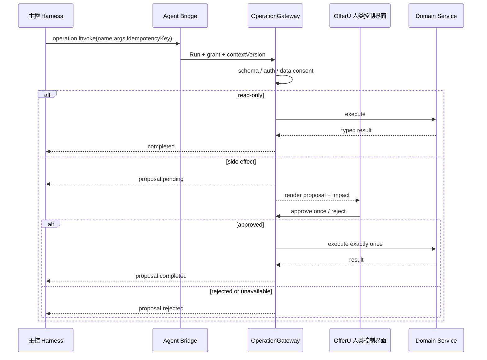

# Agent 操作控制面

> 状态：accepted target design  
> 上位设计：[Agent 系统总览](./agent-system.md)  
> 决策：[ADR-0029](../adr/README.md#adr-0029)、[ADR-0037](../adr/README.md#adr-0037)、[ADR-0051](../adr/README.md#adr-0051)

## 目标

OfferU 操作控制面把“聪明但不可信的主控 Harness”连接到“确定、可审计的求职业务”。它不包含 LLM loop，也不理解开放式用户目标；它只接收类型化请求、判断当前 Run 是否获准、执行确定性流程并持久化结果。

## 深模块

```text
HarnessIntegration
  ├─ host half ─ AgentBridge
  └─ optional client half ─ typed UI projection ─ host half
                    │
                    └─ never calls business services directly

AgentBridge
       ├─ RunCoordinator
       ├─ ContextProjector
       ├─ SkillProjector
       ├─ OperationGateway
       │    └─ Operation Registry + domain services
       ├─ ApprovalCoordinator
       ├─ RunEventLog
       └─ ArtifactWorkspaceManager

ExecutorSupervisor
  └─ ExecutorAdapter(s)
       └─ candidate handback → OperationGateway
```

### AgentBridge

唯一对 Harness 暴露的机器边界。负责协议握手、Run 绑定、能力快照、消息关联、背压和标准错误；不实现求职业务，不解析自然语言，也不根据模型内容自动选择 Operation。

### RunCoordinator

创建/附着 Run，签发单写入租约，维护 Harness session 元数据、终态和恢复位置。它不复制 Harness 的隐藏历史，也不把 provider 原始 Session 当成业务事实。

### ContextProjector

按当前 Task、Skill 和 Run 授权生成最小上下文快照，只包含已确认事实、显式候选状态、版本号和来源引用。它不会把整库、完整邮件或完整职业模型倒入 Harness。

### SkillProjector

从结构化 Skill Registry 选择当前 Skill 的说明、允许 Operations、数据类别和确认边界。Harness 专属 Skill 文件只是一层格式化结果，不是独立事实源。

### OperationGateway

把 Bridge 请求映射到现有 Operation Registry：

1. 查找实时 Operation；
2. 校验 schema；
3. 校验 Run grant 与数据范围；
4. 对读取操作直接执行；
5. 对副作用生成持久化提案；
6. 等待 OfferU 拥有的人类界面作出决定；
7. 使用幂等键执行或返回拒绝；
8. 写 Operation audit 和 Run event。

Gateway 不允许直接调用 ORM 形成第二写路径。已有 API、浏览器扩展和 TUI 的业务动作也应投影到同一 Registry。

### ApprovalCoordinator

维护提案、一次性决定、过期、迟到决定和崩溃对账。只有 OfferU 嵌入工作区、专注窗口或移动端经过身份绑定的内部 seam 可以写决定；Bridge、Harness 工具、client plugin 和公开机器 CLI 只能创建或查询提案。

### RunEventLog

以 Run 内单调序号追加 provider-neutral 事件。UI、恢复和 Eval 消费标准事件；宿主原始 JSONL 只进入可选诊断 trace。

### ArtifactWorkspaceManager

为每个 Run 创建独占目录、输入清单、输出清单、配额和销毁策略。它只管理候选文件，不读取或写入正式领域状态。

### ExecutorSupervisor

托管一个边界明确的深度任务，并用无业务逻辑的 adapter 归一不同执行器。它与主控 Harness 的接入层分开：主控 Harness 拥有用户目标，执行器只拥有任务输入和任务级 grant。

## 外部接口

控制面只保留五个稳定接口族：

| 接口族 | 典型动作 | 返回 |
| --- | --- | --- |
| Run | create、attach、resume、interrupt、finish | Run 状态与租约 |
| Context | snapshot、refresh | 版本化最小事实投影 |
| Skill | catalog、resolve | Skill 版本与 Operation grant |
| Operation | list、schema、invoke、proposal status | 类型化结果或持久化提案 |
| Event | append、read、follow | 单调事件和游标 |

这些接口通过 [Agent Bridge](./agent-bridge-protocol.md) 暴露。模块内部可以直接调用 Python 接口，不需要绕回 CLI 序列化。

### 嵌入 UI 边界

DSH rc8 的 client half 是宿主浏览器中的视图投影，不是第六个业务接口族。它只经同一接入包的 host half 读取 Run/UI 投影并提交明确用户手势；host half 再通过 stdio Bridge 调用上述接口。client half 不直连 FastAPI、SQLite、Operation Registry 或 CLI，也不持有 Bridge bootstrap token。

具体 DSH host/client remote seam 属于 adapter 实现并须由 rc8 tracer 证明。无论该 seam 如何变化，`UI → host half → Agent Bridge → control plane` 的安全边界不变，不能用浏览器直连 HTTP、iframe 或 MCP 作为兼容旁路。

## 状态边界

| 对象 | 是否权威 | 说明 |
| --- | --- | --- |
| `JobSearchTask` | 是 | 使用者可见目标与相关领域对象 |
| `AgentRunRecord` | 是 | 授权、生命周期、审计关联；不是推理全文 |
| `AgentRunEvent` | 是 | 产品可消费的标准事件 |
| Harness session ID | 否 | 恢复指针；丢失时可显式失败/交接 |
| Harness transcript | 否 | 宿主自己的执行上下文 |
| Run artifact | 否 | 待审核候选产物 |
| Operation proposal | 是 | 尚未授权的持久化意图 |
| Operation audit | 是 | 已尝试/已执行动作的审计记录 |
| 对话文本 | 否 | Task 内交互记录，不替代领域对象 |

## 一次 Operation 的完整路径



## 代码落点

目标新增模块建议位于 `backend/app/services/agent_bridge/`：

```text
agent_bridge/
  protocol.py          # envelope、版本和错误码
  server.py            # stdio 读写与背压
  run_coordinator.py   # Run 绑定、租约、恢复
  context_projector.py
  skill_projector.py
  operation_gateway.py
  event_stream.py
  artifact_workspace.py
```

已有实现优先复用：

- `ops.py` 保持 Operation Registry 事实源；
- `operation_projection.py` 深化为 Gateway/Approval 的内部实现；
- `agent_run_state.py` 深化为 RunCoordinator 与 EventLog；
- `coding_agent_runtime.py` 只服务深度执行器，不承担主控 Harness；
- `routes/main_agent.py` 逐步去 Pi 命名并成为 OfferU UI Adapter。

## 明确不做

- 不在 Python 内重建通用 Agent loop、模型路由或 compaction；
- 不提供 raw database、任意 HTTP、MCP 或通用 shell 业务接口；
- 不让每个 Harness adapter 各自解释确认、事实门或幂等；
- 不把五个 Harness 的命令行参数硬编码进业务服务；
- 不为本地单人产品引入分布式队列、SaaS 身份或多租户控制面。
