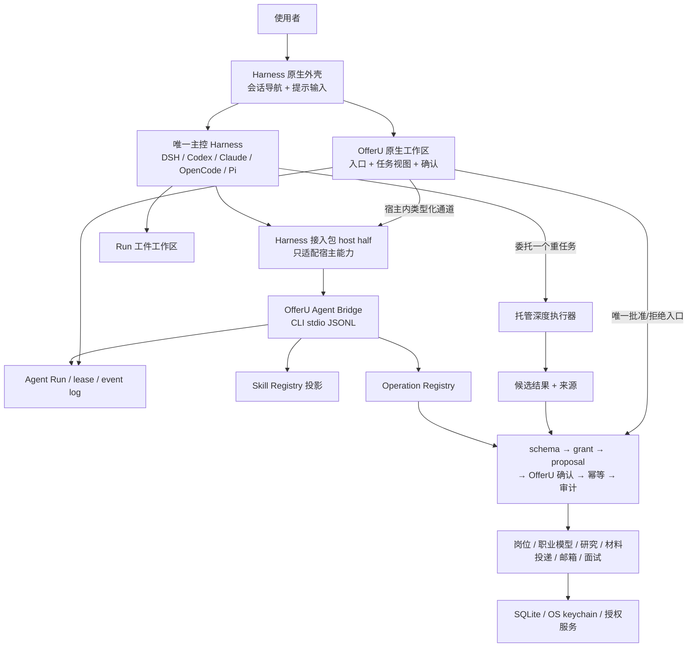

# OfferU Agent 系统总览

> 状态：accepted target architecture；实现迁移中  
> 主决策：[ADR-0051](../adr/README.md#adr-0051)  
> 适用：主控 Harness、OfferU 原生工作区、Operation Registry、本地深度执行器

## 一句话结论

外部 Coding Agent Harness 是 OfferU 唯一的主控大脑；OfferU 自身不是第二个 Agent，而是嵌入 Harness 或由其唤起的本地、确定性、可审计求职操作台和业务控制面。

DeepSeek Harness、Codex、Claude Code、OpenCode 与 Pi 可以替换主控会话，但不能改变 OfferU 的事实、授权、确认和审计规则。业务集成只走 CLI-first Agent Bridge，不提供 MCP 业务入口。

## 目标拓扑

DSH `dsh-v0.1.0-rc.8` 是首个原生嵌入基线：同一接入包有 host/client 两面，client half 只使用可加式 slots，host half 独占 `offeru bridge --stdio`。不支持安全 UI 扩展的 Harness 由原生外壳唤起 OfferU companion window；两种形态共享同一控制面，不改变主控归属。

## 两条执行路线

### 主控 Harness

主控 Harness 持有模型会话、推理、规划、上下文压缩和工具循环。它从 OfferU 取得经过授权的上下文与 Operations，并把调用、状态、结果和候选工件写回 Agent Run 事件。

主控 Harness 不拥有：

- 业务数据库或职业事实；
- Operation 授权和工作台确认；
- 跨 Run 的隐藏记忆；
- 直接写 OfferU 源码或配置的权限；
- 代表使用者提交申请、发邮件或联系第三方的权力。

### 本地深度执行器

深度执行器是主控 Harness 委托的一个任务级 Worker，用于公开公司/岗位调研、批量 JD 分析和登记工作源摘要。它由 OfferU 托管生命周期与权限，但不成为第二主脑，也不继承主控 Harness 的隐藏上下文。

两条路线都必须经过同一 Operation Registry；区别在于主控 Harness 持有用户目标，深度执行器只持有一个受限重任务。

DSH rc8 可按需安装 Codex/Claude Code subagent bundles，但它们属于 DSH 主会话内部编排，默认只形成同一 Agent Run 的嵌套事件，不自动升级为 OfferU 托管深度执行器，也不创建第二个主控 Run。只有经过 OfferU 明确委托、独立 session/workspace/grant 的重任务才进入深度执行路线。

## 状态所有权

| 状态 | 唯一拥有者 | 可重建来源 |
| --- | --- | --- |
| 开放式目标、推理、计划 | 当前 Harness session | 不要求 OfferU 完整复制 |
| 求职任务与 Agent Run | OfferU | Python 持久化 |
| 已确认职业事实与业务状态 | OfferU 领域服务 | SQLite 与来源链 |
| Skill 与 Operation 能力 | OfferU Registry | 版本化 Registry |
| 待确认提案与决定 | OfferU 工作区/协调器 | 持久化提案、一次性决定 |
| Run 候选文件 | Run 工件工作区 | 当前 Run 目录与清单 |
| Provider 原始事件 | Harness/adapter trace | 可选诊断，不是产品事实 |
| 标准生命周期事件 | OfferU Agent Run Event | 追加式事件日志 |

## 主控一致性契约

一个 Harness 只有同时通过以下能力，才能显示为“支持”：

1. 能创建、识别和恢复原生会话；
2. 能在运行中追加用户指令或显式报告不支持；
3. 能中断、取消并输出确定终态；
4. 能调用 Run 授权范围内的 OfferU Operations；
5. 能在提案待工作台确认时暂停或安全重试；
6. 能把输出映射为统一事件流；
7. 能把原生文件和 shell 工具限制在 Run 工件区；
8. 版本或能力不满足时显式失败，不静默换到另一个 Harness。

Codex 与 DeepSeek Harness 只享有实现优先级，不降低其他三种 Harness 的最终门槛。

## 全局不变量

- Python/SQL 是唯一业务事实源，Tauri/Rust 只做系统桥接。
- 产品是本地单人版，不引入 SaaS、多租户、登录、计费或 `workspace_id`。
- Agent 推断、研究摘要、简历建议、面试反馈和外部消息都先是候选，不是职业事实。
- GUI、CLI、TUI、浏览器扩展、主控 Harness 和深度执行器共用一个 Operation Registry。
- OfferU 拥有的嵌入工作区或专注窗口是业务副作用的唯一确认权威；Harness 自身审批只能约束其原生工具，不能批准 OfferU Operation。
- Run 工件工作区不是 OfferU 仓库，也不是长期记忆。
- 跨 Harness 故障切换创建新 Run，不伪造隐藏会话连续性。
- 外部数据默认不可信，凭据和敏感职业数据不得进入日志、工件或未授权模型上下文。
- 失败必须可见；禁止假分、伪造 JSON、静默降级和“返回成功但没有执行”。

## 当前代码与目标的差距

截至 2026-08-20，仓库仍以 `pi_agent_host.py`、`pi_agent_worker.py`、`agent-runtime/src/worker.mjs` 和 Pi 命名的 `/runtime` 路由承载主路径；`backend/app/cli.py` 仍公开模型可调用的 `confirm`，且尚无 `integrations/dsh/`。本机 `dsh --version` 仍是 `0.1.0-rc.6`，所以 rc8 目前只是精确设计基线，尚未形成运行验收。这些实现与 [ADR-0051](../adr/README.md#adr-0051)、[ADR-0053](../adr/README.md#adr-0053) 和 [ADR-0055](../adr/README.md#adr-0055) 冲突。

可复用的底座已经存在：

- `backend/app/ops.py`：Operation Registry；
- `backend/app/services/operation_projection.py`：执行/提案与确认协调；
- `backend/app/services/agent_run_state.py`：Run、事件和恢复；
- `AgentRunRecord` / `AgentRunEvent`：provider-neutral 持久化；
- 工作台 SSE、提案卡和审计界面。

迁移原则是先在这些接缝上增加 Bridge 和外部 Harness tracer，再替换 Pi 主路径；不得先删除可运行链路。完整顺序见[迁移路线](../implementation/migration-roadmap.md)。

## 主题入口

- 内部模块：[Agent 操作控制面](./agent-control-plane.md)
- 机器协议：[Agent Bridge 协议](./agent-bridge-protocol.md)
- 宿主差异：[Harness 接入](./harness-integrations.md)
- 权限与事实门：[Operation 与安全](./operation-security.md)
- 生命周期：[Run 生命周期](./run-lifecycle.md)
- 交互：[OfferU 原生工作区](./workbench-interaction.md)
- 决策历史：[决策账本](../adr/README.md)
