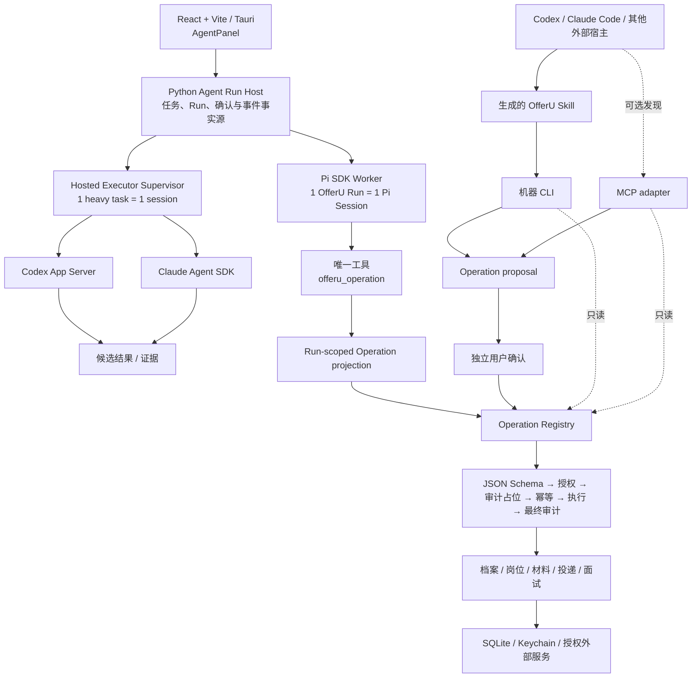

# OfferU Agent System

> 状态：current  
> 事实基线：2026-07-30  
> 适用范围：内置主 Agent、外部 Coding Agent、Skill/CLI/MCP 控制面和托管执行器

## 结论

OfferU 已经使用 Pi SDK 作为内置主 Agent 的运行时底座，但没有把 Pi 当成业务后端。

系统保留两条 Agent 路线：

1. **内置主 Agent**：Pi SDK 提供 AgentSession、模型适配、上下文压缩、类型化工具、流式事件和 Session 持久化；Python Run Host 持有产品状态和权限。
2. **外部 Coding Agent**：Codex、Claude Code 等宿主通过生成的 Skill + 机器 CLI / 可选 MCP 控制 OfferU；边界明确的重任务也可以由 OfferU 通过原生 provider adapter 托管。

两条路线共享 Skill Registry 和 Operation Registry，不复制业务逻辑，也不允许任何 Agent 直接写数据库。

## 当前拓扑



## 责任边界

| 层 | 负责 | 明确不负责 |
|---|---|---|
| Pi SDK Worker | 对话 loop、模型协议、compaction、Session、工具调用、流式生命周期 | 业务事实、数据库、用户确认、权限和审计 |
| Python Agent Run Host | Task/Run、Skill 快照、Operation grant、事件、取消、恢复、确认协调 | 重新实现通用 Agent loop |
| Operation Registry | 原子业务能力、输入契约、副作用分类、proposal、幂等和审计 | 自然语言规划和 UI |
| Main Agent Guardian | 确定性阶段判断、异常与风险提示 | 工具选择、业务执行和独立 Agent loop |
| Hosted executor adapters | Codex/Claude 原生 session、事件、结构化结果、取消和恢复 | 求职业务逻辑、长期记忆和事实写入 |
| Skill Registry | Skill 身份、版本、alias、允许 Operation 和 partial 状态 | 隐藏 shell、任意代码和第二套流程 |

## 内置主 Agent 路线

```text
用户选择 Skill / 输入目标
        ↓
Python 创建任务绑定 Agent Run
        ↓
冻结 Skill 版本与 Run-scoped Operation grant
        ↓
启动或恢复 Pi Session JSONL
        ↓
Pi 仅能调用 offeru_operation
        ↓
Python 校验 Operation、权限、确认、审计和幂等
        ↓
结果以 provider-neutral Agent Run 事件返回 AgentPanel
```

运行时约束：

- 一个 OfferU Agent Run 恰好绑定一个 Pi Session，不跨 Run 继承隐藏上下文。
- Session 使用 Run-scoped JSONL，可恢复但不是产品状态的唯一来源。
- Pi 内置 Bash、读写文件和其他 coding tools 在 OfferU Run 中关闭。
- Provider 凭据只注入内存 credential store，不写 Pi 全局认证目录。
- 写入、LLM 或外部副作用只能形成待确认 proposal；确认通过独立端点执行。
- 执行中断的写动作进入 reconciliation，不自动重放。

这一边界采用 Pi SDK 的原因是停止维护自研通用 Agent loop。Pi 官方 SDK 已直接提供 `createAgentSession()`、AgentSession 事件、compaction、SessionManager、自定义工具和内存凭据；Pi 本身不承担 OfferU 的业务权限系统，因此 Python 边界不是重复实现，而是产品必须保留的控制面。

## 外部 Coding Agent 路线

### Skill + CLI / MCP

外部宿主必须先读取 live manifest，再选择 Skill 和允许的 Operation：

```powershell
Set-Location backend
python -m app.cli doctor --pretty
python -m app.cli manifest --pretty
python -m app.cli schema <operation> --pretty
python -m app.cli run <read-operation> --pretty
python -m app.cli run <side-effect-operation> --arg key=value --pretty
python -m app.cli confirm <run_id> --action <action_id> --pretty
```

- `.agents`、`.claude`、`.codex` 和 `.copilot` 的 OfferU Skill 投影来自同一个 Skill Registry。
- 每次 CLI 调用只执行一个原子 Operation；外部 Agent 在宿主 loop 内组合步骤。
- MCP 是薄适配器且默认关闭，没有 raw HTTP/API 逃生口。
- Skill 只能缩小能力集合，不能扩大 Operation Registry 或 Run grant。
- 本地 PDF/DOCX 通过 `inspect_resume_document` 进入同一 Registry：这是需要独立确认的敏感文件读取，路径和正文审计脱敏，解析结果不会直接写入职业事实。

### OfferU 托管 Codex / Claude

Codex 和 Claude 只承担边界明确、可审计的重任务。当前首个闭环是公开岗位与公司调研：

- Codex 使用 App Server 的双向 JSONL/stdio 会话协议。
- Claude 使用 Claude Agent SDK 的 session、structured output、权限回调和取消能力。
- 一个重任务绑定一个 hosted session；任务输入、输出 schema、工作目录和 capability grant 在恢复时不可变化。
- Provider 原始事件只进入 adapter/audit 层；产品 UI 只消费统一事件。
- 研究结果先成为 candidate，使用者接受后才进入正式档案和下游事实门。
- 第一版公开研究 grant 不提供 OfferU Operation、数据库、任意 shell、文件系统或 subagent。

## 2026-07-30 可验证快照

动态事实来自 `python -m app.cli manifest`，不要在代码或 README 依赖以下固定数字：

| 项目 | 快照 |
|---|---|
| OfferU CLI | `0.4.0` |
| Operation Registry | 111 个 Operation |
| 需要独立确认 | 56 个 Operation |
| 严格 `input_schema` | 57 个 Operation |
| Skill Registry | `2026-07-30.2`，SHA-256 `957035a7…2397bb` |
| Skill | 34 个：28 native、6 partial |
| Pi SDK | `@earendil-works/pi-coding-agent` 0.82.1 |
| Claude Agent SDK | 0.3.220 |

已经完成：

- 内置 AgentPanel → Python Run Host → Pi SDK Worker → Operation projection 主路径。
- Run-scoped Pi Session、流式事件、SSE 游标续接、取消与显式恢复。
- proposal → 独立确认 → 幂等执行 → 审计结果的首个纵向切片。
- Codex App Server 与 Claude Agent SDK 原生 adapter、任务会话和统一事件。
- 外部 Skill 的确定性多宿主投影和 allowlist 完整性检查。
- PDF/DOCX 原生文本、逐页 OCR、质量诊断和来源页定位；GUI 与 Agent 都复用同一解析服务，候选内容必须人工确认。
- 岗位研究 candidate → 来源审核 → 接受/拒绝 → 下游事实门。
- Next.js 开发服务器已退出桌面链路；Tauri 使用 Vite 静态 SPA。

仍未完成：

1. 其余 54 个 Operation 的严格 JSON Schema；目标是已发布 Operation 100% 具备结构化输入契约。
2. 收敛 `ApplicationAttempt`、工作区 `ApplicationRecord` 与遗留 `Application` 的事实模型；当前外部候选进展以 Attempt 事件为权威，但部分旧 Operation 仍读写遗留表。
3. 通用文件产物 handback、预览、接受、拒绝和归档契约。
4. Codex 与 Claude 在可用官方/兼容上游上的完整多版本现场验收。
5. Pi Session 文件丢失、provider 超时和执行中断的用户决策与故障演练。
6. 浏览器岗位存活检查，以及在明确风险分层后的受控表单填充。
7. `offeru tui`；它仍必须是 Operation Registry 的薄控制面。

详细外部参考差异见 [CareerOps alignment](./career-ops-alignment.md)，现场故障与外部阻塞见 [Runtime acceptance 2026-07-30](./runtime-acceptance-2026-07-30.md)。

## 不变量

- Python/SQL 是唯一业务事实源。
- 当前产品是本地单人版；不引入 SaaS、多租户、登录、计费或 `workspace_id`。
- Agent 推断、研究结果、面试反馈和简历建议不能直接成为职业事实。
- OfferU 不自动提交申请、发送邮件或联系第三方。
- 外部 Host、Pi Worker、GUI、CLI 和 MCP 都必须经过同一个 Operation Registry。
- 失败必须可见；禁止固定假分、伪造 JSON、静默降级或“返回成功但实际未执行”。

## 决策与官方依据

- [ADR 0029：统一 Operation Registry](../adr/0029-one-operation-registry-for-gui-cli-tui-and-slash-skills.md)
- [ADR 0037：结构化 Skill Registry](../adr/0037-structured-skill-registry-is-the-single-source.md)
- [ADR 0041：Harness Agent 降为 Guardian](../adr/0041-demote-harness-agent-to-main-agent-guardian.md)
- [ADR 0044：外部 Coding Agent 使用原生协议适配器](../adr/0044-use-native-protocol-adapters-for-hosted-coding-agents.md)
- [ADR 0046：Pi SDK Worker 承载主 Agent runtime](../adr/0046-use-pi-sdk-worker-for-main-agent-runtime.md)
- [Pi SDK](https://pi.dev/docs/latest/sdk)
- [Pi security boundary](https://pi.dev/docs/latest/security)
- [Codex App Server](https://developers.openai.com/codex/app-server/)
- [Claude Agent SDK](https://platform.claude.com/docs/en/agent-sdk/overview)
- [Tauri frontend configuration](https://v2.tauri.app/start/frontend/)
