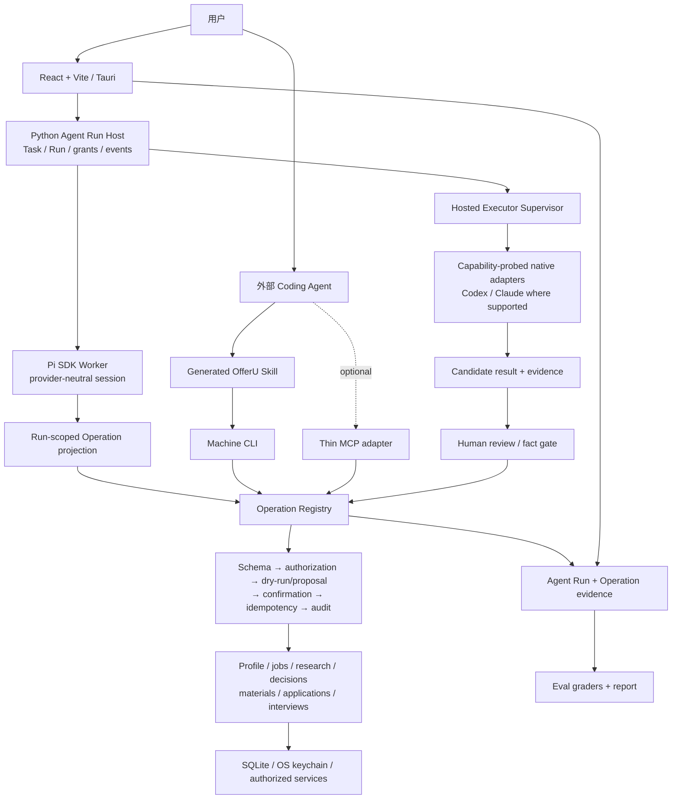

# OfferU Agent System

> 状态：current architecture contract  
> 验证状态：等待 `offeru-core-v1` 正式 baseline  
> 适用范围：内置主 Agent、外部 Coding Agent、Skill/CLI/MCP 控制面和托管重任务执行器

## 结论

OfferU 是一个本地单人求职运营系统，Python 业务层拥有事实、权限和最终状态。Agent 负责理解目标、规划和调用受限能力，但不能成为第二套业务后端。

系统有两条互补路线：

1. **内置主 Agent**：由 Pi SDK Worker 承担会话 loop、模型协议、流式事件和 compaction；Python Agent Run Host 持有 Task/Run、授权、确认与审计。
2. **外部 Coding Agent**：Codex、Claude Code、DeepSeek IDE/CLI Agent 等外部宿主先读取实时 Skill/Operation contract，再通过机器 CLI 或可选 MCP 组合原子操作；OfferU 仅对明确支持的 provider 提供托管重任务 adapter。

两条路线共享 Skill Registry 和 Operation Registry。任何 GUI、CLI、Agent 或 executor 都不得直接写业务数据库。

“架构存在”不等于“链路已可用”。当前代码表面由 live manifest 发现，当前可靠性由 [`offeru-core-v1`](../evals/offeru-core-v1.md) 报告证明；在有效 baseline 之前，Agent 完整性状态是 **未证明**。

## 当前拓扑



## 责任边界

| 层 | 负责 | 不负责 |
|---|---|---|
| Pi SDK Worker | Agent loop、模型适配、session、compaction、工具调用和流式生命周期 | 业务事实、用户授权、数据库和最终审计 |
| Python Agent Run Host | Task/Run、Skill 快照、Operation grant、事件、取消/恢复和确认协调 | 复制通用 Agent loop |
| Skill Registry | Skill 身份、版本、alias、允许的 Operations 和 partial 状态 | 隐藏 shell、任意代码或第二套业务流程 |
| Operation Registry | 原子能力、JSON schema、副作用分级、proposal/confirm、幂等和审计 | 自然语言规划和 UI 展示 |
| Main Agent Guardian | 确定性阶段检查、异常与风险信号 | 独立 Agent loop 或绕过工具执行业务 |
| Hosted adapter | 原生 session/事件/取消/恢复和结构化 candidate handback | 长期记忆、职业事实写入或扩大 task grant |
| Eval harness | fixtures、trials、trace/outcome graders 和发布报告 | 通过改 grader 掩盖产品失败 |

## 内置主 Agent

```text
用户目标
  -> Python 创建并绑定 Agent Run
  -> 冻结 Skill 版本与 run-scoped grant
  -> 启动/恢复 Pi session
  -> 模型只调用受限 OfferU operation tool
  -> Python 校验 schema、授权、副作用与确认
  -> 结果和错误写入 provider-neutral Agent Run events
```

运行时不变量：

- 一个 OfferU Agent Run 绑定一个运行时 session，不跨 Run 继承隐藏上下文。
- Session 可恢复，但不是产品事实的唯一来源。
- 通用 Bash、任意文件读写等 coding tools 不进入普通 OfferU Run grant。
- Provider 凭据只通过受控配置/内存传递，不写入报告或 Agent trace。
- 写入、LLM 或外部副作用按 Registry 声明产生 proposal；确认由独立控制面执行。
- 中断的副作用进入显式失败或 reconciliation，绝不静默重放。
- Provider/model 是运行时配置，不写死在架构文档；用 `doctor` 记录每次 Eval 的实际值。

## 外部 Coding Agent

外部宿主先探测 contract，再执行：

```powershell
Set-Location backend
.\.venv312\Scripts\python.exe -m app.cli doctor --pretty
.\.venv312\Scripts\python.exe -m app.cli manifest --pretty
.\.venv312\Scripts\python.exe -m app.cli schema <operation_name> --pretty
.\.venv312\Scripts\python.exe -m app.cli run <operation_name> --dry-run --pretty
```

- 每次 CLI 调用只执行一个 Registry operation；宿主在自己的 loop 中组合步骤。
- 任何 mutation 都必须按实时输出形成 proposal，并由使用者独立确认。
- MCP 只能是薄适配器，不能提供 raw DB、raw HTTP 或隐藏 shell 逃生口。
- Skill 和 task grant 只能缩小权限，不能扩大 Registry 能力。
- 外部 Agent 的自然语言结论、简历建议和研究结果先是 candidate，不是职业事实。

DeepSeek IDE/CLI Agent 当前可作为仓库级 Eval 执行者，通过 shell、浏览器和机器 CLI 收集证据；这不等于 OfferU 已拥有 DeepSeek hosted executor adapter。托管能力必须通过 capability probe 和 accepted ADR 明确支持，不能把某个 CLI 的 argv 永久写死。

## 托管重任务

托管 executor 只处理边界明确、可审计的重任务，例如公开岗位/公司研究：

- 一个重任务绑定一个 provider session；输入、输出 schema、工作目录和 grant 在恢复时不可变化。
- adapter 使用各 provider 的原生协议；不靠屏幕抓取或非结构化 shell 猜状态。
- provider 原始事件进入 adapter/audit 层，产品 UI 只消费统一事件。
- candidate 必须带来源和执行证据，经使用者接受后才进入事实门。
- 第一版公开研究不授予 OfferU 数据库、任意文件系统、任意 shell 或 subagent 权限。

哪些 adapter 在当前机器可用必须实时 probe；历史版本与外部阻塞见 [报告目录](../evals/reports/README.md)，不能从旧快照推断当前状态。

## Agent 完整性

OfferU 不把“能回复”定义为完整。完整性需要同时满足：

| 维度 | 必须证明 |
|---|---|
| Contract | 模型得到准确、完整且最小权限的 Skill/Operation schema |
| Context | 当前岗位、已确认档案和任务状态在正确边界内可用 |
| Planning | 自然语言稳定路由；缺信息会提问，不臆造 ID 或事实 |
| Control | 读写分类正确，proposal/confirm/reject/cancel 语义一致 |
| Outcome | 最终状态与用户目标一致，失败不会伪装完成 |
| Resilience | 超时、重启、取消和重试可解释且不重复副作用 |
| Observability | 能从 Task/Run/Operation/trace 复盘每个决策和动作 |
| Security | 不受不可信内容注入，不泄漏凭据，不越过数据授权 |

这些维度映射到 [`CORE-AGT-*`](../evals/offeru-core-v1.md) 和安全/韧性任务。任何维度只靠模型自评都不能判为通过。

## Eval 驱动的变更环

```text
真实失败或用户目标
  -> 版本化 Eval Task
  -> baseline trace + outcome
  -> 选择一个纵向修复切片
  -> candidate run
  -> core regression
  -> 人工发布决策
```

当前优先级不再来自旧功能路线图，而来自首份有效 baseline：先处理安全违规和静默失败，再处理阻断普通用户闭环的问题，最后优化主观质量和扩展能力。

## 系统不变量

- Python/SQL 是唯一业务事实源。
- 当前产品是本地单人版；不引入 SaaS、多租户、登录、计费或 `workspace_id`。
- Agent 推断、面试反馈、简历建议和投递信号不能直接成为职业事实。
- OfferU 不自动提交申请、发送邮件或联系第三方。
- GUI、CLI、MCP、内置 Agent 和外部 executor 都经过同一个 Operation Registry。
- 外部数据默认不可信；职业数据发往云模型前必须满足 provider/数据类别授权。
- 失败必须可见；禁止固定假分、伪造 JSON、静默降级或“返回成功但实际未执行”。

## 决策入口

- [ADR 0028：三层量化验收原则](../adr/0028-use-three-layer-quantitative-acceptance-gates.md)
- [ADR 0029：统一 Operation Registry](../adr/0029-one-operation-registry-for-gui-cli-tui-and-slash-skills.md)
- [ADR 0034：投前决策事实门](../adr/0034-require-a-reviewed-pre-application-decision-before-the-hero-resume-proposal.md)
- [ADR 0037：结构化 Skill Registry](../adr/0037-structured-skill-registry-is-the-single-source.md)
- [ADR 0041：Main Agent Guardian](../adr/0041-demote-harness-agent-to-main-agent-guardian.md)
- [ADR 0044：Hosted Coding Agent 原生适配器](../adr/0044-use-native-protocol-adapters-for-hosted-coding-agents.md)
- [ADR 0046：Pi SDK Worker](../adr/0046-use-pi-sdk-worker-for-main-agent-runtime.md)
- [ADR 0047：Vite/Tauri 静态 SPA](../adr/0047-use-vite-static-spa-for-tauri-frontend.md)
- [Eval 手册](../evals/README.md)
