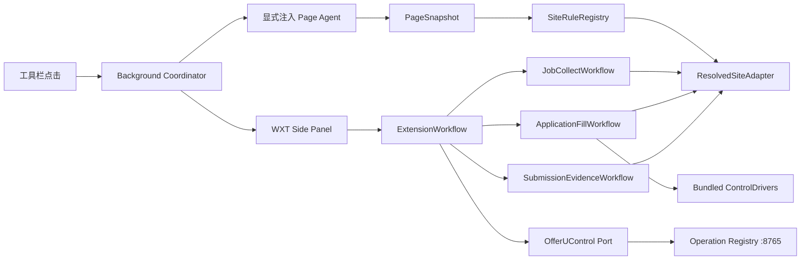

# OfferU 浏览器扩展框架契约

> 状态：approved architecture，尚未实施  
> 日期：2026-08-10  
> 决策源：[ADR-0049](../adr/0049-unify-browser-job-collection-and-application-form-fill.md)  
> 交互源：[浏览器扩展交互设计](../design/browser-extension-interaction.md)  
> 规则规范：[SiteRulePack v1](site-rule-pack-v1.md)  
> 面向对象：实现 Agent、评审 Agent、规则包维护者

## 1. 框架解决什么

OfferU 只发布一个浏览器扩展。它以同一个站点适配框架完成三种工作：

1. 在岗位页采集岗位候选；
2. 在 ATS 表单页生成安全填写计划并按确认结果写入；
3. 在使用者亲自提交后生成最小提交候选证据。

“结合牛客”只表示 clean-room 借鉴其规则化适配、进度反馈和增量处理思路。`Niuke/` 的压缩代码、选择器数据、私有 API、登录/Cookie、验证码、遥测和资产都不是 OfferU 的运行依赖或复制来源。

## 2. 总体结构



框架边界：

- Side Panel 只渲染状态并发出意图，不读取页面 DOM；
- Page Agent 只在使用者当前授权的 tab 中读取/写入 DOM，不直连数据库或第三方模型；
- Background 负责临时权限、消息路由、短期会话和本地队列，不包含求职业务判断；
- 所有 OfferU 事实读写通过 `OfferUControl` 投影到 Operation Registry；
- 站点差异只进入规则包或内置控件驱动，不进入工作流 UI。

### 2.1 牛客思路的 clean-room 映射

| 在牛客发布包中观察到的产品思路 | OfferU 的独立实现 | 不带入 OfferU 的部分 |
|---|---|---|
| 按平台描述分组、一级/二级标题和选项容器 | `SiteRulePack.form` 的结构化只读数据 | 牛客的具体 selector 表和远程配置地址 |
| 根据当前页面选择平台配置 | 带正反信号、冲突门和状态的 `SiteRuleRegistry` | 私有接口返回的站点判断 |
| 对 Ant/Element/Moka/北森/飞书等复杂控件分类处理 | 扩展内置、可测试的 `ControlDriver` | 压缩包中的实现代码与任意脚本 hook |
| 选择简历后进行字段匹配 | OfferU 后端提供最小已确认职业投影并形成 `FillPlan` | 牛客账号、云简历和 `/resume-fill-plugin/*` API |
| 侧栏展示提取、匹配、填写进度 | WXT Side Panel 的显式状态机与字段级 outcome | 遥测、鼠标轨迹、截图上传和远端公告 |
| 版本化更新适配配置 | 第一阶段随扩展发布版本化 pack；未来远程数据另立 ADR | 未签名热更新、远程代码和静默放宽规则 |
| 页面不兼容时采集反馈 | 使用者确认后导出本地脱敏适配报告 | 默认上传页面、表单值、Cookie 或截图 |

这里复用的是“把站点差异数据化、把复杂控件代码化、把过程可视化”的方法，不复用牛客实现或数据。

## 3. 目标目录

这是目标结构，不要求一次性搬完。DeepSeek 每轮只迁移一个纵向切片。

```text
extension/
  entrypoints/
    background.ts
    sidepanel/
      index.html
      main.ts
      style.css
    page-agent.ts              # WXT unlisted script，按 activeTab 显式注入
  src/
    framework/
      contracts.ts
      messages.ts
      workflow.ts
      page-snapshot.ts
      offeru-control.ts
    rule-packs/
      schema.ts
      validator.ts
      registry.ts
      resolver.ts
      packs/
        portals/
        ats/
        employers/
    workflows/
      job-collect/
      application-fill/
      submission-evidence/
    page-agent/
      detect.ts
      collect.ts
      scan-form.ts
      apply-fill-plan.ts
      inspect-receipt.ts
    control-drivers/
      native.ts
      antd.ts
      element.ts
      moka.ts
      beisen.ts
      feishu.ts
    sidepanel/
      state-machine.ts
      views/
      components/
    storage/
      settings.ts
      job-queue.ts
      active-session.ts
```

禁止建立第二套 `platforms/` 与 `ats/adapters/` 长期并存。迁移期允许旧模块作为薄 Adapter 调用新 Registry；对应能力完成验收后必须删除旧入口，不再双写或双检测。

## 4. SiteRulePack：唯一站点适配格式

### 4.1 契约草图

下面是结构摘要；实现必须遵守完整的 [SiteRulePack v1 规范](site-rule-pack-v1.md)。

```ts
type PageKind =
  | "job-list"
  | "job-detail"
  | "application-form"
  | "submission-receipt";

type RuleStatus = "experimental" | "verified" | "disabled";

type DriverId =
  | "native"
  | "antd"
  | "element"
  | "moka"
  | "beisen"
  | "feishu";

interface SiteRulePackV1 {
  schemaVersion: 1;
  id: string;
  version: string;
  status: RuleStatus;
  displayName: string;
  hosts: string[];
  pages: PageRule[];
  fixtures: FixtureRef[];
  provenance: {
    owner: "offeru";
    method: "first-party" | "clean-room";
    lastVerifiedAt?: string;
  };
}

interface PageRule {
  id: string;
  kind: PageKind;
  detection: DetectionRule;
  driverIds: DriverId[];
  job?: JobCollectionRule;
  form?: FormStructureRule;
  receipt?: ReceiptEvidenceRule;
}
```

### 4.2 规则是数据，Driver 才是代码

规则包允许：

- host、URL pattern、页面标题、meta、稳定 DOM 信号及其权重；
- CSS selector 列表、字段别名、页面/分组/重复项结构；
- 已知 `driverId`、能力开关、验证状态、fixture 引用；
- 成功与排除证据的组合条件。

规则包禁止：

- JavaScript、WASM、函数字符串、`eval`、动态 import 或远程模块 URL；
- 任意“点击这个 selector 然后执行脚本”的动作描述；
- 牛客接口、账号、Cookie、验证码、遥测或远程配置依赖；
- 表单值、简历内容、Cookie、整页 HTML 或截图原件；
- 最终提交按钮 selector。

复杂控件由打包代码实现：

```ts
interface ControlDriver {
  readonly id: DriverId;
  canHandle(field: FieldDescriptor): boolean;
  read(field: FieldDescriptor): Promise<ReadResult>;
  apply(field: FieldDescriptor, value: PlannedValue): Promise<WriteResult>;
  verify(field: FieldDescriptor, expected: PlannedValue): Promise<VerifyResult>;
}
```

`apply` 只能由已确认且未过期的 `FillPlan` 调用。Driver 不能创建新经历、上传文件、勾选授权、点击提交或绕过验证码。

### 4.3 规则包必须自包含

源码可以用构建期常量减少重复，但运行产物中的每个规则包必须已经扁平化。禁止运行时出现“通用规则 → ATS 规则 → 公司补丁 → 临时远程覆盖”的不透明继承链。

如果同一 ATS 在不同公司有差异，应生成一个明确的 employer pack，例如 `ats.moka.example-corp`，并在 provenance 和 fixture 中解释差异。Resolver 最终只能返回一个 pack/page rule。

## 5. 检测与解析

检测分四层，均有读取预算：

1. host 与 URL path；
2. title、meta、script src 的非内容信号；
3. 稳定 CSS/ARIA/DOM signature；
4. 受限大小的结构摘要，不能扫描并保存完整 `outerHTML`。

每条 detection signal 必须区分 positive 与 negative。Resolver 按规则得分后遵守：

- 最高候选低于阈值：`unsupported`；
- 前两名分差不足安全 margin：`ambiguous`；
- pack 为 `experimental`：`diagnostic-only`；
- 只有唯一 `verified` 候选才能启用其已声明的写入能力。

`unknown` 不是万能 Adapter。它只能做通用只读扫描和脱敏诊断，不能填表。

## 6. 四种页面能力

### 6.1 job-list

描述岗位卡片容器、标题、公司、地点、薪资、链接和稳定卡片 ID。只允许读取当前已渲染列表；不自动翻页、不后台滚动、不绕过站点限制。

### 6.2 job-detail

描述标题、公司、地点、薪资、JD、发布日期、标签和申请链接。采集结果先进入本地岗位篮，使用者确认同步前不写 OfferU。

### 6.3 application-form

描述表单 root、section、label、repeat item、字段容器和可用 Driver。预览阶段只读取，不自动展开/新增/删除经历，不打开下拉框，不改变 DOM。隐藏内容由使用者手动展开后重扫。

### 6.4 submission-receipt

描述成功证据与排除证据，例如申请编号、明确成功标题、与当前岗位一致的可见文本，以及校验错误、草稿、取消页等反证。它只在当前短期填写会话中产生 pending candidate，不能直接写 `Submitted`。

## 7. 工作流合同

所有流程使用同一两阶段 Interface：

```ts
interface ExtensionWorkflow<Plan, Result> {
  prepare(context: PageContext): Promise<Plan>; // 只读
  confirm(planId: string): Promise<Result>;     // 显式确认后执行
}
```

### JobCollectWorkflow

- `prepare`：扫描当前页，形成岗位预览；
- `confirm`：加入本地岗位篮或确认同步；
- 不创建投递尝试。

### ApplicationFillWorkflow

- `prepare`：获取 OfferU 最小职业投影，形成脱敏字段预览；
- `confirm`：只写同 URL、同字段指纹、未过期计划中的空白非敏感字段；
- 结果逐字段验证，不因部分失败返回全局成功；
- 不点击或模拟最终提交。

### SubmissionEvidenceWorkflow

- `prepare`：在当前会话中读取最小回执证据，形成 pending candidate；
- `confirm`：通过 Operation Registry 原子创建 `ApplicationAttempt + Submitted event`；
- 误识别、拒绝或关闭候选不留下正式事实。

## 8. OfferUControl Port

浏览器只看见窄接口，不拼任意 URL：

```ts
interface OfferUControl {
  probe(): Promise<ConnectionState>;
  prepareJobImport(input: JobCandidate[]): Promise<JobImportPlan>;
  confirmJobImport(planId: string): Promise<JobImportResult>;
  getFillProjection(jobId: string): Promise<FillProjection>;
  recordFillOutcome(outcome: RedactedFillOutcome): Promise<void>;
  createSubmissionCandidate(input: ReceiptEvidence): Promise<SubmissionCandidate>;
  confirmSubmissionCandidate(candidateId: string): Promise<SubmissionResult>;
}
```

生产 Adapter 指向 `http://127.0.0.1:8765` 的固定 Operation 投影；测试使用内存 Adapter。不得让规则包指定 endpoint，也不得让浏览器直接写数据库。

## 9. 状态与存储

允许持久化到 `chrome.storage.local`：

- 后端地址等非敏感设置；
- 未同步岗位候选；
- 规则包版本和非敏感兼容性统计；
- 不包含字段值的最近错误摘要。

只允许短期保存在 `chrome.storage.session` 或内存：

- 活跃 tab/session ID；
- FillPlan ID、URL/结构指纹和过期时间；
- 脱敏字段预览；
- 待确认提交候选 ID。

禁止浏览器存储：模型 API Key、完整简历、身份证明、完整字段值、Cookie、整页 HTML、提交页面原文、截图和第三方账号凭据。

## 10. 规则包质量门

一个规则包从 `experimental` 升为 `verified` 必须同时满足：

1. schema 与 selector 静态校验通过；
2. pack ID/version 唯一，引用的 Driver 全部存在；
3. 至少一个脱敏 fixture 覆盖每个声明的 page kind；
4. 检测 fixture 同时包含正例、近似反例和冲突例；
5. 岗位采集字段达到约定完整度且不会跨卡片串值；
6. 表单预览对 fixture 的 DOM 是零写入；
7. 写入 fixture 证明保护已有值、敏感字段、文件和同意项；
8. 真实 Edge/Chrome 侧载只在测试账号/脱敏页面完成运行验收；
9. 兼容性报告记录 pack/version、浏览器、页面类型、结果和失败控件；
10. 没有真实投递、验证码绕过或第三方账号副作用。

“支持某网站”只表示对应 pack/version 的声明能力已通过上述门，不代表该网站所有公司、所有页面版本或所有控件都被覆盖。

## 11. 当前迁移映射

| 当前代码 | 目标位置 | 迁移原则 |
|---|---|---|
| `src/content/platforms/*.ts` | `rule-packs/packs/portals/*` | 先迁移五个平台的岗位读取数据，不改变字段语义 |
| `smartfill-v2/ats/adapters/*.ts` 的信号/alias/selector/capability | `rule-packs/packs/ats/*` | 只迁移数据，Writer 行为不塞进规则 |
| `smartfill-v2/write/site-writers/*` | `control-drivers/*` | 保留为打包代码，收紧统一 Driver contract |
| `smartfill-v2/ats/detector.ts` | `rule-packs/resolver.ts` | 增加反证、冲突和 diagnostic-only 结果 |
| 根目录 popup/build 产物 | WXT sidepanel 与 `.output/chrome-mv3` | 删除双构建事实源 |
| `Niuke/` | 无运行目标 | 只保留本地研究证据，不修改、不打包、不复制 |

当前候选覆盖包括 BOSS、智联、猎聘、实习僧、LinkedIn 岗位页，以及 Moka、北森、飞书、大易、ATSX、Hotjob、阿里/Kuma、网易等 ATS 线索。它们全部是“待逐包验收候选”，不是现成的已验证兼容清单。

## 12. 新站点规则包的 clean-room 流程

每适配一个新招聘站点或 ATS，严格按以下顺序：

1. 从公开页面、使用者明确授权访问的当前页面或站点提供的测试环境确认目标 page kind；
2. 在不运行、不读取 `Niuke/` 规则数据的独立会话中生成脱敏 DOM 结构摘要；
3. 只基于目标页面本身选择稳定的 role、label、name、data attribute 和结构 selector，哈希 class 只能作为低权重辅助；
4. 先写 positive、near-negative、conflict fixture，再写规则包；
5. 规则包只引用已有 Driver；确实出现新控件时，另开任务实现并测试一个新 Driver；
6. 先以 `experimental` 发布到诊断流程，禁止 apply；
7. 在 fixture 与真实浏览器中分别证明声明能力后，单独评审升为 `verified`；
8. 页面改版导致证据失败时降回 `experimental`，不能用更宽的万能 selector 掩盖。

规则报告必须写明“观察的页面/版本、自己采集的 fixture、选择器理由和未覆盖控件”，不能把“牛客能填”当作 OfferU 规则的证据。

## 13. 实现停止条件

实现 Agent 遇到以下任一情况必须停下回传，不得自行扩大设计：

- 需要复制 `Niuke/` 压缩代码、选择器数据或调用其私有 API；
- 需要为规则包增加任意代码 hook 或远程可执行逻辑；
- 需要恢复 `<all_urls>` 常驻内容脚本或持久化敏感值；
- 需要自动点击提交、验证码、同意项或文件上传；
- 新规则无法用脱敏 fixture 证明；
- 需要绕过 Operation Registry 或新增第二套投递事实模型。

## 14. 官方实现依据

- [Chrome activeTab](https://developer.chrome.com/docs/extensions/develop/concepts/activeTab)
- [Chrome scripting API](https://developer.chrome.com/docs/extensions/reference/api/scripting)
- [Chrome sidePanel API](https://developer.chrome.com/docs/extensions/reference/api/sidePanel)
- [Chrome remote hosted code boundary](https://developer.chrome.com/docs/extensions/develop/migrate/remote-hosted-code)
- [WXT entrypoints](https://wxt.dev/guide/essentials/entrypoints)
- [WXT scripting](https://wxt.dev/guide/essentials/scripting)
