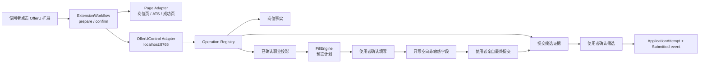

# OfferU 单浏览器扩展纵向切片计划

> 状态：approved plan，尚未实施  
> 日期：2026-08-10  
> 决策源：[ADR-0049](../adr/0049-unify-browser-job-collection-and-application-form-fill.md)  
> 框架契约：[浏览器扩展框架](browser-extension-framework.md)  
> 规则规范：[SiteRulePack v1](site-rule-pack-v1.md)  
> 交互规格：[浏览器扩展交互设计](../design/browser-extension-interaction.md)  
> 实施交接：[DeepSeek 实施任务书](../implementation/deepseek-browser-extension-framework-brief.md)  
> 约束：一次只实施一个切片；每个切片必须独立达到浏览器运行验收后才能进入下一个。

## 结论

合并不是把 `Niuke/` 复制进 `extension/`，而是把 OfferU 自有扩展重建为唯一浏览器入口。牛客发布包只提供 clean-room 产品参考；所有运行代码、数据源、权限、操作和测试均由 OfferU 拥有。

目标链路：



## 当前基线

| 级别 | 当前证据 | 影响 |
|---|---|---|
| P0 | `extension/popup.html` 引用不存在的 `chunks/popup-DKt8WnMn.js`；真实 Edge 侧载返回 `ERR_FILE_NOT_FOUND` | README 指定的插件入口按钮逻辑未加载 |
| P0 | `src/content.ts` 已是预览/确认流程，但根目录 `content-scripts/content.js` 仍调用旧完整填充 pipeline | 用户实际加载的安全行为与源码不一致 |
| P1 | 文档/静态页/源码默认地址分别出现 8000、9000、3000，项目契约是后端 8765、前端 7410 | 开箱无法连接 OfferU |
| P1 | 插件直接 POST `/api/jobs/ingest`，路由直接写 `Job/Batch` | 绕开 Operation Registry 的 schema、审计和统一错误语义 |
| P1 | API Key 持久化到 `chrome.storage.local`，内容脚本匹配 `<all_urls>` | 凭据与全站页面暴露面过大 |
| P1 | 岗位同步只创建 `Job`；填表不创建 `ApplicationAttempt`；没有提交候选证据路径 | “采集、填写、投递”被 UI 文案混用 |
| 参考 | `Niuke/` 使用 activeTab 注入、进度步骤、增量填写和版本化站点配置 | 可 clean-room 借鉴，不可复制发布包 |

## 全局不变量

- 不修改或打包 `Niuke/`，不调用牛客私有 API，不引入牛客账号/Cookie/验证码。
- 扩展不保存模型 API Key、完整职业模型、身份证明、授权同意或完整提交页面。
- 不自动覆盖网页已有值，不自动填写敏感/承诺字段，不自动上传文件，不点击最终提交。
- 所有 OfferU 事实写入通过 Operation Registry；失败必须显示，不能返回伪成功。
- 浏览器实际加载的产物必须来自本次源码构建，不能依赖仓库中的旧生成物。
- README 只描述已经通过当前浏览器验收的能力。

## Slice 1：规则框架与唯一插件的岗位采集闭环

### 用户结果

用户加载 `.output/chrome-mv3` 后，在受支持岗位详情页点击扩展，可以预览岗位、加入本地队列、明确确认同步，并在 OfferU 岗位 inbox 看到同一条记录。断网、后端关闭或部分失败时，本地未确认条目必须保留。

### 允许文件范围

扩展：

- `extension/package.json`
- `extension/wxt.config.ts`
- `extension/entrypoints/background.ts`
- `extension/entrypoints/content.ts`（删除静态全站入口）
- 新增 `extension/entrypoints/sidepanel/**`
- 新增 WXT unlisted page Agent entrypoint，由 `scripting.executeScript` 显式注入
- `extension/src/background.ts`
- `extension/src/popup.ts`（只允许删除或迁移，不再作为主入口）
- `extension/src/content.ts`
- `extension/src/types.ts`
- 新增 `extension/src/framework/**`
- 新增 `extension/src/rule-packs/**`
- `extension/src/lib/collect-utils.ts`
- `extension/src/content/platforms/**`
- `extension/scripts/sync-root-build.mjs`（移除根目录同步职责）
- `extension/scripts/**` 中本切片新增的产物/浏览器验收脚本
- `extension/README.md`
- 删除已跟踪的根目录生成物：`extension/background.js`、`extension/content-scripts/**`、`extension/manifest.json`、`extension/popup.html`、`extension/popup.css` 及其生成资源

后端：

- `backend/app/ops.py`
- `backend/app/services/agent_operations.py`
- 新增 `backend/app/services/job_ingest.py`
- `backend/app/routes/jobs.py`
- 与新 Operation 输入 schema 直接相关的模型文件
- 新增或更新本切片专用后端测试

不得修改 SmartFill Writer、投递进展模型、前端投递页或 `Niuke/`。

### 实现约束

1. 先建立 `SiteRulePack` schema、validator、registry、resolver 和 fixture contract；运行时不允许任意 JavaScript hook、远程脚本或多层规则继承。
2. 把现有五个岗位平台配置迁移为 OfferU 自有规则包；迁移时保持规则语义，不从 `Niuke/` 复制选择器或资产。
3. 新建一个批量岗位导入 Operation；旧 `/api/jobs/ingest` 只能成为调用该 Operation 的薄 Adapter，不能保留第二套写库逻辑。
4. side panel 的“同步 N 条”是显式 UI 确认，调用同一个 Operation 并保留逐条幂等结果。
5. 默认后端地址统一为 `http://127.0.0.1:8765`；打开 OfferU 使用 `http://127.0.0.1:7410`。删除 8000/9000/3000 默认值。
6. manifest 不再声明 `<all_urls>` 静态内容脚本；岗位采集在用户点击后用 `activeTab + scripting` 注入当前 tab。
7. `npm run build` 只产出 `.output/chrome-mv3`；README 只指导加载这个目录。
8. 后端逐条确认前不得删除扩展本地队列。

### 验收证据

- 构建产物包含有效 side panel、background 和显式注入代码；侧边栏打开时没有 failed request、console error 或缺失 chunk。
- 规则 schema 拒绝任意脚本字段、未知 `driverId`、重复 pack ID、非法 selector 和缺失 fixture；低置信或冲突规则只能进入诊断态。
- manifest 没有 `<all_urls>` content script、任意公网 host permission 或 `cookies`。
- 在本地岗位 fixture 上完成“预览 → 确认同步 → Job inbox”闭环；重复同步不创建重复 Job。
- 后端不可达、超时、单条失败时显示具体错误，未确认条目仍在本地。
- Operation audit 能识别 `browser_extension_ui` surface、输入摘要、创建/跳过数量和批次幂等键。
- 根目录不再存在可被误加载的旧扩展生成物。

### 建议由用户执行的命令

```powershell
Set-Location extension
npm run typecheck
npm test
npm run build

Set-Location ..\backend
.\.venv312\Scripts\python.exe -m pytest tests -q
```

命令通过不等于切片通过；还必须在 Edge/Chrome 真实加载 `.output/chrome-mv3` 完成上述运行验收。

## Slice 2：OfferU 安全填表闭环

### 用户结果

用户在投前决策允许的 ATS 页面点击“扫描表单”，先看到字段和值预览；页面此时不发生改变。用户确认后，只填入空白、非敏感、高置信字段，并得到成功/待补/已保护清单。用户仍需亲自检查并提交。

### 允许文件范围

在 Slice 1 文件范围基础上，仅增加：

- `extension/src/content/smartfill-v2/**`
- `extension/src/background/smartfill-*.ts`
- 新增 `extension/src/workflows/application-fill/**`
- SmartFill 专用 fixture 与浏览器验收脚本
- `backend/app/routes/profile.py` 中 SmartFill 路由的薄化范围
- 新增 `backend/app/services/application_fill.py`
- `backend/app/ops.py`
- `backend/app/services/agent_operations.py`
- SmartFill/职业投影专用后端测试

不得修改 ApplicationAttempt/ApplicationRecord、外部进展候选或最终提交行为。

### 实现约束

1. 删除 plugin-direct provider 和浏览器内 API Key；模型匹配只走 OfferU 后端配置及数据授权。
2. 把现有 ATS Adapter 的检测信号、结构选择器、字段别名和能力迁移到 `SiteRulePack`；复杂写入行为仍留在内置 `ControlDriver`，规则包只能引用已知 `driverId`。
3. 后端提供当前岗位所需的最小、已确认职业投影；完整 Profile 不发送到内容脚本或模型。
4. `FillEngine.prepare()` 必须纯预览；`FillEngine.apply()` 只接受同 URL、未过期、字段指纹仍匹配的已确认计划。
5. 保留现有值；敏感、承诺、文件、开放题、低置信和不支持的控件一律进入 skipped/pending。
6. 复杂 ATS 差异留在 Page Adapter/ControlDriver 内部 seam，不向 side panel 暴露站点特例。
7. `experimental` 或 `unknown` 规则只能扫描并导出脱敏适配报告，不能调用 `FillEngine.apply()`。
8. 记录脱敏填写结果，不记录完整字段值或页面 HTML。

### 验收证据

- 第一次点击后 DOM 零变化；第二次确认后才发生写入。
- 姓名/邮箱/电话预览脱敏；身份证、薪资、工作许可、同意条款、已有值和文件控件均未写入。
- URL 改变、计划超过两分钟、字段被页面重建时拒绝应用并要求重扫。
- 本地 fixture 覆盖原生输入、下拉框、日期和至少两种现有 ATS Adapter；真实浏览器验收不访问或提交真实招聘表单。
- 全仓库扩展源码及存储快照中不存在持久化 API Key。
- 不存在 `requestSubmit()`、`form.submit()` 或最终提交按钮选择器。

## Slice 3：提交候选证据与确认记账

### 用户结果

用户亲自在 ATS 点击最终提交后，扩展在当前短期填表会话内识别成功页或回执，展示最小候选证据。只有用户点击“确认已提交”后，OfferU 才创建一条正式投递尝试和初始 `Submitted` 阶段事件；拒绝或关闭候选不改变投递事实。

### 允许文件范围

在前两切片范围基础上，仅增加：

- 新增 `extension/src/workflows/submission-evidence/**`
- popup/侧栏中的候选审核界面
- 提交成功/失败/模糊页面 fixture 与浏览器验收脚本
- `backend/app/services/application_progress.py`
- `backend/app/services/agent_operations.py`
- `backend/app/ops.py`
- 与浏览器证据 channel 和原子建档直接相关的 schema/model 文件
- `backend/tests/test_application_progress.py` 或等价专用测试

不得增加最终提交执行代码，不得把 `ApplicationRecord` 当成新的正式投递事实源。

### 实现约束

1. 深化现有候选进展 Module，增加类型化 `browser_receipt` Adapter；不要复制一套浏览器专用候选表。
2. 候选只保存公司、岗位、申请编号、发生时间、来源 URL 的脱敏形式和必要哈希；不保存整页 HTML、Cookie、表单值或截图原件。
3. 候选确认必须通过 Operation Registry 原子完成 `ApplicationAttempt + Submitted event`，并使用候选 ID 作为幂等键。
4. 同一候选重复确认返回已处理结果，不创建第二次尝试；同一岗位未来再次真实提交可以产生新的候选和尝试。
5. 模糊成功页必须要求用户补充/选择岗位；系统不能凭 URL 或“感谢”文本直接写正式状态。

### 验收证据

- 普通表单页、校验错误页和取消页不会生成提交候选。
- 成功 fixture 只生成 pending candidate，数据库中尚无新 ApplicationAttempt。
- 接受候选后恰好新增一个 ApplicationAttempt 和一个 Submitted 事件；拒绝候选新增零条正式事实。
- 重放、刷新、浏览器重启和重复确认保持幂等。
- 投递概览从 ApplicationAttempt/事件派生，且不把待投递 `ApplicationRecord` 误算成 Submitted。

## README 与发布门

三个切片分别通过前，README 只能使用以下状态措辞：

- Slice 1 通过：支持用户触发的岗位采集和本地同步；
- Slice 2 通过：支持先预览、再确认的安全非敏感字段填写；
- Slice 3 通过：支持提交后候选证据和人工确认记账；
- 永远不得写“自动投递”“自动提交”或把填表完成描述为已投递。

最终发布报告必须同时包含：构建/类型/测试结果、真实浏览器侧载结果、manifest 权限快照、三个直接症状的运行证据、Operation audit，以及仍未覆盖的 ATS 清单。

## 当前明确不做

- 牛客账号、牛客云简历、牛客私有 API、牛客验证码或遥测接入；
- 无人值守找岗、批量自动申请、自动最终提交；
- 敏感字段、开放题或附件自动填写；
- SaaS、多用户、浏览器账号同步；
- 未经单独设计的在线选择器热更新；
- 为兼容旧根目录构建产物保留双打包链路。
