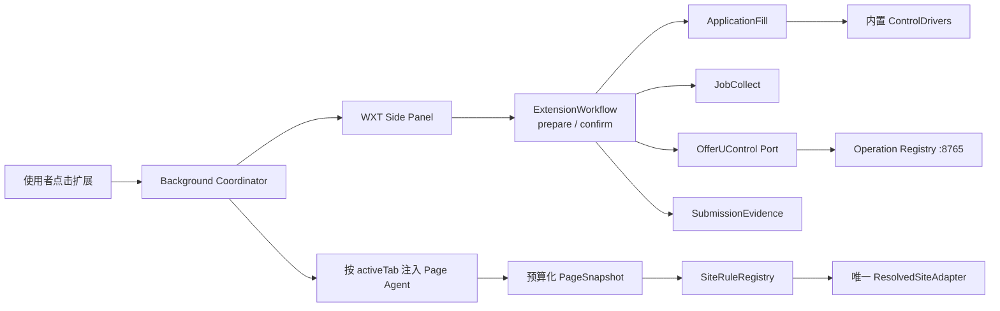

# OfferU 浏览器扩展

> 状态：accepted target design；迁移未完成  
> 精确规则契约：[SiteRulePack v1](./site-rule-pack-v1.md)  
> 决策：[ADR-0049](../adr/README.md#adr-0049)、[ADR-0050](../adr/README.md#adr-0050)

## 产品边界

OfferU 只发布一个自有 WXT 扩展，并只提供三个动作：

1. 在使用者当前打开的招聘页面采集岗位候选；
2. 从已确认职业事实生成填写预览，经二次确认后填写空白、非敏感字段；
3. 在使用者亲自提交后读取最小回执，形成待确认的提交候选。

扩展永远不执行最终提交。岗位采集、加入岗位篮和填写完成都不代表已经投递，也不创建正式投递尝试。

`Niuke/` 等已发布第三方扩展只可用于 clean-room 产品观察。OfferU 不复制其压缩代码、选择器、私有 API、账号/Cookie、验证码、遥测或资产。

## 目标拓扑



责任边界：

- Side Panel 只显示状态和收集意图，不读 DOM；
- Page Agent 只在当前临时授权 tab 中读/写 DOM，不直连数据库或模型；
- Background 管理权限、消息、短期会话和本地队列，不判断求职事实；
- SiteRulePack 只描述受限数据，复杂行为只在随扩展打包的 Driver；
- OfferUControl 是窄 Adapter，所有正式读写进入 Operation Registry。

## 页面识别

支持四种 page kind：`job-list`、`job-detail`、`application-form`、`submission-receipt`。

Resolver 依次使用 host/path、title/meta/script host、CSS/ARIA 信号和受限结构摘要。信号包含正证与反证：

- 低于阈值：`unsupported`；
- 前两候选分差不足：`ambiguous`；
- 规则为 `experimental`：`diagnostic-only`；
- 只有唯一 `verified` 规则可启用其声明的写能力。

`unknown` 不是万能 Adapter，只能做只读扫描和脱敏诊断，不能填写。

## 规则与 Driver

`SiteRulePack` 是岗位页与 ATS 的唯一适配数据格式，包含版本、状态、hosts、页面信号、selectors、字段 alias、driver binding、fixture 和 provenance。规则不能包含 JavaScript、WASM、函数、动态模块、endpoint、最终提交 selector 或真实表单值。

复杂控件由内置 `ControlDriver` 处理：

```ts
interface ControlDriver {
  readonly id: DriverId;
  canHandle(field: FieldDescriptor): boolean;
  read(field: FieldDescriptor): Promise<ReadResult>;
  apply(field: FieldDescriptor, value: PlannedValue): Promise<WriteResult>;
  verify(field: FieldDescriptor, expected: PlannedValue): Promise<VerifyResult>;
}
```

Driver 只能执行已确认且未过期的 FillPlan，不能新增经历、上传文件、勾选同意、绕过验证码或点击提交。精确 schema、算法和 validator 反例见 [SiteRulePack v1](./site-rule-pack-v1.md)。

## 统一工作流

```ts
interface ExtensionWorkflow<Plan, Result> {
  prepare(context: PageContext): Promise<Plan>; // 只读
  confirm(planId: string): Promise<Result>;     // 显式确认后执行
}
```

### 岗位采集

`prepare` 从当前列表/详情页生成岗位预览，缺失字段明确标记，不猜测。`confirm` 先加入本地岗位篮，再由 `确认同步 N 个岗位到 OfferU` 调用批量导入 Operation。逐条成功前不能删除本地条目，重复同步必须幂等。

岗位篮状态为 `待同步 / 同步中 / 已同步 / 失败`。成功文案只能是“已加入 OfferU 岗位库”，不能写“已申请”。

### 安全填表

开始前同时满足：

- 连接到本机 OfferU；
- 关联一个岗位；
- 投前决策允许继续；
- 规则包为 `verified`；
- 已取得最小、已确认职业投影。

第一步按钮固定表达“扫描表单（不会填写）”。扫描不得展开区块、添加经历、打开下拉、聚焦输入或修改 DOM。预览把字段分为：

1. 可填写：空白、非敏感、事实已确认、控件已验证；
2. 受保护：已有值、身份/薪资/工作许可/同意/文件等；
3. 需要使用者处理：开放题、附件、缺少事实或不支持控件；
4. 未识别：无法稳定定位或匹配。

二次确认必须明确：不会覆盖已有值、不会上传附件、不会勾选同意、不会提交申请。计划绑定 URL、字段指纹、context version 和短期过期时间；页面变化、计划过期或字段重建后拒绝应用并要求重扫。

执行逐字段返回 `已填写并验证 / 页面拒绝 / 页面已变化 / 已保护 / 待人工`。部分失败不能显示全局成功。敏感值只在当前会话按需展示，持久化结果必须脱敏。

### 提交候选

扩展不监听或代理提交按钮。使用者亲自提交后主动点击“我已自行提交，检查结果”；跨域导航后重新点击扩展取得临时权限。

回执规则需要当前未过期填写会话、明确岗位和至少两组独立成功证据，同时以校验错误、草稿、取消、登录和验证码作为反证。候选只含公司、岗位、申请编号、时间、来源 URL 的最小/脱敏形式和必要 hash。

候选确认前数据库没有新正式投递。使用者点击“确认已提交并记入”后，Operation Registry 以 candidate ID 为幂等键原子创建一个 `ApplicationAttempt` 和一个 `Submitted` 事件；拒绝、关闭或误识别不写正式事实。

## Side Panel

工具栏点击完成：授予当前 tab 临时权限、打开侧边栏、注入本次 Page Agent。侧边栏按页面只显示一个主动作：

| 状态 | 主动作 |
| --- | --- |
| 已验证岗位页 | 预览岗位 |
| 已验证表单 | 扫描表单（不会填写） |
| 当前会话成功页 | 检查提交结果 |
| 实验/冲突/未知 | 生成脱敏适配报告 |
| OfferU 离线 | 重新连接 |
| 浏览器受限页 | 无操作，并解释原因 |

Header 始终显示连接、站点/ATS、规则版本与 `verified/experimental` 文字。主动作每屏最多一个，状态不只靠颜色，宽度 320px 时不横向滚动。

## 权限与存储

Manifest 不声明 `<all_urls>` 静态内容脚本；使用 `activeTab + scripting` 按点击注入。后端 host permission 只覆盖本机 `127.0.0.1/localhost` 所需端口，额外站点权限按需申请。

`chrome.storage.local` 只允许：非敏感设置、未同步岗位队列、规则版本、兼容性统计和不含值的错误摘要。短期 session/内存保存 FillPlan、tab/session、脱敏预览和 pending candidate ID。

禁止保存模型 API Key、完整简历、身份字段、完整表单值、Cookie、整页 HTML、提交页原文、截图和第三方账号凭据。模型匹配只能经 OfferU 后端的 provider/数据授权规则。

## 远程规则包

本地内置规则始终是离线基线。允许从固定 OfferU 地址拉取签名 JSON bundle，但远程内容仍只是规则数据：

- bundle 具有 `schemaVersion`、单调递增 `bundleVersion`、packages 和签名；
- 使用内置公钥验证 ECDSA P-256/SHA-256，再逐包做严格 schema 校验；
- 规则不能引用远程代码、脚本或 endpoint；
- 验签失败、离线、重放、坏包或熔断时继续使用已知良好/内置规则；
- 同版本内容不可变，远程包按 ID 覆盖内置包；
- 发布前复核 Chrome/Edge 商店对 remote configuration 的当前政策。

## 规则质量门

规则从 `experimental` 升为 `verified` 必须同时通过：schema/selector 校验、driver 存在、每个 page kind 的脱敏 fixture、正例/近似反例/冲突例、只读预览零 DOM 写入、已有值和敏感字段保护、受支持 Chromium 浏览器中的用户主动验收，以及版本化兼容性报告。自动化验收统一使用隔离的 Playwright managed Chromium 无头模式，不启动系统 Edge/Chrome。

“支持某网站”只表示某个 pack/version 的声明能力通过，不代表所有公司、页面版本和控件 100% 支持。

## 当前静态基线（2026-08-19）

已有可复用部分：WXT 项目、Page Agent、初版 framework、SiteRulePack schema/validator/resolver/fixtures、签名远程规则实现、SmartFill drivers 与大量 fixture tests。

仍与目标冲突：

- `entrypoints/content.ts` 静态内容脚本仍存在；
- 无 sidepanel entrypoint，manifest 仍以 popup 为主；
- `src/background.ts`、popup 和类型仍保留 `plugin-direct`、浏览器内 `apiKey`；
- `npm run build` 仍调用 `sync-root-build.mjs` 生成第二套根目录产物；
- 站点规则迁移仍不完整，旧 `content/platforms` 与 ATS adapters 并存；
- OfferUControl 的填表/回执 Operations 尚未形成完整生产闭环。

该表是静态设计审计，不构成运行验收。

## 纵向实施顺序

### EXT-1：唯一插件的岗位采集

建立 side panel、按点击注入、唯一 WXT 构建产物和批量岗位导入 Operation；迁移现有岗位平台到规则包。真实浏览器证明“预览 → 确认同步 → Job inbox”，再删除对应旧入口。

### EXT-2：安全填表

删除 plugin-direct 与浏览器 API Key；提供最小职业投影 Operation；把 ATS 数据迁入规则包、Writer 收敛到 Driver；证明第一次扫描 DOM 零变化，第二次确认只写安全字段。

### EXT-3：提交候选

复用候选进展领域模型增加 `browser_receipt` 来源；成功页只生成 pending candidate；确认后原子创建一次投递尝试与 Submitted 事件，并通过刷新/重启/重复确认幂等测试。

每个切片都必须有浏览器行为、manifest 权限快照和 Operation audit；受支持 Chromium 浏览器的真实侧载验收由用户主动执行，不能由类型检查、单测或构建替代。Agent 自动化只使用隔离的 Playwright managed Chromium 无头路径，不打开 Edge 或 Chrome。

## 明确不做

- 第三方账号、云简历、私有 API、验证码或遥测接入；
- 无人值守找岗、批量自动申请、自动最终提交；
- 敏感字段、开放题、附件或同意项自动填写；
- 未签名规则、远程可执行逻辑或万能 selector；
- 双构建链路、常驻全网页脚本或浏览器内模型 key；
- 绕过 Operation Registry 的浏览器专用业务状态机。
