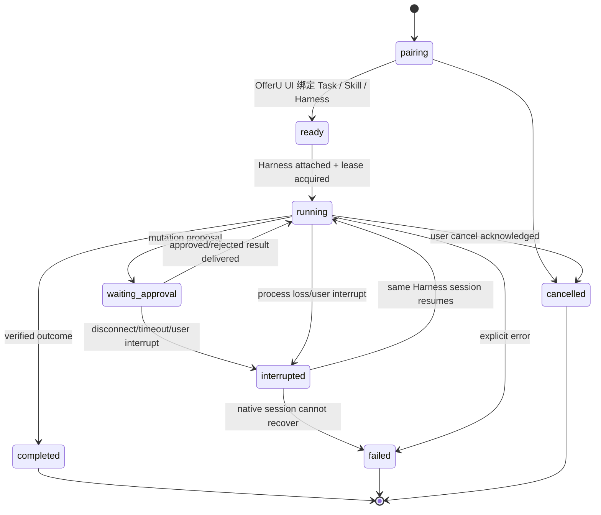

# Agent Run 生命周期

> 状态：accepted target design  
> 决策：[ADR-0042](../adr/README.md#adr-0042)、[ADR-0054](../adr/README.md#adr-0054)

## 三个不同对象

| 对象 | 代表什么 | 生命周期 |
| --- | --- | --- |
| 求职任务 | 使用者持续推进的目标 | 可跨多次对话与 Run |
| Agent Run | 一次获授权、可审计的主控执行 | 从配对/启动到确定终态 |
| Harness session | 某个宿主的隐藏会话与模型上下文 | 由宿主拥有，只服务一个 Run |

Run 不是对话，不是页面，也不是后台任务。Harness session ID 只是 Run 的恢复指针；丢失它不会丢失已确认业务事实，但可能使当前 Run 无法继续。

## Run 状态机



跨 Harness 交接不从 `interrupted` 回到同一个 Run；它结束原 Run 并创建新 Run。

## 创建与配对

OfferU 专注窗口启动时，Task、Skill、Harness 和 grant 先确定，再启动宿主。Harness 原生界面启动时，只建立 `pairing` 请求；OfferU 嵌入入口/浮层显示真实 executable、版本、adapter、profile/preset、composed profile hash、cwd 指纹和所需能力，使用者选择 Task/Skill 后才创建 Run。

DSH rc8 的 OfferU 主视图注册在 session-scoped `conversation.view`。因此无活动 session 时只能通过 root 级入口/浮层完成选择或创建；关联后，任务视图才挂到对应 DSH session。OfferU 全局领域导航不形成全局 Run，也不能让多个求职任务共享同一隐藏会话。

Run 创建时冻结：

- Task ID、Skill ID/版本；
- Harness/adapter 名称与版本；
- Operation/Data/Workspace/Network grant；
- Context snapshot 版本；
- 协议版本与 capability report；
- 幂等命名空间。

冻结不意味着数据永不变化。Context refresh 会生成新版本并写事件；写调用必须携带自己基于的版本。

## 单写入租约

一个 Run 同一时刻只有一个 Harness connection 可以：

- 追加 agent 生命周期事件；
- 调用 Operation；
- 声明/更新候选工件；
- 报告 Run 终态。

OfferU UI 无需 Harness 写租约即可读取、审批和请求中断，但所有用户决定仍需绑定身份与 proposal。adapter 周期续租；连接丢失后租约自然过期，旧连接即使恢复也不能继续写，必须通过 `run.attach` 对账并重新取得租约。

租约解决双进程和僵尸 adapter，不表示工作台可改变 Harness 的隐藏会话。

## 输入所有权

首个 DSH tracer 采用最小边界：

- DSH Chat 是首个 tracer 中用户提示的唯一写入端；
- OfferU 任务视图只观察、配对和中断，加入 mutation 后才提供业务确认；
- OfferU client half 不把普通聊天文本注入运行中的 DSH 会话。

后续若加入 OfferU 任务视图 follow-up，必须仍是单输入写入者语义：每条输入有稳定 ID、来源、顺序和宿主接收确认，且不能与 Harness 原生输入竞争。该 UX 决策不阻塞 DSH rc8 native tracer。

## 事件与游标

`AgentRunEvent.seq` 在 Run 内严格单调。最小字段：

```text
run_id, seq, type, occurred_at,
source (offeru_ui|bridge|harness|operation|executor),
correlation_id, redacted_payload, raw_trace_ref?
```

写入规则：

- adapter 原始事件先去重，再映射为标准事件；
- 消息 delta 可压缩，但 completed、proposal、decision、operation result 和终态不能丢；
- UI 以 `after_seq` 追随，重连不会重播已确认消费的事件；
- provider trace 可以单独保留并按策略清理，不能替代标准事件；
- Run 终态只写一次，迟到事件进入诊断而不重开 Run。

## 等待确认

`waiting_approval` 不等于 Harness 整体退出：

1. OperationGateway 持久化 proposal；
2. Harness tool call 暂停或收到结构化 pending；
3. OfferU 嵌入浮层/专注窗口批准、拒绝、取消或让其过期；
4. 协调器执行/关闭 proposal；
5. adapter 从事件游标取得决定并恢复同一工具调用；
6. Run 回到 `running`，或因断连进入 `interrupted`。

同一 Run 可以有多个历史 proposal，但 v1 同时只允许一个阻塞式 mutation proposal，减少并发确认歧义。只读 Operation 可在等待期间由 OfferU UI 读取，Harness 不继续发起新副作用。

## DSH rc8 内部 subagent

DSH rc8 可通过 Profile Bundles 安装 Codex 与 Claude Code subagents。只要委托由 DSH 主会话发起并由 DSH 管理，它仍属于当前 DSH session 和 OfferU Run：

- subagent 开始、工具、报告和失败映射为带 parent/child correlation 的嵌套事件；
- 不创建第二个 OfferU 主控 Run，不取得独立业务 grant；
- subagent 只能通过主会话当前可见的 OfferU tools 间接工作，不能旁路 Bridge；
- DSH 的 subagent approval/permission mode 不能批准 OfferU proposal。

只有主控 Harness 显式调用 OfferU 的深度执行委托 Operation，且 `ExecutorSupervisor` 创建独立 session/workspace/task grant 时，才形成托管执行会话。这一区分防止 rc8 新能力把主控和深度执行边界重新混在一起。

## 中断、取消和失败

- `interrupt`：请求停止当前模型 turn，保留可恢复 Run；
- `cancel`：使用者要求终止整个 Run，adapter 终止宿主并写 `cancelled`；
- `failed`：能力不匹配、进程错误、协议错误或不可恢复 session；
- `reconciliation_required`：副作用可能已开始但结果未知，Run 不能宣称失败后安全重试；
- `completed`：Harness 报告完成且 OfferU 验证必需 outcome，不只依赖最终自然语言。

强制结束进程前先请求宿主原生 interrupt；超时后终止进程树。任何 executing Operation 都先对账，绝不因为进程消失而自动重放。

## 同 Harness 恢复

只有同时满足以下条件才能恢复原 Run：

- Harness 名称、adapter major、Bridge 协议和 grant 兼容；
- 原生 session 可按官方机制恢复；
- 工件 workspace 与 manifest 未变化；
- 上次事件游标和未决 proposal 可对账；
- 没有另一连接持有有效租约。

恢复后追加 `run.resumed`，不重写历史事件。若宿主只能从摘要重新开会话，这属于交接/新 Run，不是假装原生恢复。

## 跨 Harness 交接

原 Harness 不可恢复时，由使用者在 OfferU 工作区显式选择目标 Harness。OfferU 创建 `HandoffSnapshot`：

- 来源 Run 与终态；
- 已确认领域事实引用和 context version；
- 已接受/待审核工件清单与 hash；
- 未决 proposal 的状态；
- 去除隐藏推理和敏感原文的执行摘要；
- 交接原因和使用者补充说明。

目标 Harness 使用新 Run ID、session、租约和幂等命名空间。未决 proposal 不自动执行；新 Run 只能读取其状态，并由 OfferU UI 决定继续、拒绝或用新提案替代。

## 清理与保留

- Run metadata、标准事件、Operation audit 和决定按产品审计策略保留；
- 原始 provider trace、delta 和临时工件设置更短保留期；
- 凭据、完整敏感输入和 sealed execution args 不长期保留；
- 删除来源或撤销数据授权时，相关 Context/Artifacts 按来源级联失效；
- 清理不能删除仍用于解释正式业务状态的最小审计引用。

## 生命周期验收

- 一个 Run 不会同时出现两个有效写租约；
- 重连从事件游标恢复且不重复副作用；
- interrupt、cancel、failed、completed 可在 UI 和持久化中区分；
- app 重启后 pending proposal 仍可见且不会自动执行；
- same-Harness 原生恢复保留 Run，cross-Harness 必须新建 Run；
- DSH OfferU tab 随 session 绑定，切换求职任务不会复用另一任务的隐藏上下文；
- DSH 内部 Codex/Claude subagent 只形成当前 Run 的嵌套事件，不冒充新主控 Run；
- 终态后任何迟到 tool/event 都不改变正式结果。
