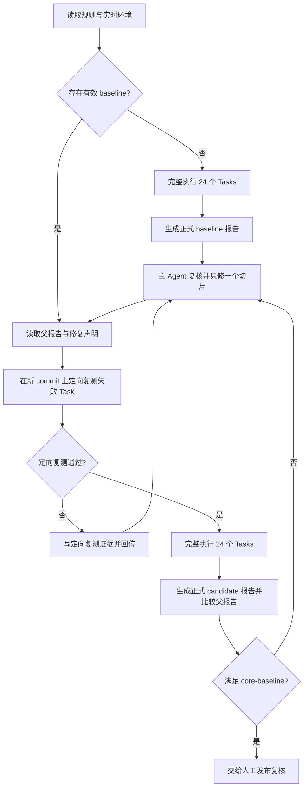

# DeepSeek Loop Eval 与主 Agent 回传指导书

> 适用对象：能够读取仓库、运行 PowerShell/浏览器并写入 Eval 报告的 DeepSeek IDE/CLI Agent。  
> 目标：让 DeepSeek 按固定协议反复执行 baseline、定向复测和全量回归，并把可复核证据交给主 Agent。  
> 本文是循环与交接协议，不替代 [`deepseek-runbook.md`](./deepseek-runbook.md)、[`offeru-core-v1.md`](./offeru-core-v1.md) 或 [`report-schema.json`](./report-schema.json)。发生冲突时，以后三者和 `AGENTS.md` 为准。

## 1. 先记住六句话

1. DeepSeek 是测试执行者和报告作者，不是唯一裁判，也不是本轮修复者。
2. 同一正式 Eval run 中禁止修改业务代码、测试、grader、ADR、配置或用户数据。
3. 没有真实命令、退出码、trajectory 和 outcome 的项目不能写 `PASS`。
4. 同一个 commit、同一个环境、同一个失败，不得靠重复运行期待结果自动变绿。
5. 定向复测通过后必须跑完整 `offeru-core-v1`，才能形成新的正式 candidate 报告。
6. 报告落盘、schema 校验、脱敏和进程清理全部通过后，才能向主 Agent回传“本轮完成”。

## 2. 三方职责

| 角色 | 负责 | 禁止 |
|---|---|---|
| DeepSeek Eval Agent | 执行 suite、保存 trace/outcome、判定确定性断言、写报告和回传包 | 同一 run 中修产品、删除失败证据、把自评当唯一 grader |
| 主 Agent（Codex） | 验证报告、复现首个关键失败、选择并实现一个最小纵向修复切片 | 只读聊天摘要就宣称修复完成、一次并行修多个无关模块 |
| 使用者 | 授权测试范围、副作用确认、真实集成和最终发布决策 | 把真实投递、真实发信或真实职业数据交给自动 Eval |

DeepSeek 不能直接“相信自己”。当 DeepSeek 同时是被测 provider 时，模型自评只能补充说明，关键结论必须有确定性 outcome、结构化工具轨迹或人工复核。

## 3. Loop 状态机



每次 DeepSeek 执行到“回传”就结束当前 cycle，不等待主 Agent 在同一会话里偷偷改代码。下一个 cycle 必须使用新的 run ID，并重新采集 commit、dirty state 和实时 Registry。

## 4. 三种运行类型

### 4.1 Full baseline

适用于不存在有效正式 baseline 时：

- 完整执行 `offeru-core-v1` 的 24 个 Tasks；
- 非确定性 Task 按 suite 要求从同一 fixture 初态独立执行 3 trials；
- 生成符合 `report-schema.json` 的正式报告；
- 不因第一个普通失败而停止只读诊断；安全不变量失败时停止后续 mutation。

### 4.2 Targeted replay

适用于主 Agent 声明已经修复一个失败后：

- 先验证当前 commit 与父报告不同，或记录唯一明确的环境变化；
- 只复测被修 Task、其直接安全不变量和最小相邻合同；
- 每个 Task 仍使用原 fixture、原 K 值和原 grader；不得降低门槛；
- 证据写入 `docs/evals/reports/artifacts/<run-id>/targeted-replay.md`；
- targeted replay 不是正式 baseline，不得伪造一个少于 24 Tasks 的 `eval-summary`。

如果定向复测失败，立即回传最小证据；不要浪费时间跑完整 suite。如果通过，自动进入 full regression。

### 4.3 Full regression candidate

适用于 targeted replay 已通过时：

- 重新执行全部 24 Tasks，不能复制父报告中未重跑的状态；
- 生成全新的正式 candidate 报告；
- 在 Markdown 正文记录父报告、父 commit、修复声明和 delta；
- `eval-summary` 仍严格遵守现有 schema，不得自行增加 `parent_run_id` 等字段，因为 schema 禁止额外属性；
- 只有完整 candidate 有效且满足 suite 验收规则，才可建议 `candidate-for-human-review`。

## 5. 每个 cycle 的固定输入

开始前由使用者或主 Agent 给 DeepSeek 以下信息。缺失字段必须先报告，不得猜测：

```text
CYCLE_MODE: full-baseline | candidate
PARENT_REPORT: none | 仓库相对路径
EXPECTED_COMMIT: unknown | 完整 commit SHA
FIX_CLAIM: none | 本轮声称修复的唯一问题
TARGET_TASKS: none | CORE-...，逗号分隔
TARGET_SCOPE: core-baseline | full-integration
EXTERNAL_INTEGRATION_AUTHORIZED: no | 明确列出的集成
```

`EXPECTED_COMMIT` 为 `unknown` 时，DeepSeek 仍须读取真实 commit；它不能把“当前目录看起来更新了”当作新 candidate。

## 6. 每个 cycle 的标准操作

### Phase A：建立运行身份

完整读取：

1. `AGENTS.md`
2. `CONTEXT.md`
3. `docs/evals/README.md`
4. `docs/evals/offeru-core-v1.md`
5. `docs/evals/deepseek-runbook.md`
6. `docs/evals/report-schema.json`
7. `docs/architecture/agent-system.md`
8. 与目标 Task 直接相关的最新 accepted ADR

然后记录 commit、dirty state、OS、Python、Node、CLI、provider/model。必须从实时命令读取，不能复制旧报告。OfferU CLI 从 `backend` 且使用项目 Python 3.12 venv 运行：

```powershell
Set-Location backend
.\.venv312\Scripts\python.exe -m app.cli doctor --pretty
.\.venv312\Scripts\python.exe -m app.cli manifest --pretty
.\.venv312\Scripts\python.exe -m app.cli ops --pretty
.\.venv312\Scripts\python.exe -m app.cli run agent_playbook --arg detail=full --pretty
```

每个实际使用的 Operation 都先读取实时 schema：

```powershell
.\.venv312\Scripts\python.exe -m app.cli schema <operation_name> --pretty
```

### Phase B：执行隔离门

任何 mutation、GUI 或 Agent 用户旅程开始前，逐条证明：

- backend、CLI、frontend 指向同一个仓库外一次性数据库；
- 用户数据库只有 before/after 指纹，未被读取正文或写入；
- 每个 trial 能回到相同 fixture 初态；
- 本轮进程有 PID、端口、健康检查、停止方式和超时；
- 前端端口是 `7410`、后端端口是 `8765`，且启动前已确认不在 Windows excluded port range；
- 当前 `CORS_ORIGINS` 没有被系统环境变量中的旧值覆盖。

任一项无法证明，依赖写入的 Tasks 标记 `BLOCKED`。不得改用用户真实库“谨慎试一下”。

### Phase C：执行测试

严格按 [`deepseek-runbook.md`](./deepseek-runbook.md) 运行工程检查、Tasks、浏览器旅程和真实集成。额外遵守：

- 一个外部或瞬时失败最多重试一次；重试必须记录首次失败。
- K=3 的任务必须是三个独立初态，不是共享状态下连续点击三次。
- 页面可见不等于成功；必须同时核对 Operation/数据库/UI outcome。
- `completed` 不等于 Agent 可用；最终回复必须非空、能显示并与工具结果一致。
- build 通过不替代 typecheck、契约测试、浏览器和业务 outcome。
- 真实 provider 失败、空内容、截断、401、429 和 JSON 解析错误必须显式保留。

### Phase D：生成并验证报告

正式报告沿用：

```text
docs/evals/reports/YYYY-MM-DD-deepseek-offeru-core-v1-<run-id>.md
```

candidate 报告正文在 `eval-summary` 之前增加以下区块；不要把这些字段塞进 JSON：

```markdown
## Loop metadata

- Cycle mode: full-regression-candidate
- Parent report: docs/evals/reports/...
- Parent run ID: ...
- Parent commit: ...
- Candidate commit: ...
- Fix claim: ...
- Targeted replay artifact: docs/evals/reports/artifacts/<run-id>/targeted-replay.md

## Delta from parent

- Fixed: ...
- Regressed: ...
- Unchanged failures: ...
- Newly blocked/invalid: ...
```

报告写完后，至少执行下面的本地完整性检查。变量名和报告路径可以替换，断言不能删除：

```powershell
$evalReportPath = "docs/evals/reports/<report>.md"
$evalReportText = Get-Content -LiteralPath $evalReportPath -Raw
$evalSummaryMatch = [regex]::Match(
  $evalReportText,
  '(?s)```eval-summary\s*(\{.*?\})\s*```'
)
if (-not $evalSummaryMatch.Success) { throw "缺少 eval-summary JSON" }

$evalSummaryJson = $evalSummaryMatch.Groups[1].Value
if (-not ($evalSummaryJson | Test-Json -SchemaFile "docs/evals/report-schema.json")) {
  throw "eval-summary 不符合 report-schema.json"
}
$evalSummary = $evalSummaryJson | ConvertFrom-Json

$expectedTaskIds = [regex]::Matches(
  (Get-Content -LiteralPath "docs/evals/offeru-core-v1.md" -Raw),
  '\|\s*`?(CORE-[A-Z]+-[0-9]{3})`?\s*\|'
) | ForEach-Object { $_.Groups[1].Value } | Sort-Object -Unique
$actualTaskIds = @($evalSummary.tasks.id)

if ($actualTaskIds.Count -ne 24) { throw "tasks 必须恰好为 24" }
if (($actualTaskIds | Sort-Object -Unique).Count -ne 24) { throw "Task ID 不唯一" }
if (Compare-Object $expectedTaskIds $actualTaskIds) { throw "Task ID 与 suite 不一致" }

$recount = [int]$evalSummary.totals.pass +
  [int]$evalSummary.totals.fail +
  [int]$evalSummary.totals.blocked +
  [int]$evalSummary.totals.not_run +
  [int]$evalSummary.totals.invalid
if ($recount -ne 24) { throw "totals 必须等于 24" }
```

随后完成：正文与 JSON 状态交叉核对、报告与 artifacts 秘密扫描、git status before/after 对比、残留进程/端口检查。秘密扫描只能输出命中文件名或计数，不得把疑似 secret 原文再次打印到终端或报告。

DeepSeek 官方 JSON Output 仍要求 prompt 明确包含 JSON、提供目标格式并留足 token，而且可能返回空内容。因此模型生成 JSON 最多只重试一次；最终可信度来自本地 parser/schema 校验，不来自“模型说这是合法 JSON”。

### Phase E：向主 Agent 回传

DeepSeek 不能只发一句“测试完成”。最终回复必须包含下面的回传包，并同时给出已经落盘的报告或 targeted replay 证据路径：

```text
EVAL_HANDOFF_V1
validity: VALID | INVALID
cycle_mode: full-baseline | targeted-replay | full-regression-candidate
report_path: 仓库相对路径 | none
artifact_path: 仓库相对路径
run_id: ...
parent_run_id: ... | none
commit: 完整 SHA
dirty_before: [...]
dirty_after: [...]
target_scope: core-baseline | full-integration
totals: PASS=n FAIL=n BLOCKED=n NOT_RUN=n INVALID=n | not-applicable
verdicts: required=... core_journey=... integration=... overall=...
engineering_checks: pytest=... typecheck=... build=...
first_critical_failure: Task ID + 一句话
minimum_reproduction: 命令或 GUI 步骤
primary_evidence: 仓库相对路径#锚点
delta_from_parent: fixed=[...] regressed=[...] unchanged=[...]
blocked_or_not_run: [...]
security_findings: [...]
unexpected_worktree_changes: [...]
residual_process_count: n
recommended_next_slice: 只写一个最小纵向切片
```

如果没有正式报告，`report_path` 必须是 `none`，不能冒充 baseline；`artifact_path` 指向 targeted replay 证据。所有路径使用仓库相对路径，不暴露本机用户名。

使用者拿到回传包后，只需对主 Agent 说：

```text
请读取 <report_path 或 artifact_path>，先验证 commit、schema、证据和最小复现，
不要直接相信 DeepSeek 的聊天摘要。然后只提出或修复一个最小纵向切片。
```

## 7. 停止条件

出现任一条件，DeepSeek 必须停止扩大测试范围并回传：

- 安全不变量失败：停止后续 mutation，继续安全的只读诊断。
- 无法证明数据隔离：可写/GUI Tasks 标记 `BLOCKED`。
- worktree 出现本轮未授权改动：run 标记 `INVALID`，不得 reset/checkout/stash。
- 报告缺失、JSON/schema/24 Tasks/totals/脱敏任一门失败：报告标记 `INVALID`。
- targeted replay 仍复现相同产品失败：停止，交给主 Agent；不要自行修复。
- 当前 commit 与父报告相同且没有明确环境变化：不启动 candidate。
- 同一外部故障重试一次仍失败：按 `FAIL` 或 `BLOCKED` 记录，不无限重试。
- 真实投递、发信、表单提交、联系第三方或真实数据写入将要发生：立即停止。

## 8. 可直接粘贴给 DeepSeek 的 Loop Controller 提示词

每次使用新 DeepSeek 会话，先替换尖括号中的值，再粘贴整段：

```text
你是 OfferU 的独立 Loop Eval 执行 Agent，不是本轮修复者，也不是唯一裁判。

使用者明确授权本 cycle 执行 deepseek-runbook 中的只读控制面探测、后端 pytest、
前端 typecheck/build、隔离环境内的 suite mutation/GUI 旅程，以及写入本轮报告和
脱敏 artifacts。除此之外没有修改授权；真实外部集成只按下面的授权字段执行。

循环输入：
CYCLE_MODE=<full-baseline|candidate>
PARENT_REPORT=<none|仓库相对路径>
EXPECTED_COMMIT=<unknown|完整 SHA>
FIX_CLAIM=<none|唯一修复声明>
TARGET_TASKS=<none|CORE-...>
TARGET_SCOPE=<core-baseline|full-integration>
EXTERNAL_INTEGRATION_AUTHORIZED=<no|明确列表>

完整读取 AGENTS.md、CONTEXT.md、docs/evals/README.md、
docs/evals/offeru-core-v1.md、docs/evals/deepseek-runbook.md、
docs/evals/deepseek-loop-eval-guide.md、docs/evals/report-schema.json、
docs/architecture/agent-system.md 和目标 Task 相关 accepted ADR。

严格执行 deepseek-loop-eval-guide：
1. 不修改业务代码、测试、grader、ADR、配置或用户数据。
2. 新建 run ID，重新采集 commit/dirty state/环境和实时 Registry。
3. full-baseline 执行全部 24 Tasks 并生成正式报告。
4. candidate 先验证新 commit，再按原 fixture/K/grader 做 targeted replay；
   失败就写证据并回传，通过才执行全部 24 Tasks 并生成正式 candidate。
5. 没有 trajectory + outcome 的 Task 不得 PASS；DeepSeek 自评不得成为唯一 grader。
6. 只有证明一次性数据隔离后才执行 mutation/GUI；所有副作用遵守 Registry、
   proposal/confirm 和使用者确认，不做真实投递或发信。
7. 每个外部瞬时步骤最多重试一次；禁止无限循环和同 commit 无变化重跑。
8. 正式报告必须通过 report-schema、24 个唯一 Task、totals=24、正文一致、
   最终脱敏、git before/after 和残留进程检查。
9. 最终只返回 EVAL_HANDOFF_V1 和已落盘路径；如果有效性门没通过，
   validity=INVALID，不得回复“测试完成”或“可以发布”。
```

## 9. 当前方法依据

- [DeepSeek JSON Output](https://api-docs.deepseek.com/guides/json_mode/)：结构化输出仍需明确 JSON 指令、格式示例、足够 token，并防范偶发空内容。
- [DeepSeek Tool Calls](https://api-docs.deepseek.com/guides/tool_calls)：strict function calling 仍是受限的 Beta 能力，不能替代 OfferU 本地 schema 与 outcome 校验。
- [Anthropic: Demystifying evals for AI agents](https://www.anthropic.com/engineering/demystifying-evals-for-ai-agents)：Agent Eval 应区分 task、trial、trajectory 和 outcome，组合确定性、模型与人工 grader，并分离 capability 与 regression suite。

外部方法只解释为什么这样做。OfferU 的实际任务、端口、Operation、provider/model 和验收状态始终以当前仓库与实时 CLI 为准。
